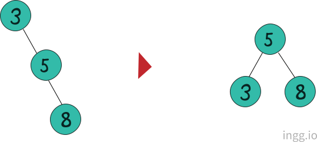
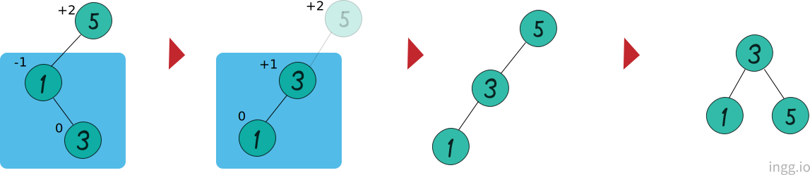
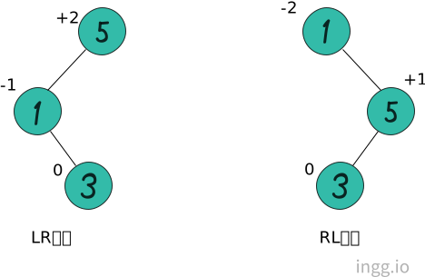
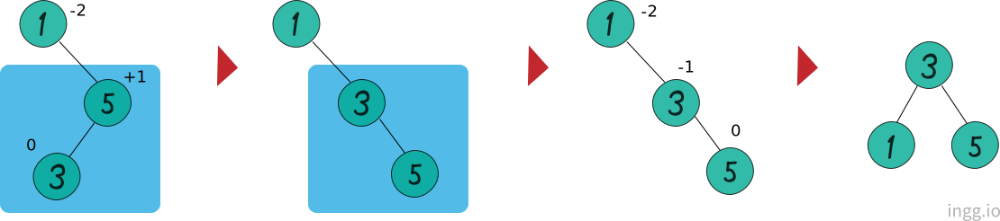

## AVL 트리

AVL트리는 노드가 추가/삭제될때, 트리의 균형상태를 파악해서 스스로 그 구조를 변경하여 균형을 잡는 트리이다.

균형 인수는 AVL트리에서 균형의 정도를 표현한다.


```
균형 인수 = 왼쪽 서브트리 높이 - 오른쪽 서브트리 높이
```

<br>

균형을 잡기위한 트리의 재조정을 **'리밸런싱'** 이라고 한다. AVL트리는 균형인수의 절대값이 2이상인 경우 균형을 잡기위해 재조정한다.

<br>

### LL회전

> 왼쪽으로 두번 회전이 아니라, LL상태에서 균형을 잡기위한 회전이다.

자식노드가 왼쪽으로 두개 연결되어 균형인수가 **+2**인 상태를 LL상태(Left Left)라고 한다. LL상태에서 리밸런싱하는것을 **LL회전**이라고 한다.


균형인수가 **+2**인 노드를 균형인수가 **+1**인 노드의 오른쪽 자식 노드가 되게했다.

<br>

### RR회전

RR상태는 반대로 오른쪽으로 늘어진 형태이다.



<br>

### LR회전

LR상태는 자식노드가 왼쪽하나, 오른쪽하나 달린 상태이다. LR상태는 먼저 **부분적으로 RR회전**을하고 **LL회전**을 진행한다.



<br>

### RL회전

RL상태는 자식노드가 연결된 방향이 LR상태와 반대이다.



RL회전은 먼저 **부분적으로 LL회전**을 하고 **RR회전**을 진행한다.


