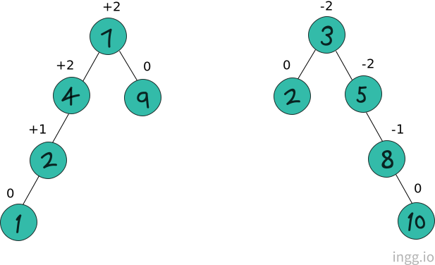
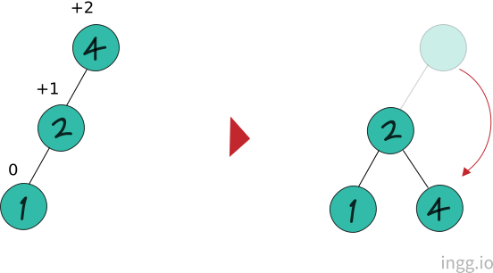

## AVL 트리

AVL트리는 노드가 추가/삭제될때, 트리의 균형상태를 파악해서 스스로 그 구조를 변경하여 균형을 잡는 트리이다.

균형 인수는 AVL트리에서 균형의 정도를 표현한다.



```
균형 인수 = 왼쪽 서브트리 높이 - 오른쪽 서브트리 높이
```

<br>

균형을 잡기위한 트리의 재조정을 **'리밸런싱'** 이라고 한다. AVL트리는 균형인수의 절대값이 2이상인 경우 균형을 잡기위해 재조정한다.

<br>

### LL회전

자식노드가 왼쪽으로 두개 연결되어 균형인수가 +2인 상태를 LL상태(Left Left)라고 한다. LL상태에서 리밸런싱하는것을 **LL회전**이라고 한다.



균형인수가 +2인 노드를 균형인수가 +1인 노드의 오른쪽 자식 노드가 되게했다.
