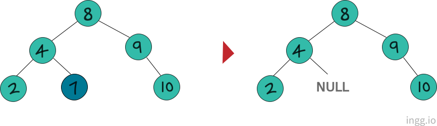
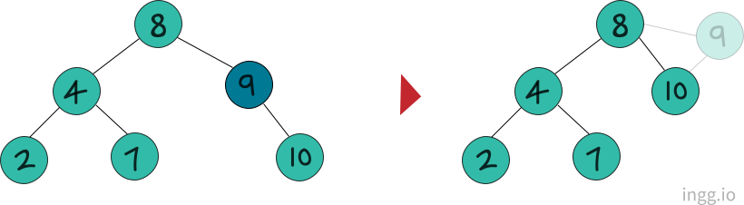
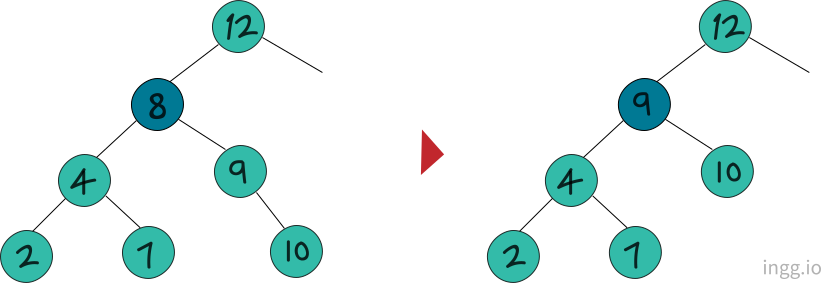
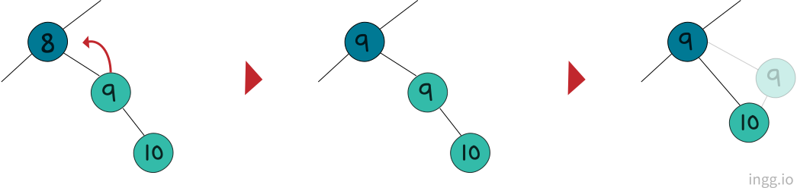

## 이진 탐색 트리

이진 탐색 트리가 되기위해서는,

노드의 **왼쪽** 서브트리에는 그 노드의 값보다 **작은 값**들을 갖는 노드들로 이루어져있고, 노드의 **오른쪽** 서브트리에는 그 노드의 값보다 **크거나 같은 값**들을 지닌 노드들로 이루어져 있어야 한다.

이진탐색트리에서 **삽입**은 현재노드보다 작으면 왼쪽, 크면 오른쪽에 위치시킨다.

이진탐색 트리에서 **삭제**는 **세가지** 경우가 있다.

1. 삭제할 노드가 단말노드(리프노드)일 경우
2. 삭제할 노드가 하나의 자식노드를 갖는 경우
3. 삭제할 노드가 두개의 자식노드를 갖는 경우

<br>

#### Case 1: 삭제할 노드가 단말노드일 경우



삭제할 노드가 단말노드인 경우에는 그냥 삭제하면 된다.

```c
//dNode, pNode: 삭제할 노드, 부모 노드를 가리키는 포인터 변수
if(삭제할 노드가 단말노드)
{
    if(GetLeftSubTree(pNode) == dNode)  //삭제할 노드가 왼쪽 자식 노드면
        RemoveLeftSubTree(pNode);       //왼쪽 자식 노드 트리에서 제거
    else                                //삭제할 노드가 오른쪽 자식 노드면
        RemoveRightSubTree(pNode);      //오른쪽 자식 노드 트리에서 제거
}
```

<br>

#### Case 2: 삭제할 노드가 하나의 자식노드를 갖는 경우



삭제하려는 노드(9)의 부모(8)가 삭제하려는 노드의 자식(10)을 가리키게 한다.

```c
if(삭제할 노드가 하나의 자식노드를 가짐)
{
    BTreeNode * dcNode;     //삭제 대상의 자식 노드를 가리키는 포인터변수

    //삭제 대상의 자식노드를 찾음
    if(GetLeftSubTree(dNode) != NULL)   //자식노드가 왼쪽에 있으면
        dcNode = GetLeftSubTree(dNode);
    else                                //자식노드가 오른쪽에 있으면
        dcNode = GetRightSubTree(dNode);

    //삭제 대상의 부모 노드와 자식노드 연결
    if(GetLeftSubTree(pNode) == dNode)  //삭제 대상이 왼쪽 자식 노드면
        ChangeLeftSubTree(pNode, dcNode);   //왼쪽으로 연결
    else
        ChangeRightSubTree(pNode, dcNode);  //오른쪽으로 연결
}
```

<br>

#### Case 3: 삭제할 노드가 두개의 자식노드를 갖는 경우



삭제할 노드의 **오른쪽 서브트리에서 가장 작은노드**를 삭제하려는 노드로 대체한다. 삭제과정은 세가지 단계로 진행된다.



- **단계 1**: 삭제할 노드를 대체할 노드를 찾음
- **단계 2**: 대체할 노드에 저장된 값을 삭제할 노드에 대입
- **단계 3**: 대체할 노드의 부모노드와 자식노드 연결

```c
if(삭제할 노드가 두개의 자식노드를 가짐)
{
    BTreeNode * mNode = GetRightSubTree(dNode); //mNode는 대체 노드 가리킴
    BTreeNode * mpNode = dNode; // mpNode는 대체노드의 부모노드 가리킴

    //...

    // 단계1
    while(GetLeftSubTree(mNode) != NULL)
    {
        mpNode = mNode;
        mNode = GetLeftSubTree(mNode);
    }

    // 단계2
    SetData(dNode, GetData(mNode));

    // 단계3
    if(GetLeftSubTree(mpNode) == mNode)     //대체할 노드가 왼쪽 자식 노드면
    {
        //대체할 노드의 자식노드를 부모노드의 왼쪽에 연결
        ChangeLeftSubTree(mpNode, GetRightSubTree(mNode));
    }
    else    //대체할 노드가 오른쪽 자식노드면
    {
        //대체할 노드의 자식노드를 부모노드의 오른쪽에 연결
        ChageRightSubTree(mpNode, GetGetRightSubTree(mNode));
    }

    //...
}
```

**단계 3**에서 `if`와 `else`모두 `GetGetRightSubTree`를 호출한 이유는 대체할 노드의 자식노드가 항상 오른쪽 자식 노드로 존재하기 때문이다.
