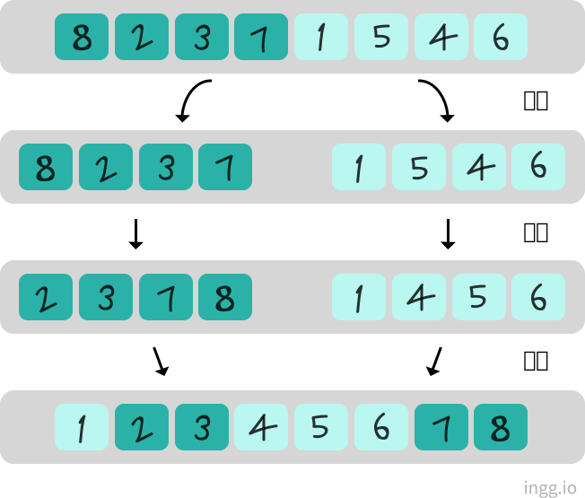
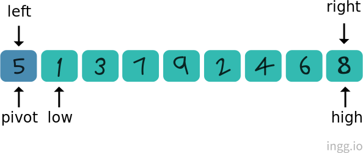
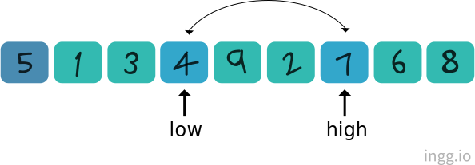
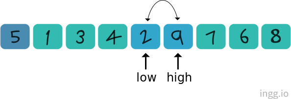
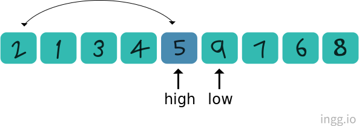
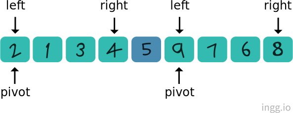

## Contents

[힙 정렬(Heap Sort)](#힙-정렬)<br/>
[병합 정렬(Merge Sort)](#병합-정렬)<br/>
[퀵 정렬(Quick Sort)](#퀵-정렬)<br/>
[기수 정렬(Radix Sort)](#기수-정렬)<br/>

<br>

## 힙 정렬

1. 부분트리에서 최댓값을 부모로 올리면서 완전이진트리를 최대힙으로 만든다.
2. 맨 마지막 노드와 루트노드를 교환한다.
3. 루트노드에 대해 다운힙 다운힙을 진행한다.

힙정렬의 시간복잡도는 n개의 데이터에 대해 2logn번의 비교를 진행하므로 O(NlogN)이다.

<br>

## 병합 정렬

병합 정렬은 '분할 정복'이라는 알고리즘 디자인 기법에 근거하여 만들어졌다. 단계는 다음과 같다.

- 1단계 분할 : 문제를 분할해나간다.
- 2단계 정복 : 분할된 문제를 해결한다.
- 3단계 결합 : 분할하여 해결한 결과를 결합한다.

병합 정렬은 데이터가 1개 남을때까지 분할한다. 재귀적인 구현을 위해 둘로 나누는 과정을 반복한다.



### 구현

```c
void MergeSort(int arr[], int left, int right);
```

첫번째 인자로 정렬대상이 담긴 배열 주소값, 두번째와 세번째 인자로 정렬대상의 범위정보를 인덱스값의 형태로 전달한다.

```c
void MergeSort(int arr[], int left, int right)
{
    int mid;

    if(left < right)
    {
        mid = (left + right) / 2;       //중간지점 계산

        //둘로 나눠서 각각 정렬
        MergeSort(arr, left, mid);      //left~mid 데이터 정렬
        MergeSort(arr, mid+1, right);   //mid+1~right 데이터 정렬

        MergeTwoArea(arr, left, mid, right);
    }
}
```

위의 그림을 구현한 결과이다. 재귀적으로 구현하여 데이터가 하나씩 구분이 될때까지 호출한다. left가 더 작다는 것은 더 나눌 수 있다는 것이므로 데이터가 하나씩 구분될때까지 `MergeSort`함수를 호출한다.

`MergeTwoArea`함수는 배열 arr의 **_left ~ mid_**, **_mid+1 ~ right_** 까지 각각 정렬되어 있으므로 하나의 정렬로 묶어서 배열 arr에 저장한다.

```c
void MergeTwoArea(int arr[], int left, int mid, int right)
{
    ...
    //병합한 결과를 담을 배열 sortArr의 동적 할당
    int * sortArr = (int *)malloc(sizeof(int)*(right+1));

    ...

    while(frontIdx<=mid && rearIdx<=right)
    {
        // 병합할 두 영역의 데이터 비교한다.
        // 정렬순서대로 sortArr에 하나씩 옮겨담는다.
    }

    if(frontIdx > mid)  //배열의 앞부분이 모두 sortArr에 옮겨졌으면
    {
        //배열의 뒷부분에 남은 데이터들을 sortArr에 그대로 옮긴다.
    }
    else    //배열의 뒷부분이 모두 sortArr에 옮겨졌다면
    {
        //배열의 앞부분에 남은 데이터들을 sortArr에 그대로 옮긴다.
    }

    ...

    free(sortArr);
}
```

`frontIdx`와 `rearIdx`에 각각 병합할 두 영역의 첫번째 위치정보(인덱스 값)이 담긴다. `frontIdx`는 배열의 앞쪽 영역, `rearIdx`는 배열의 뒷쪽 영역을 가리키며, `mid+1`의 위치부터 뒤쪽영역이 시작된다.


위와 같이 두 영역을 합치기 전 상태에서, 저장된 값들을 하나씩 증가하면서 비교한다.

- **2**와 **1**을 비교해서 **1**이 더 작으므로 **sortArr**로 이동시키고, **rearIdx**값을 하나 증가시킨다.
- **2**와 **4**를 비교해서 이번엔 **2**가 더 작으므로 **sortArr**로 이동시키고, **frontIdx**값을 하나 증가시킨다.
- **3**과 **4**를 비교해서 **3**이 더 작으므로 **sortArr**로 이동시키고, **frontIdx**값을 하나 증가시킨다.
- 이런식으로 7과 4비교, 7과 5비교, 7과 6을 비교한다.


이렇게 계속해서 비교하고 **_rearIdx_** 를 증가시키다보면 **_right_** 를 넘어서며, 비교가 끝나게된다. 즉 `rearIdx`가 `right`보다 커지는 경우는 배열의 뒤쪽 영역의 데이터들이 모두 옮겨진 상태이며 `frontIdx`가 `mid`보다 커지는 경우는 앞쪽 데이터들이 옮겨진 상태이다.

#### 전체코드

```c

#include <stdio.h>
#include <stdlib.h>


void MergeTwoArea(int arr[], int left, int mid, int right)
{
    int frontIdx = left;
    int rearIdx = mid+1;
    int i;

    int * sortArr = (int *)malloc(sizeof(int)*(right+1));
    int sortIdx = left;

    //배열 앞쪽과 뒤쪽영역에 비교대상이 남아있는 경우 반복
    while(frontIdx<=mid && rearIdx<=right)
    {
        if(arr[frontIdx] <= arr[rearIdx])
            sortArr[sortIdx] = arr[frontIdx++];
        else
            sortArr[sortIdx] = arr[rearIdx++];

        sortIdx++;
    }

    //반복문을 빠져나오면 어느 영역에 데이터가 남아있는지 확인해서 그대로 옮긴다.

    if(frontIdx > mid)
    {
        for(i=rearIdx; i<=right; i++, sortIdx++)
            sortArr[sortIdx] = arr[i];
    }
    else
    {
        for(i=frontIdx; i<=mid; i++, sortIdx++)
            sortArr[sortIdx] = arr[i];
    }

    //임시배열에 저장된 데이터 모두 이동
    for(i=left; i<=right; i++)
        arr[i] = sortArr[i];

    free(sortArr);
}

void MergeSort(int arr[], int left, int right)
{
    int mid;

    if(left < right)
    {
        mid = (left + right) / 2;

        MergeSort(arr, left, mid);      //둘로나눠서 각각 정렬
        MergeSort(arr, mid+1, right);

        MergeTwoArea(arr, left, mid, right);    //정렬된 두 배열 병합
    }
}

int main(void)
{
    int arr[7] = {3,2,4,1,7,6,5};
    int i;

    MergeSort(arr, 0, sizeof(arr)/sizeof(int)-1);

    for(i=0; i<7; i++)
        printf("%d ", arr[i]);

    printf("\n");
    return 0;
}
```

```
1 2 3 4 5 6 7
```

병합 정렬의 시간복잡도는 비교연산과 이동연산 모두 O(NlogN)이므로 **O(NlogN)** 이다.

<br>

## 퀵 정렬

퀵 정렬도 분할정복에 근거해 만들어진 정렬이다.



`left`는 정렬대상의 가장 왼쪽, `right`는 오른쪽, `pivot(피벗)`은 중심점을 뜻한다. `low`는 피벗을 제외한 가장 왼쪽 지점, `high`는 피벗을 제외한 가장 오른쪽 지점을 가리킨다.

`low`는 피벗보다 큰 값(우선순위가 낮은 데이터)을 만날때까지 오른쪽으로 이동하고, `high`는 피벗보다 작은 값(우선순위가 높은 데이터)을 만날때까지 왼쪽으로 이동한다.



이동한 후에 데이터를 서로 교환한다.

<br>



계속해서 `low`는 피벗보다 큰값, `high`는 피벗보다 작은 값을 찾아 이동시키고 교환한다.

<br>



`high`와 `low`가 교차되는 상태가 되면, 이번에는 `pivot`과 `high`를 교환한다.

<br>



`pivot`이 정렬되며 제위치를 찾게된다. 피벗의 왼쪽에는 피벗보다 작은값, 오른쪽에는 큰값들이 위치한다. 이제 왼쪽 영역과 오른쪽 영역에 퀵정렬 과정을 반복한다.

이 과정은 `left`와 `right`가 교차될때까지 (`left > right` 일때까지) 진행하면된다.

### 구현

```c
#include <stdio.h>

void Swap(int arr[], int idx1, idx2)
{
    int temp = arr[idx1];
    arr[idx1] = arr[idx2];
    arr[idx2] = temp;
}

int Partition(int arr[], int left, int right)
{
    int pivot = arr[left];  //피벗은 가장왼쪽
    int low = left+1;
    int high = right;

    while(low <= high)      //교차되지 않을때까지 반복
    {
        //피벗보다 큰 값을 찾음
        while(pivot >= arr[low] && low <= right)
            low++;          //low를 오른쪽으로 이동

        //피벗보다 작은값을 찾음. left+1로 high와 경계 검사한 이유는 가장왼쪽의 피벗 제외
        while(pivot <= arr[high] && high >= (left+1))
            high--;         //high를 왼쪽으로 이동

        if(low <= high)     //교차되지 않은 상태면 Swap 실행
            Swap(arr, low, high);
    }

    Swap(arr, left, high);  //피벗과 high가 가리키는 대상 교환
    return high;            //옮겨진 피벗의 위치정보 반환
}

void QuickSort(int arr[], int left, int right)
{
    if(left <= right)
    {
        int pivot = Partition(arr, left, right);
        QuickSort(arr, left, pivot-1);
        QuickSort(arr, pivot+1, right);
    }
}
```

#### main함수 예시

```c
int main(void)
{
    int arr[7] = {3,2,4,1,7,6,5};

    int len = sizeof(arr)/sizeof(int);
    int i;

    QuickSort(arr, 0, sizeof(arr)/sizeof(int)-1);

    for(i=0; i<len; i++)
        printf("%d ", arr[i]);

    printf("\n");
    return 0;
}
```

```
1 2 3 4 5 6 7
```

퀵 정렬의 시간복잡도는 **O(NlogN)** 이다. 데이터의 이동이 데이터 비교에비해 적고, 별도 메모리 공간이 필요하지 않으므로 동일한 빅오를 갖는 정렬 알고리즘들 보다 평균적으로 가장 빠르다.

<br>

## 기수 정렬

기수(radix)정렬은 데이터를 구성하는 기본요소, 즉 기수를 이용해서 정렬하는 방식이다. 예를들어 2진수는 0과1의 조합이므로 2진수 기수는 0과 1, 10진수에서는 0부터 9까지가 기수이다.

- LSD (Least Significant Digit) 기수 정렬

: 첫 번째 자릿수 부터 시작해서 정렬해 나간다. 작은 자릿수부터 큰자릿수까지 모두 비교해야 대소 값을 판단할 수 있다.

- MSD (Most Siginificant Digit) rltn wjdfuf

: 가장 큰 자릿수부터 정렬이 진행된다.

일반적으로 기수 정렬은 LSD 방식을 말한다. MSD는 모든 데이터에 일관적인 과정을 거치게 할 수 없고 추가적인 연산과 별도 메모리가 요구된다는 단점이 있다.

- LSD에서 첫번째 자리 숫자 추출: NUM / 1 % 10
- LSD에서 두번째 자리 숫자 추출: NUM / 10 % 10
- LSD에서 세번째 자리 숫자 추출: NUM / 100 % 10

기수 정렬의 빅오는 O(n)이다.
