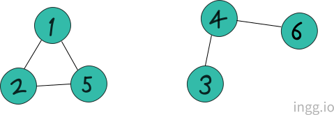

## 그래프의 탐색

> 목적 : 임의의 정점에서 시작하여 연결된 모든 정점을 1번씩 방문하는 것

- DFS : 깊이 우선 탐색
- BFS : 너비 우선 탐색

DFS는 하나의 정점에서 시작해서 최대한 갈 수 있는것 다 방문하고, 갈 수 없으면 돌아와서 다른걸 방문. 사람 한명이 왔다갔다하는 형태. Stack으로 구현

BFS는 한번에 방문. 사람이 복제되는 형태. Queue로 구현

### 깊이 우선 탐색(DFS)

스택은 더 이상 갈 수 있는것이 없을때 어디로 돌아갈지 기록하는 역할

#### 재귀 호출을 이용한 구현

- 인접 행렬 이용한 구현

```cpp
// dfs(x) : x를 방문했을때.
void dfs(int x){
    check[x] = true;
    for(int i=1; i<=n; i++){
        if(a[x][i] == 1 && check[i] == false){  //간선이 있고, 방문한적이 없으면 방문한다.
            dfs(i);
        }
    }
}
```

시간복잡도는 **O(V²)** : dfs의 시간복잡도는 정점의 개수이다. 그 정점과 연결된 간선을 다 살펴보려면 모든 정점 살펴야하니까 O(V), 모든 정점을 한번씩 방문해야하니까 V, 따라서 V²

<br>

- 인접 리스트 이용한 구현

```cpp
void dfs(int x){
    check[x] = true;
    for(int i=0; i<a[x].size(); i++){   //a[x]에 x와 연결된 모든 정점이 들어있으므로, 하나씩 보면서 검사하고 방문하지 않았으면 방문
        if(check[y] == false){
            dfs(y);
        }
    }
}
```

시간복잡도는 **O(V+E) = O(E)** (대부분 V<=E이므로)

<br>

### 너비 우선 탐색(BFS)

- 큐를 이용해서 지금 위치에서 갈 수 있는 것을 모두 큐에 넣음
- 큐에 **넣을때** 방문했다고 체크해야함

#### 인접 행렬

```cpp
queue<int> q;
check[1] = true;
q.push(1);      //시작점 넣고
while(!q.empty()){  //큐가 비어있지 않은동안
    int x = q.front(); q.pop(); //현재점 x빼주고
    for(int i=1; i<=n; i++){ //x랑 연결된 모든 정점을 다 검사
        if(a[x][i] == 1 && check[i] == false){
            check[i] = true;
            q.push(i);
        }
    }
}
```

시간복잡도 **O(V²)**

#### 인접 리스트

```cpp
queue<int> q;
check[1] = true;
q.push(1);
while(!q.empty()){
    int x = q.front(); q.pop();
    for(int i =1; i<a[x].size(); i++){
       int y = a[x][i];
       if(check[y] == false){
           check[y] = true; q.push(y);
       }
    }
}
```

시간복잡도는 **O(V+E) = O(E)**

<br>

## 연결 요소

- 나누어진 그래프 각각을 연결 요소라고 함
- 아래 그래프가 하나라고 하면, 연결 요소는 2개

<center></center>

- 연결 요소가 몇개인지 알아보려면, **_dfs_** 나 **_bfs_** 탐색을 이용
  - 두 알고리즘 목적이 하나의 시작점에서 연결된 모든 지점을 방문하는 알고리즘이기 때문

<br>

## 이분 그래프

<center></center>

- 그래프의 모든 간선이 A와 B사이에만 있는 그래프
  - A에 있는 정점끼리 연결된 간선이 없고
  - B에 있는 정점끼리 연결된 간선도 없음
- **_dfs_** 나 **_bfs_** 탐색으로 이분그래프인지 아닌지 알 수 있음

<br>

## BFS

- 모든 가중치가 1일때, 최단거리를 구하는 알고리즘

#### BFS를 이용해 해결할 수 있는 문제 조건

1. 최소 비용 문제이어야 한다.
2. 간선의 가중치가 1이어야 한다.
3. 정점과 간선의 개수가 적어야한다.

- 간선의 가중치가 문제에서 구하라고 하는 최소 비용과 의미가 일치해야 한다.
- 거리의 최소값을 구하는 문제라면 가중치는 거리를 의미해야 하고, 시간의 최소값을 구하는 문제라면 가중치는 시간을 의미해야 한다.
