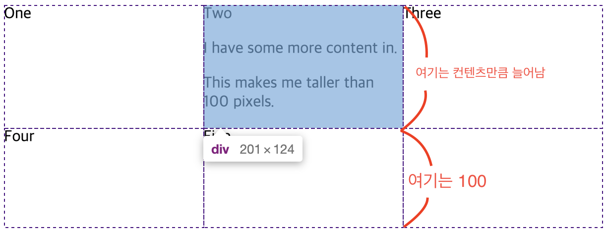
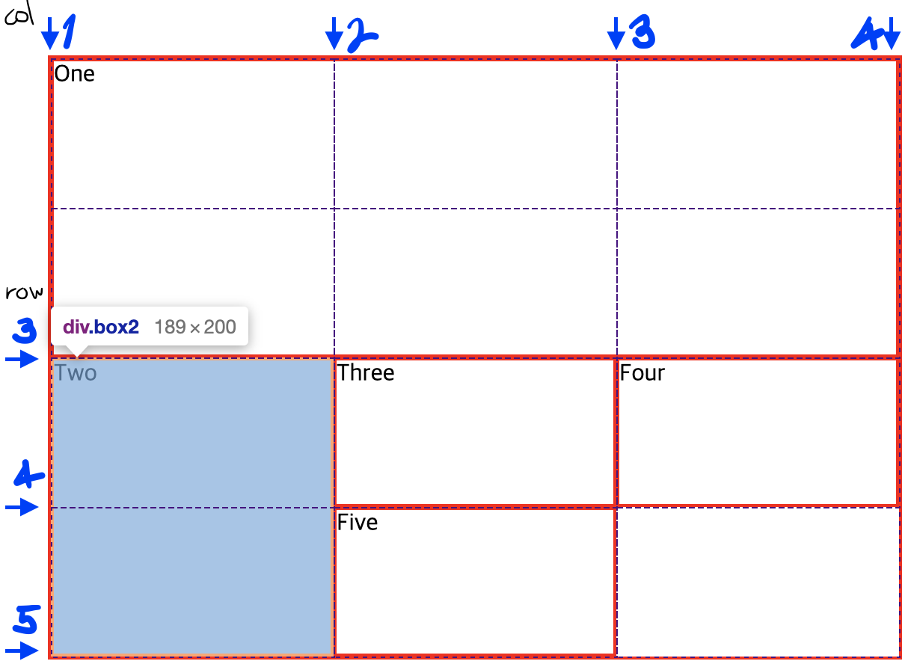

# CSS Grid Layout

> 그리드는 수평선과 수직선이 교차해서 이루어진 집합체이다. 각 요소는 이러한 열과 행으로 된 라인을 따라 생성된 그리드에 배치할 수 있다.

---

📌Content

- [그리드 컨테이너](#그리드-컨테이너)
- [그리드 트랙](#그리드-트랙)
  - fr
  - repeat()
  - 잠재적/명시적 그리드
  - minmax()
- [그리드 라인](#그리드-라인)

---

## 그리드 컨테이너

**그리드 컨테이너**는 `display: grid` 또는 `display: inline-grid`를 선언하여 만든다. 해당 요소 바로 밑에 있는 모든 자식요소는 **그리드 아이템**이 된다.

## 그리드 트랙

그리드의 행과 열은 `grid-template-columns`와 `grid-template-rows` 프로퍼티로 정의한다. 그리드 트랙은 그리드에 그려진 두 라인 사이의 공간을 말한다.

### fr

`fr` 단위는 그리드 컨테이너의 사용가능한 공간의 일정 비율을 나타낸다.

- 같은 너비의 트랙 3개를 생성

```html
<div class="wrapper">
  <div>One</div>
  <div>Two</div>
  <div>Three</div>
  <div>Four</div>
  <div>Five</div>
</div>
```

```css
.wrapper {
  display: grid;
  grid-template-columns: 1fr 1fr 1fr;
}
```


<br>

- `2fr`과 `1fr` 트랙 두개를 지정한 결과

```css
.wrapper {
  display: grid;
  grid-template-columns: 2fr 1fr 1fr;
}
```


<br>

- 고정된 크기의 트랙과 비율로 섞은 트랙

```css
.wrapper {
  display: grid;
  grid-template-columns: 500px 1fr 2fr;
}
```

첫번째 트랙은 500px를 차지하므로 이 고정너비는 사용가능한 공간에서 제외되고 나머지공간은 비율에 맞게 나뉜다.


<br>

### repeat()

많은 트랙은 포함하는 그리드는 `repeat()`으로 트랙의 전체나 일부분을 반복해서 나열할 수 있다.

예를들어 아래와 같이 정의된 그리드의 경우

```css
.wrapper {
  display: grid;
  grid-template-columns: 1fr 1fr 1fr;
}
```

아래와 같이 작성할 수도 있다.

```css
.wrapper {
  display: grid;
  grid-template-columns: repeat(3, 1fr);
}
```

<br>

- 목록 중 일부분에만 사용하기

```css
.wrapper {
  display: grid;
  grid-template-columns: 20px repeat(6, 1fr) 20px;
}
```


처음에 20px 트랙을 생성하고 그다음 `1fr` 트랙을 6번 반복해서 채운후 마지막에 다시 20px 트랙을 붙인 그리드이다.

<br>

- 트랙의 목록을 함께 나열하기 : 트랙의 반복 패턴 생성

```css
.wrapper {
  display: grid;
  grid-template-columns: repeat(5, 1fr 2fr);
}
```


그리드가 10개의 트랙으로 구성되고, `1fr` 트랙 다음에 `2fr` 트랙이 위치하며 `5`번 반복된다. (12, 12, 12, 12, 12 순으로)

<br>

### 잠재적 그리드, 명시적 그리드

- `grid-template-columns` 프로퍼티를 써서 세로 열의 트랙을 정의하면 가로 행은 그리드가 콘텐츠에 맞게 알아서 새로운 행을 만든다. 이렇게 만들어진 행은 **잠재적 그리드** 안에서 생성된다.

- **명시적 그리드**는 `grid-template-columns` 및 `grid-template-rows`로 직접 정의한 행과 열로 이루어진 그리드를 말한다.

- 잠재적 그리드에서 생성된 트랙의 크기는 `grid-auto-rows` 및 `grid-auto-columns` 프로퍼티를 써서 지정해줄 수도 있다.

잠재적 그리드에서 생성된 트랙의 높이가 _200px_ 이 되도록 `grid-auto-rows`를 사용한 예시 :

```css
.wrapper {
  display: grid;
  grid-template-columns: repeat(3, 1fr);
  grid-auto-rows: 200px;
}
```


<br>

### minmax()

- 명시적 그리드를 설정하거나 자동으로 생성된 행이나 열의 크기를 정의할 때, 트랙의 최소 크기를 정해도 나중에 추가되는 콘텐츠에 맞게 늘어나도록 하려면 `minmax()`함수를 사용한다.

아래 코드는 가로 행의 높이가 _100px_ 밑으로 줄어드는 것은 막고, 콘텐츠가 일정 높이까지 늘어나면 그에 따라 행의 높이도 같이 늘어난다.

```html
<div class="wrapper">
  <div>One</div>
  <div>
    Two
    <p>I have some more content in.</p>
    <p>This makes me taller than 100 pixels.</p>
  </div>
  <div>Three</div>
  <div>Four</div>
  <div>Five</div>
</div>
```

```css
.wrapper {
  display: grid;
  grid-template-columns: repeat(3, 1fr);
  grid-auto-rows: minmax(100px, auto);
}
```



자동으로 생성된 행의 높이는 최소 _100px_ 이고 최댓값은 _**auto**_ 이다. _**auto**_ 를 지정하면 가로 행에 있는 가장 높은 셀의 크기만큼 자동으로 늘어나서 부족한 공간을 메꿔준다.

<br>

## 그리드 라인

- 그리드 라인을 이용하여 아이템 배치하기

```html
<div class="wrapper">
  <div class="box1">One</div>
  <div class="box2">Two</div>
  <div class="box3">Three</div>
  <div class="box4">Four</div>
  <div class="box5">Five</div>
</div>
```

```css
.wrapper {
  display: grid;
  grid-template-columns: repeat(3, 1fr);
  grid-auto-rows: 100px;
}

.box1 {
  grid-column-start: 1;
  grid-column-end: 4;
  grid-row-start: 1;
  grid-row-end: 3;
}

.box2 {
  grid-column-start: 1;
  grid-row-start: 3;
  grid-row-end: 5;
}
```



**box1**은 세로 열 1번~4번 라인까지 (그리드 맨 오른쪽라인), 가로 행은 1번~3번 라인까지이고<br>**box2**는 세로 열 1번~트랙하나까지 (기본값을 사용해서 마지막 라인은 지정할 필요없다), 가로 행 3번~5번 라인까지이다. 나머지 box들은 그리드 빈 자리에 자동으로 배치된다.
