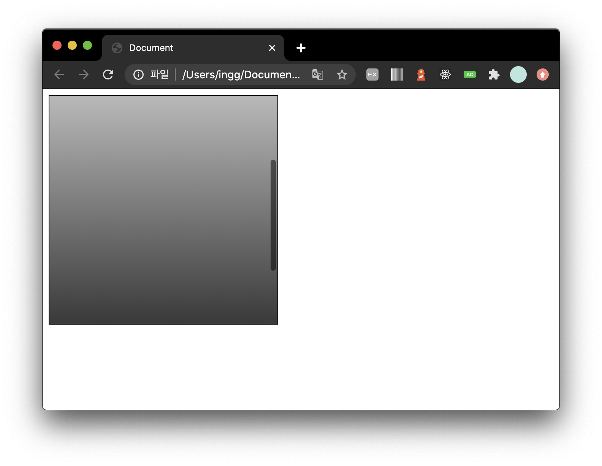

# CSS Tip

> CSS 팁들을 짧게 기록하는 파일

---

<br>

## 1. em과 rem차이

> em과 rem 모두 길이가 유연한 가변 단위로서, 디자인에 설정된 폰트 크기에 따라 브라우저에 의해 픽셀값으로 변환됨

- `rem` 단위를 쓰면, 변환된 픽셀 크기는 페이지 최상위(root) 요소. 즉, html 요소의 폰트 크기가 기준

- `em` 단위를 쓰면 변환되는 픽셀값은 스타일을 지정한 요소의 폰트 크기를 곱한 값

<!-- 참고 : [https://webdesign.tutsplus.com/ko/tutorials/comprehensive-guide-when-to-use-em-vs-rem--cms-23984](https://webdesign.tutsplus.com/ko/tutorials/comprehensive-guide-when-to-use-em-vs-rem--cms-23984) -->

<br>

## 2. CSS Resetting

주로 [Eric Meyer의 Reset.css](https://meyerweb.com/eric/tools/css/reset/)를 사용한다.

#### 쓰는이유 ?

브라우저별로 태그에 대한 기본 스타일링이 다르기 때문에, 기본적인 것들을 초기화해서 사용한다.

<br>

## 3. [scroll-behavior Property](https://www.w3schools.com/cssref/pr_scroll-behavior.asp)

> 부드러운 스크롤 기능을 추가할 수 있다.

```css
html {
  scroll-behavior: smooth;
}
```

### 브라우저 지원상황

- Chrome : 61.0
- IE / Edge : 79.0
- FireFox : 36.0
- Safari : Not supported

### Property Value

- auto : Allows a straight jump "scroll effect" between elements within the scrolling box. This is default
- smooth : Allows a smooth animated "scroll effect" between elements within the scrolling box.
- initial : Sets this property to its default value.
- inherit : Inherits this property from its parent element.

<br>

## 4. [place-content](https://developer.mozilla.org/ko/docs/Web/CSS/place-content)

> align-content와 justify-content의 단축 속성이다.

```css
place-content: <align-content> <justify-content>;
```

첫번째 값은 `align-content` 속성값, 두번째 값은 `justify-content` 속성값이다.

```css
/* Positional alignment */
/* align-content는 left와 right값을 가지지않음 */
place-content: center start;
place-content: start center;
place-content: end left;
place-content: flex-start center;
place-content: flex-end center;

/* Baseline alignment */
/* justify-content는 baseline값을 가지지않음 */
place-content: baseline center;
place-content: first baseline space-evenly;
place-content: last baseline right;

/* Distributed alignment */
place-content: space-between space-evenly;
place-content: space-around space-evenly;
place-content: space-evenly stretch;
place-content: stretch space-evenly;

/* Global values */
place-content: inherit;
place-content: initial;
place-content: unset;
```

- Edge(IE) 브라우저에서 지원하지 않는다.

<br>

## 5. [속성 선택자 (Attribute selectors)](https://developer.mozilla.org/ko/docs/Web/CSS/Attribute_selectors)

```css
/* title이라는 이름의 특성을 가진 <a>를 선택 */
a[title] {
  color: purple;
}

/* href이 정확히 "https://example.org"인 <a>를 선택*/
a[href="https://example.org"]
{
  color: green;
}

/* href이 "example"를 포함하는 <a>를 선택 */
a[href*="example"] {
  font-size: 2em;
}

/* "#"으로 시작하는 href를 가진 <a>를 선택 */
a[href^="#"] {
  font-style: italic;
}

/* ".org"로 끝나는 href를 가진 <a>를 선택 */
a[href$=".org"] {
  font-style: italic;
}

/* class 속성이 "logo"를 포함하는 <a>를 선택*/
a[class~="logo"] {
  padding: 2px;
}
```

<br>

## 6. [overflow](https://developer.mozilla.org/ko/docs/Web/CSS/overflow)

- 요소의 콘텐츠가 너무 커서 요소의 블록에 맞출 수 없을 때의 처리법을 지정

```css
overflow: visible;
overflow: hidden;
overflow: scroll;
overflow: auto;
```

- 예시

```html
<div class="outer">
  <div class="inner"></div>
</div>
```

```css
.outer {
  border: 1px solid black;
  height: 300px;
  width: 300px;
  overflow: auto;
}
.inner {
  width: 100%;
  height: 600px;
  background: linear-gradient(white, black);
}
```

<!--  -->


<br>

## 7. user-select

- 사용자가 텍스트를 선택할 수 있는지 지정

```css
/* none: 선택하지 못하게 막는다 */
user-select: none;
```
