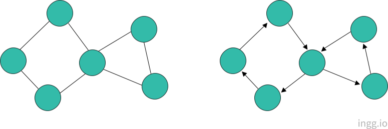
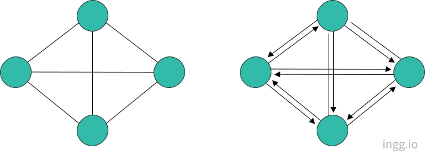
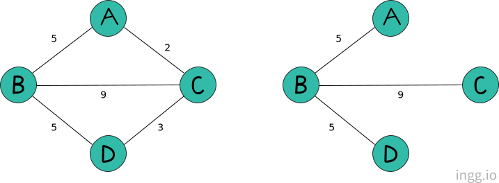
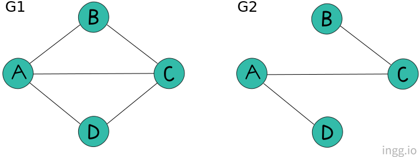
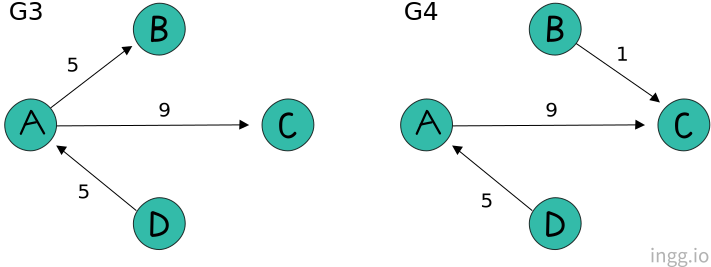

## 그래프(Graph)

그래프 알고리즘은 수학자 '오일러'에 의해 고안됐고 '쾨니히스베르크의 다리 문제'를 풀기위해 사용하였다. (모든 다리를 한번씩만 건너 처음장소로 돌아올 수 있는가?)

- 정점(vertex) : 연결 대상이 되는 개체 또는 위치
- 간선(edge) : 이들 사이의 연결

정점별로 연결된 간선의 개수가 모두 짝수여야, 한번씩만 지나서 원점으로 되돌아올 수 있다.

방향성이 없는 그래프를 **무방향 그래프**라고 하고, 방향성이 있는 그래프를 **방향 그래프**또는 **다이그래프**라고 한다.

 

### 완전그래프

**완전그래프**는 각 정점에서 다른 모든 정점을 연결한 그래프이다. 동일한 그래프인 경우 방향그래프의 간선의 수는 무방향그래프의 두배이다.

 

### 가중치 그래프, 부분 그래프

**가중치 그래프**는 가중치를 표시한 그래프이다. 가중치는 정점을 이동하는데 드는 시간 등을 표시할 수 있다.

**부분 그래프**는 일부 정점 및 간선으로 이루어진 그래프이다.

 

### 집합 표현

그래프는 정점과 간선의 집합이므로 집합의 표기법으로 나타낼 수 있다.

그래프 **G**의 정점 집합은 **_V(G)_** 로, 간선 집합은 **_E(G)_** 로 표시한다. 무방향 그래프에서는 연결하는 간선을 괄호`()`로 표시한다.

- 그래프 G1 표기

  - V(G1) = {A,B,C,D}
  - E(G1) = **{(A,B), (A,C), (A,D), (B,C), (C,D)}**

- 그래프 G2 표기
  - V(G2) = {A,B,C,D}
  - E(G2) = **{(A,C), (A,D), (B,C)}**

 

반면 방향 그래프에서는 간선을 괄호`<>`로 표시한다.

- 그래프 G3 표기

  - V(G3) = {A,B,C,D}
  - E(G3) = **{<A,B>, <A,C>, <D,A>}**

- 그래프 G4 표기
  - V(G4) = {A,B,C,D}
  - E(G4) = **{<A,C>, <B,C>, <D,A>}**
