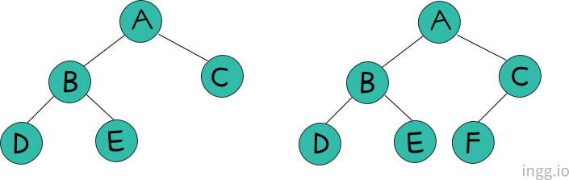
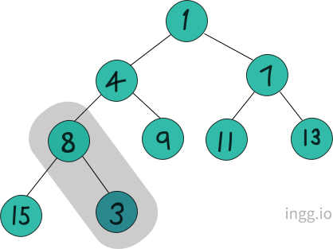
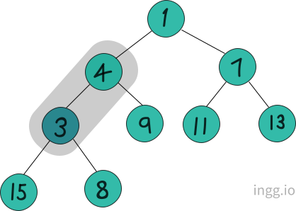
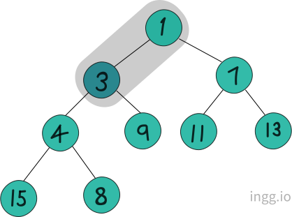
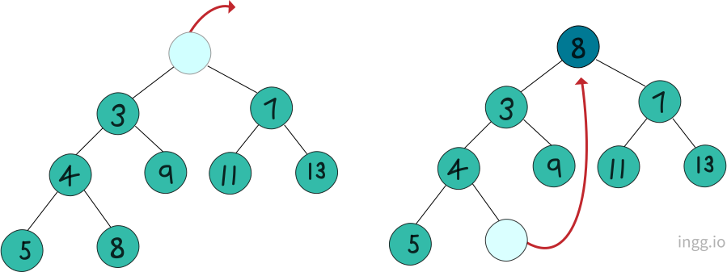
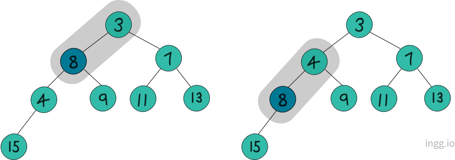
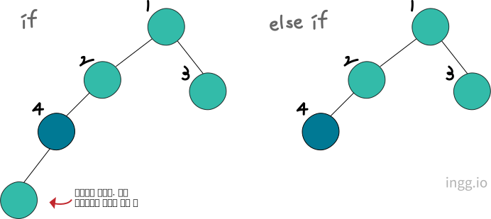
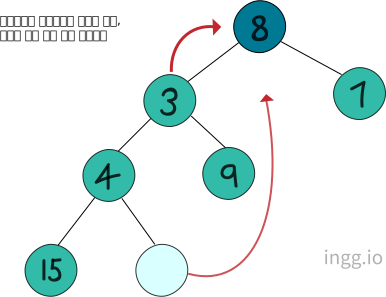
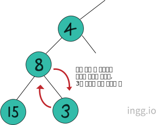

## 우선순위 큐(Priority Queue)

큐가 대기 행렬이라면 우선순위 큐는 응급상황이다. 우선순위 큐는 세가지로 구현할 수 있다.

- 배열 기반으로 구현
- 연결리스트 기반으로 구현
- 힙(heap)을 이용

배열의 경우에는 데이터를 삽입, 삭제하는 과정에서 데이터를 한칸씩 이동시켜야한다는 단점이 있다. 또한 배열과 연결리스트는 최악의 경우 삽입 위치를 찾기위해 모든 데이터와 우선순위 비교를 해야할 수도 있다는 단점이 있다.

## 힙(Heap)

힙은 **완전 이진 트리**이다. 완전 이진 트리는 잎 노드들이 트리의 왼쪽부터 차곡차곡 채워진 트리이다.

<!--  -->

<center></center>

<br>

### 힙에 데이터 삽입하기

힙의 삽입 연산은 세 단계로 진행된다.

1. 먼저 힙의 최고 깊이, 최 우측에 새 노드를 삽입한다.
2. 그리고 삽압한 노드를 부모 노드와 비교한다. 부모 노드보다 크면 제 위치에 삽입된 것이므로 연산을 종료한다.
3. 부모 노드보다 작다면 부모 노드와 삽입한 노드의 위치를 바꾼다. 바꾸고 나면 두번째 단계를 다시 진행한다.

<!--  -->

<center></center>

예를들어, 이러한 최소 힙이 있고 숫자 3을 추가한다고 하자. 위와 같이 마지막 위치에 노드를 추가하고 부모노드와 우선순위를 비교한다. 부모 노드보다 크므로 위치를 바꿔야 한다.

<center></center>

그리고 다시 부모 노드와 비교한다. 이번에도 부모 노드의 우선순위가 낮으므로 위치를 바꾼다.

<center></center>

마지막으로 루트 노드와 비교하는데, 부모 노드보다 우선순위가 높지 않으므로 제 위치를 찾은 것이다.

<br>

### 힙에서 데이터 삭제하기

삭제 과정은 먼저 루트 노드를 삭제하고 최고 깊이, 최 우측에 있는 노드를 루트 노드로 옮겨온다.

<center></center>

그 다음으로 노드를 삽입할 때와 유사하게, 제자리를 찾게 한다. 옮겨온 노드의 양쪽 자식을 비교하여 작은 쪽 자식과 위치를 교환한다.

<center></center>

이렇게 빈 공간을 채워서 삭제 과정을 마무리한다.

<br>

### 힙 구현

힙이 트리라서 연결리스트로 구현해야할 것 같지만 연결리스트 기반 구현은 새로운 노드를 힙의 마지막 위치에 추가하는 것이 어렵다는 문제가 있다. 그래서 힙은 배열로 구현한다.

### 노드의 인덱스 값 얻기

배열 기반 힙을 구현하려면 인덱스 값을 얻는 방법을 알아야 한다.

- 왼쪽 자식 노드의 인덱스 값 : 부모 노드의 인덱스 값 \* 2
- 오른쪽 자식 노드의 인덱스 값 : 부모 노드의 인덱스 값 \* 2 + 1
- 부모 노드의 인덱스 값 : 자식 노드의 인덱스 값 / 2

### SimpleHeap.h

```c
#ifndef __SIMPLE_HEAP_H__
#define __SIMPLE_HEAP_H__

#define TRUE 1
#define FALSE 0

#define HEAP_LEN 100

typedef int Priority;
typedef char HData;

typedef struct _heapElem
{
    Priority pr;        //값이 작을수록 높은 우선순위
    HData data;
} HeapElem;

typedef struct _heap
{
    int numOfData;
    HeapElem heapArr[HEAP_LEN];
} Heap;

void HeapInit(Heap * ph);
int HIsEmpty(Heap * ph);

void HInsert(Heap * ph, HData data, Priority pr);
HData HDelete(Heap * ph);

#endif
```

- 힙은 완전 이진 트리
- 힙의 구현은 배열을 기반으로 하며 인덱스가 0인 요소는 비워둠
- 힙에 저장된 노드 개수 = 마지막 노드 고유번호
- 노드의 고유번호 = 노드가 저장되는 배열의 인덱스 값
- 우선순위를 나타내는 정수 값이 작을수록 높은 우선순위를 나타냄

### SimpleHeap.c

```c
#include "SimpleHeap.h"

void HeapInit(Heap * ph)    //힙 초기화
{
    ph->numOfData = 0;
}

int HIsEmpty(Heap * ph)     //힙이 비었는지 확인
{
    if(ph->numOfData == 0)
        return TRUE;
    else
        return FALSE;
}

int GetParentIDX(int idx)   //부모 노드의 인덱스 값 반환
{
    return idx/2;
}

int GetLChildIDX(int idx)   //왼쪽 자식 노드의 인덱스 값 반환
{
    return idx*2;
}

int GetRChildIDX(int idx)   //오른쪽 자식 노드의 인덱스 값 반환
{
    return GetLChildIDX(idx)+1;
}

int GetHiPriChildIDX(Heap * ph, int idx)
{
    if(GetLChildIDX(idx) > ph->numOfData)
        return 0;
    else if(GetLChildIDX(idx) == ph->numOfData)
        return GetLChildIDX(idx);
    else
    {
        if(ph->heapArr[GetLChildIDX(idx)].pr > ph->heapArr[GetRChildIDX(idx)].pr)
            return GetRChildIDX(idx);
        else
            return GetLChildIDX(idx);
    }
}

void HInsert(Heap * ph, HData data, Priority pr)
{
    int idx = ph->numOfData+1;
    HeapElem nelem = {pr, data};

    while(idx != 1)
    {
        if(pr < (ph->heapArr[GetParentIDX(idx)].pr))
        {
            ph->heapArr[idx] = ph->heapArr[GetParentIDX(idx)];
            idx = GetParentIDX(idx);
        }
        else
            break;
    }

    ph->heapArr[idx] = nelem;
    ph->numOfData += 1;
}

HData HDelete(Heap * ph)
{
    HData retData = (ph->heapArr[1]).data;
    HeapElem lastElem = ph->heapArr[ph->numOfData];

    int parentIdx = 1;
    int childIdx;

    while(childIdx = GetHiPriChildIDX(ph, parentIdx))
    {
        if(lastElem.pr <= ph->heapArr[childIdx].pr)
            break;
        ph->heapArr[parentIdx] = ph->heapArr[childIdx];
        parentIdx = childIdx;
    }

    ph->heapArr[parentIdx] = lastElem;
    ph->numOfData -= 1;
    return retData;
}
```

<br>

#### GetHiPriChildIDX 함수

```c
int GetHiPriChildIDX(Heap * ph, int idx)
{
    if(GetLChildIDX(idx) > ph->numOfData)
        return 0;
    else if(GetLChildIDX(idx) == ph->numOfData)
        return GetLChildIDX(idx);
```

if문은 자식 노드가 존재하지 않을때를 말한다. numOfData는 마지막 노드의 인덱스값이므로 인덱스값을 얻어온게(존재하지 않는 노드의 인덱스값) 마지막 인덱스 값보다 크다면 자식 노드가 존재하지 않는 것이다.

<center></center>

else if는 자식노드가 왼쪽 자식 노드 하나만 존재할때를 의미한다. 자식노드의 인덱스 값이 마지막 노드인지 판단한다.

```c
    else
    {
        if(ph->heapArr[GetLChildIDX(idx)].pr > ph->heapArr[GetRChildIDX(idx)].pr)
            return GetRChildIDX(idx);
        else
            return GetLChildIDX(idx);
    }
}
```

else는 자식 노드가 둘다 존재할때를 말한다. if문에서는 오른쪽 자식 노드의 우선순위가 높으면 오르쪽 자식 노드의 인덱스 값을 반환한다 (값이 작을수록 높은 우선순위). else는 왼쪽자식 노드의 우선순위가 높으면 왼쪽자식 노드의 인덱스 값을 반환한다.

<br>

#### HDelete 함수

```c
HData HDelete(Heap * ph)
{
    HData retData = (ph->heapArr[1]).data;
    HeapElem lastElem = ph->heapArr[ph->numOfData];

    int parentIdx = 1;      //루트노드가 위치해야할 인덱스 값 저장
    int childIdx;
```

HDelete 함수는 마지막 노드를 임시 저장하여 그에 맞는 자리를 찾아나간다. 첫줄은 반환을 위해 삭제할 데이터를 백업한다. `[1]`은 루트노드의 인덱스이다. `parentIdx`에는 마지막 노드가 저장될 위치 정보가 담긴다.

```c
    while(childIdx = GetHiPriChildIDX(ph, parentIdx))
    {
        if(lastElem.pr <= ph->heapArr[childIdx].pr)
            break;      // 제자리 찾으면 반복문 탈출
        ph->heapArr[parentIdx] = ph->heapArr[childIdx];
        parentIdx = childIdx;
    }

    ph->heapArr[parentIdx] = lastElem;  //마지막 노트 최종 저장
    ph->numOfData -= 1;
    return retData;
}
```

첫줄은 1이라는 인덱스 기준으로 자식노드를 살펴본다. 1이라는 값을 이용해서 자식노드 중 누가 우선순위가 더 높은지 확인해서 그 우선순위가 높은 자식노드의 인덱스 값을 얻어온다.

그다음 if문에서는 백업받아놓은 마지막 노드의 우선순위와 1이라는 인덱스 값을 이용해 얻어온 자식노드의 우선순위를 비교한다. 마지막 노드의 우선순위가 높으면 반복문을 탈출한다.

<center></center>

`ph->heapArr[parentIdx] = ph->heapArr[childIdx];` 은 마지막 노드보다 우선순위가 높으니, 비교대상 노드의 위치를 한 레벨 올린다. `parentIdx = childIdx;`는 마지막 노드가 저장될 위치정보를 한 레벨 내린다. 반복문을 빠져나오면 `parentIdx`에는 마지막 노드의 위치정보가 저장된다.

그리고 `numOfData`값을 1빼주고 삭제한 노드의 데이터를 반환하고 연산이 끝난다.

<br>

#### HInsert 함수

HInsert함수도 마찬가지로 임시공간에 저장해두고 인덱스 값만 유지한다.

```c
void HInsert(Heap * ph, HData data, Priority pr)
{
    int idx = ph->numOfData+1;
    HeapElem nelem = {pr, data};    //새 노드의 생성 및 초기화
```

`int idx = ph->numOfData+1;`는 새 노드가 저장될 인덱스 값을 `idx`에 저장하는데, 마지막 노드 그 다음 위치이므로 **+1** 이다.

```c
    while(idx != 1)
    {
        if(pr < (ph->heapArr[GetParentIDX(idx)].pr))    //새 노드의 우선순위가 높다면
        {
            ph->heapArr[idx] = ph->heapArr[GetParentIDX(idx)];
            idx = GetParentIDX(idx);
        }
        else        //새 노드의 우선순위가 높지않으면
            break;
    }

    ph->heapArr[idx] = nelem;      //새 노드를 배열에 저장
    ph->numOfData += 1;
}
```

`while`문은 새 노드가 저장될 위치가 루트 노드의 위치가 아니면 반복한다. if문은 부모노드 인덱스 값을 얻어와서, 새 노드와 부모노드의 우선순위를 비교한다. 새 노드의 우선순위가 높지 않다면 빠져나간다.

`ph->heapArr[idx] = ph->heapArr[GetParentIDX(idx)];`는 새 노드의 우선순위가 높으므로 부모노드를 한 레벨 내린다.

<center></center>

`idx = GetParentIDX(idx);`는 부모노드의 인덱스 값을 얻어서 `idx`에 저장한다.

<br>

### SimpleHeapMain.c

```c
#include <stdio.h>
#include "SimpleHeap.h"

int main(void)
{
    Heap heap;
    HeapInit(&heap);

    HInsert(&heap, 'A', 1);
    HInsert(&heap, 'B', 2);
    HInsert(&heap, 'C', 3);
    printf("%c \n", HDelete(&heap));

    HInsert(&heap, 'A', 1);
    HInsert(&heap, 'B', 2);
    HInsert(&heap, 'C', 3);
    printf("%c \n", HDelete(&heap));

    while(!HIsEmpty(&heap))
        printf("%c \n", HDelete(&heap));

    return 0;
}
```

- 실행결과

```
A
A
B
B
C
C
```

우선순위가 높은 데이터들부터 꺼내졌음을 알 수 있다.
