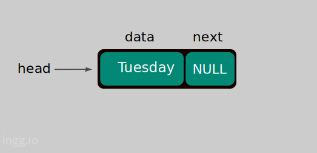
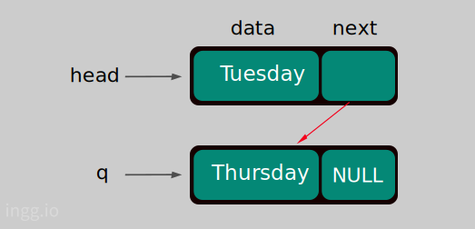
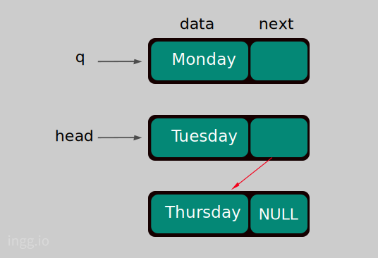
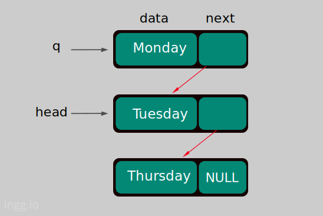
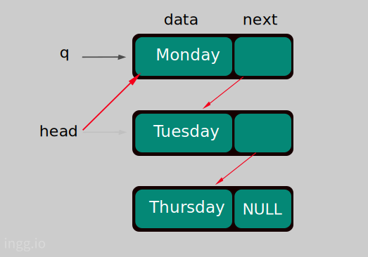
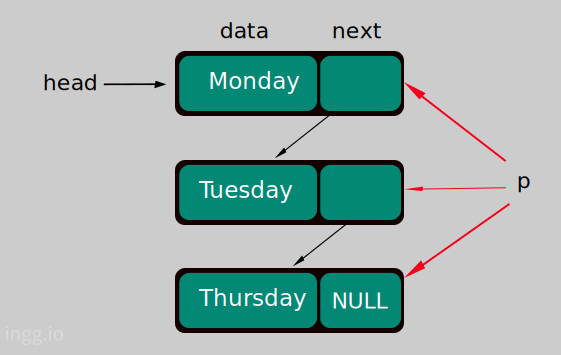
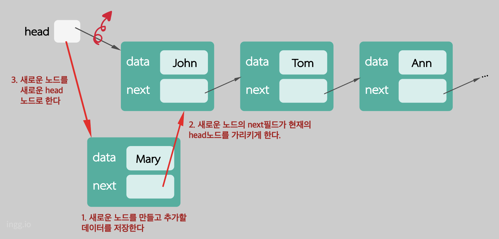
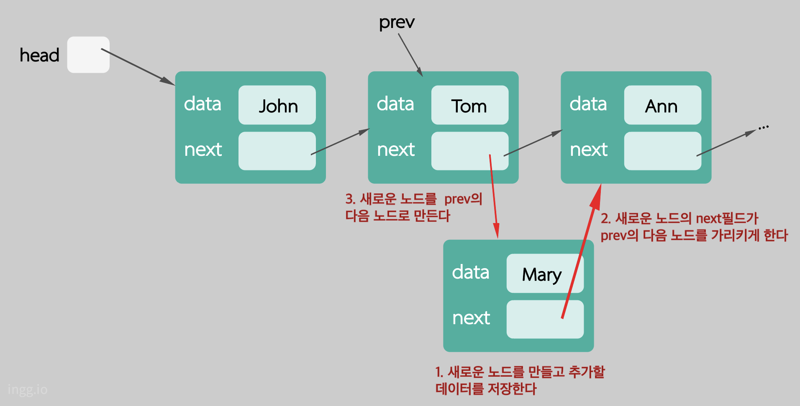
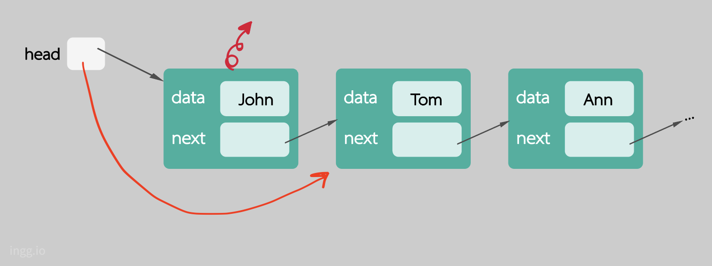
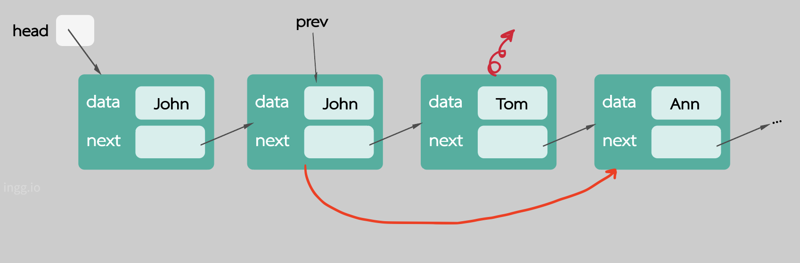

## 리스트(List)

- 기본적인 연산 : 삽입(insert), 삭제(remove), 검색(search)등
- 리스트를 구현하는 대표적인 두 가지 방법: **배열, 연결리스트**

### 배열의 단점

- 크기가 고정 - reallocation이 필요
- 리스트의 중간에 원소를 삽입하거나 삭제할 경우 다수의 데이터를 옮겨야함

### 연결리스트

- 다른 데이터의 이동없이 중간에 삽입이나 삭제가 가능
- 길이의 제한이 없음
- 그러나 랜덤 엑세스가 불가능

### 노드

- 각각의 노드는 필요한 **데이터 필드**와 하나혹은 그 이상의 **링크 필드**로 구성됨
- 링크 필드는 다음 노드의 주소를 저장
- 첫번째 노드의 주소는 따로 저장해야함
- 마지막 노드의 _**next**_ 필드에는 **_NULL_** 을 지정하여 연결리스트의 끝임을 표시

## 링크드 리스트란?

### Node

> 연결리스트에서 하나의 노드를 표현하기 위한 구조체이다. 각 노드에 저장될 데이터는 하나의 문자열이라고 가정하자.

```c
struct node{
    char *data;
    struct node *next;      //다음 노드의 주소를 저장할 필드이다.
}
typedef struct node Node;
Node *head = NULL;          //연결리스트의 첫 번째 노드의 주소를 저장할 포인터이다.
```

### 예제프로그램

```c
int main(){
    head = (Node *)malloc(sizeof(Node));
    head->data = "Tuesday";
    head->next = NULL;

    Node *q = (Node *)malloc(sizeof(Node));
    q->data = "Thursday";
    q->next = NULL;
    head->next = q;


    q = (Node *)malloc(sizeof(Node));
    q->data = "Monday";
    q->next = head;
    head = q;

    Node *p = head;
    while(p!=NULL){
        printf("%s\n", p->data);
        p = p->next;
    }
}
```

- 배열을 사용할때는 미리 배열을 만들어놓고 데이터를 하나씩 필요할때마다 저장하는 형식이다. 데이터를 저장할 메모리를 미리 잡아놓고 데이터를 하나씩 저장해나간다.

- 연결리스트에서는 노드가 10개인 연결리스트를 만든다고해서 노드10개를 미리 만들지 않고 노드가 필요할때 그때그때 노드를 하나씩 만들어서 연결리스트에 추가하는 형식이다.

- 노드는 동적메모리 할당 `malloc` 으로 만든다.

<br>

### #1

```c
    head = (Node *)malloc(sizeof(Node));
    head->data = "Tuesday";
    head->next = NULL;
```

<center></center>

지금은 노드가 하나밖에 없으니까 _**next**_ 노드는 **_NULL_** 이다. 이 하나의 노드가 첫번째 노드가 된다. 그래서 이 블록에서는 _**head**_ 가 첫번째 노드를 가리키게 만들어주는 역할을 한다.

- `head->data = "Tuesday";` : _**head**_ 가 가르키는 노드의 데이터 필드에 "Tuesday" 저장

- `head->next = NULL;` : 첫번째 노드이자 마지막 노드이므로 **_NULL_** 값을 저장해서 이것이 마지막 노드임을 표시

<br>

### #2

그 다음에는 또다른 노드를 만들어서 두번째 노드를 첫번째 노드의 _**next**_ 노드로 (Tuesday 다음에 Thursday가 오도록) 만들어보자.

```c
    Node *q = (Node *)malloc(sizeof(Node));
    q->data = "Thursday";
    q->next = NULL;
    head->next = q;
```

<center></center>

- Thursday를 저장하기위한 노드를 만들고 이 노드의 주소를 q라는 포인터 변수에 저장한다.

- `q->data = "Thursday";`, `q->next = NULL;` : q의 데이터와 _**next**_ 에 "Thursday"와 **_NULL_** 을 각각 저장한다.

- `head->next = q;` : Tuesday의 _**next**_ 필드에 Thursday노드의 주소를 넣어준다. 즉, _**head**_ 가 가리키고있는 노드의 _**next**_ 필드에 q를 저장한다.

<br>

### #3

이번엔 "Monday"라는 노드를 만들어서 "Tuesday"앞에 넣어보자. 연결리스트의 맨 앞에 새로운 노드를 만든다. 아까와 마찬가지로 새로운 노드를 만들고 포인터 변수 q가 새로 만들어진 노드를 가리키도록 한다.

```c
    q = (Node *)malloc(sizeof(Node));
    q->data = "Monday";
    q->next = head;
    head = q;
```

- `q->data = "Monday";` : 먼저 q의 데이터필드에 "Monday"를 저장한다.

<center></center>

- `q->next = head;` : Monday를 앞쪽에 넣으려면 Monday의 _**next**_ 노드가 Tuesday가 되어야한다. 따라서 q가 가리키고있는 노드의 _**next**_ 필드에 Tuesday노드의 주소(포인터변수 _**head**_ )를 쓴다.

<center></center>

- `head = q;` : 이제 더이상 Tuesday가 첫번째 노드가 아니므로 _**head**_ 가 Monday를 가리키도록 바꾼다. Monday의 주소는 q이므로 `head = q;`

<center></center>

<br>

### #4

마지막 부분은 이렇게 만들어진 연결리스트의 각 노드에 저장된 데이터를 순서대로 출력한다.

```c
    Node *p = head;
    while(p!=NULL){
        printf("%s\n", p->data);
        p = p->next;
    }
```

<center></center>

- `Node *p = head;` : p라는 포인터 변수가 선언되고 현재 _**head**_ 에 저장된 값을 p에 쓴다. 따라서 p가 첫번째 노드를 가리키게 된다.

- `while(p!=NULL) {...}` : p가 **_NULL_** 이 아닌 동안 p.data를 출력한다. 현재 p가 "Monday"를 가리키고 있으니까 거기 저장된 데이터 "Monday"를 출력하고 다음 노드로 넘어간다. p가 가리키는 노드의 _**next**_ 필드에 저장된 값이 **_NULL_** 이 되면 `p = NULL`이 되면서 while문을 빠져나온다.

- `p = p->next;` : 그다음 노드로 넘어가는 일을 한다. 현재 p가 가리키고있는 노드의 _**next**_ 필드에 저장된 값(그다음 노드의 주소)을 p에 쓴다.

<br>

## 연결리스트의 맨 앞에 새로운 노드 삽입하기



```c
Node *temp = (Node *)malloc(sizeof(Node));
temp->data = "Mary"
temp->next = head;
head = temp;
```

temp라는 포인터 변수를 임시로 만들어서 새로 만들어진 노드의 주소를 보관하도록 하고, temp가 가리키는 노드의 data필드에 저장할 데이터("Mary")를 넣는다. temp가 가리키는 노드의 _**next**_ 필드에는 _**head**_ 에 보관된 "John"노드의 주소를 넣는다. 따라서 `temp->next = head` 이다. 마지막으로 _**head**_ 가 새로만들어진 노드의 주소(temp)를 가리킨다.

> 만약 노드의 개수가 0개라면, 즉 head가 NULL인 경우에도 문제가 없는지 확인해야 한다.

<br>

### 첫번째 노드를 가리키는 포인터 head가 전역변수인 경우

> head가 전역변수라면 프로그램의 아무 부분에서나 head의 값에 접근할 수 있으므로 head를 매개변수로 넘겨줄 필요가 없다.

```c
void add_first(char *item)
{
    Node *temp = (Node *)malloc(sizeof(Node));
    temp->data = item;
    temp->next = head;
    head = temp;
}
```

### 첫번째 노드를 가리키는 포인터 head가 전역변수가 아닌 경우

> 그 변수의 값 대신 주소를 매개변수로 넘겨준다.

```c
void add_first(Node **ptr_head, char *item)     // 포인터 변수 head의 주소를 매개변수로 받는다.
{
    Node *temp = (Node *)malloc(sizeof(Node));
    temp->data = item;
    temp->next = *ptr_head;
    *ptr_head = temp;         // 바뀐 head노드의 주소를 포인터를 이용하여 변수 head에 쓴다.
}
```

_**head**_ 노드의 주소를 값으로 넘겨주는 것이 아니라 _**head**_ 노드의 주소가 저장된 변수의 주소를 매개변수로 넘겨주는 것이다.<br>

이렇게 구현할 경우 이 함수는 다음과 같이 호출해야 한다.

```c
add_first(&head, item_to_store);
```

<br>

이런 방법도 가능하다. _add_first_ 라는 함수가 연결리스트의 첫번째 노드를 변경하는 함수인 경우에 변경된 **_head_** 노드의 주소를 리턴해주도록 한다.

```c
Node *add_first(Node *head, char *item)
{
    Node *temp = (Node *)malloc(sizeof(Node));
    temp->data = item;
    temp->next = head;
    return temp;        // 새로운 head노드의 주소를 return한다.
}
```

이렇게 구현할 경우 이 함수는 다음과 같이 호출해야 한다.

```c
head = add_first(head, item_to_store);
```

<br>

## 어떤 노드 뒤에 새로운 노드 삽입하기



```c
Node *temp = (Node *)malloc(sizeof(Node));
temp->data = data_to_store; //("Mary")
temp->next = prev->next;
prev->next = temp;
```

`temp->next` 에 "Ann"의 주소를 써야하는데 그 주소는 `prev.next`에 있으므로 `temp->next = prev->next;`이 된다. 그다음 _**prev**_ 가 "Ann"이 아니라 새로운 노드를 가리키게 한다.

> 여기서 주의할 점은 2번과 3번의 순서를 바꾸면 절대안된다. 연결리스트의 전체 연결이 끊어져버리기 때문이다.

### insert_after()

```c
int add_after(Node *prev, char *item)       //삽입에 성공하면 1, 아니면 0을 반환한다.
{
    if (prev == NULL)
        return 0;

    Node *temp = (Node *)malloc(sizeof(Node));
    temp->data = item;
    temp->next = prev->next;
    prev->next = temp;

    return 1;
}
```

> 연결리스트에 새로운 노드를 삽입할 때 삽입할 위치의 바로 앞 노드의 주소가 필요하다. 즉 어떤 노드의 뒤에 삽입하는 것은 간단하지만, 반대로 어떤 노드의 앞에 삽입하는 것은 간단하지 않다.

<br>

## 첫번째 노드의 삭제



_**head**_ 가 현재 _**head**_ 노드의 다음 노드를 가리키게 만든다.

```c
head = head->next;
```

### remove_first()

> 연결리스트의 첫번째 노드를 삭제하고 그 노드의 주소를 반환한다.

```c
Node *remove_first(){
    if(head == NULL){
        return NULL;
    }else{
        Node *temp = head;
        head = head->next;
        return temp;
    }
}
```

<br>

## 어떤 노드의 다음 노드 삭제하기

> prev가 가리키는 노드의 다음 노드를 삭제한다.



_**prev**_ 의 다음 노드가 _**NULL**_ 이 아니라면 _**prev**_ 의 _**next**_ 필드가 현재 _**next**_ 노드의 다음 노드를 가리키게 만든다.

```c
if (prev->next != NULL)
    prev->next = prev->next->next;
```

### remove_after()

```c
Node *remove_after (Node *prev){
    Node *temp = prev->next;
    if (temp == NULL){
        return NULL;
    }else{
        prev->next = temp->next;
        return temp;
    }
}
```

매개변수로 _**prev**_ 노드를 받아서 _**prev**_ 의 다음 노드(temp)를 삭제한다. 만약 temp가 _**NULL**_ 이라면 삭제할 노드가 존재하지 않으므로 _**NULL**_ 을 리턴하고 끝낸다. 그렇지 않다면 temp의 다음노드의 주소는 _temp.next_ 에 있으므로
`temp->next`이다. 여기서 temp자체가 `prev->next`이기 때문에 결국 `temp->next`는 `prev->next->next`와 같다.

> 단순 연결리스트에 어떤 노드를 삭제할 때는 삭제할 노드의 바로 앞 노드의 주소가 필요하다. 삭제할 노드의 주소만으로는 삭제할 수 없다.

<br>

## 연결리스트 순회하기

```c
Node *find(char *word){
    Node *p = head;
    while (p != NULL){
        if (strcmp(p->data, word) == 0)
            return p;
        p = p->next;
    }
    return NULL;
}
```

`return NULL;` : _while_ 문을 빠져나와서 여기 도달했다는 것은 `return p;`에서 리턴되지 않았다는 것이므로 연결리스트를 끝까지 순회했지만 원하는 단어를 찾지 못한 것이다. 그래서 _**NULL**_ 을 리턴하고 끝낸다.

> 연결리스트의 노드들을 처음부터 순서대로 방문하는 것을 순회(traverse)한다고 한다. 이 함수는 입력된 문자열 word와 동일한 단어를 저장한 노드를 찾아서 그 노드의 주소를 반환한다.

<br>

### 연결리스트의 index번째 노드의 주소를 반환

```c
Node *get_node(int index){
    if(index < 0)
        return NULL;
    Node *p = head;
    for(int i = 0; i <index && p!=NULL; i++)
        p = p->next;
    return p;
}
```

인덱스 0부터 시작해서 index번 순회한다. `&& p!=NULL;`는 p가 _**NULL**_ 이 아닌 경우만 돌도록 조건을 추가한 것이다.

<br>

### void add(int index, ...)

> 연결리스트의 index번째 위치에 새로운 노드를 만들어서 삽입한다.

```c
int add(int index, char *item){
    if (index < 0)
        return 0;

    if (index == 0){
        add_first(item);
        return 1;
    }

    Node *prev = get_node(index - 1);       // index번째 자리에 넣으려면 그 바로 앞 노드는 `index - 1` 이 된다.
    if (prev != NULL){
        add_after(prev, item);
        return 1;
    }
    return 0;
}
```

<br>

### char \*remove(int index, ...)

> index번째 노드를 삭제하고 그 노드에 저장된 데이터를 반환한다.

```c
Node *remove(int index){
    if (index < 0){
        return NULL;
    }

    if (index == 0){
        return remove_first();
    }

    Node *prev = get_node(index - 1);
    if (prev == NULL)
        return NULL;
    else{
        return remove_after(prev);
    }
}
```

<br>

### char *remove(char *item)

> 입력된 스트링을 저장한 노드를 찾아 삭제한다. 삭제된 노드에 저장된 스트링을 반환한다.

```c
Node *remove(char *item){
    Node *p = head
    Node *q = NULL;
    while(p!=NULL && strcmp(p->data, item)!=0){
        q = p;
        p=p->next;      //p가 한칸 전진
    }
    if(p == NULL)
        return NULL;
    if(q == NULL)
        return remove_first();      // q가 NULL이라는 것은 삭제할 노드가 첫번째 노드라는 뜻이다.
    else
        return remove_after(q);     // null이 아니라면 q다음 노드를 삭제하면 된다.
}
```

q는 항상 p의 한칸 뒤를 쫓아가는 역할을 한다. p가 첫번째 노드일 경우 q는 _**NULL**_ 이 된다.

<br>

<!-- ### void add_to_ordered_list(char \*item)

> 연결리스트에 데이터들이 오름차순으로 정렬되어 있다는 가정하에 새로운 데이터를 삽입한다.

```c
void  add_to_ordered_list(char *item){
    Node *p = head;
    Node *q = NULL;
    while (p!=null && strcmp(p->data, item)<=0) {
        q = p;
        p=p->next;
    }
    if (q == NULL)
        add_first(item);
    else
        add_after(q);
}
``` -->
