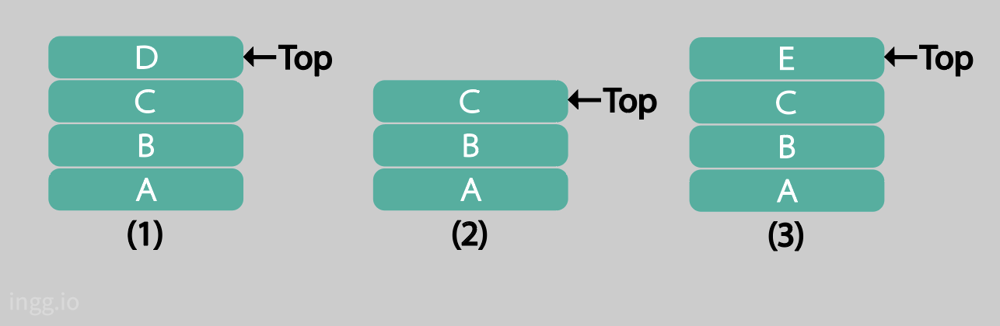

## 스택(Stack)

스택은 '입력과 출력을 한 방향으로 제한한 자료구조'라고 말할 수 있다. 데이터의 삽입과 삭제가 한쪽 끝에서만 이루어진다. 삽입/삭제가 일어나는 쪽을 스택의 top이라고 부른다.

- **푸시(push)** : 접시를 찬장에 쌓는다. 즉, 데이터에 순서를 적용해 차례로 저장한다.
- **팝(pop)** : 접시를 사용하기위해 찬장의 가장 위에 있는 접시를 가져온다. 즉, 가장 최신 데이터부터 차례로 가져온다.
- peek : 스택 top의 원소를 제거하지 않고 반환
- empty : 스택이 비었는지 검사

이런 방식을 **LIFO(Last In, First Out)** 이라고 한다. 마지막에 들어간 것이 제일 처음 나온다는 뜻이다.

<br>


<!--  -->

```c
push("A");
push("B");
push("C");
push("D");                  //스택의 상태는 (1)이 됨

char *str1 = peek();        //str1은 "D"가 됨
char *str2 = pop();         //str2는 "D"가 되고 스택의 상태는 (2)로 바뀜
push("E");                  //스택의 상태가 (3)으로 바뀜
```

<br>

### 스택 구현

#### 링크드 리스트를 사용하는 스택의 구조체 정의

```c
typedef struct _NODE {
    int data;
    struct _NODE *next;
} NODE;
```

#### 스택 초기화 코드

```c
void InitializeStack(void)
{
    head = (NODE *)malloc(sizeof(NODE));
    end = (NODE *)malloc(sizeof(NODE));
    head->next = end;
    end->next = end;
}
```

현재는 스택이 비워져 있으므로 `head->next` 값은 _end_ 를 가리키고, `end->next`값은 _end_ 를 가리킨다.

#### Push()함수

```c
void Push(int num)
{
    ptrNode = (NODE *)malloc(sizeof(NODE));
    ptrNode->data = num;
    ptrNode->next = head->next;
    head->next = ptrNode;
}
```

매개변수로 int 자료형 데이터를 받고 이것은 스택에 저장될 데이터가 된다. 새로 생성한 노드는 ptrNode로 가리키고, `ptrNode->data` 값에 매개변수로 받은 int 자료형 데이터를 저장한다. 그리고 새로 생성한 노드의 _**next**_ 값이 _**head**_ 노드의 _**next**_ 값이 가리키는 노드가 되게 한다. _**head**_ 노드의 _**next**_ 값은 ptrNode값으로 한다.

<br>

<!--   -->

<center></center>

여기서 `ptr->next = head->next`를 실행하면 `head->next`가 스택의 가장 윗부분 노드를 가리키므로 새로운 노드가 추가되면 해당 노드의 _**next**_ 값에 `head->next`값에 저장된 주소를 넣는다. 그러면 새로 추가된 노드의 _**next**_ 값은 이전에 추가된 노드를 가리키게 된다. 그다음 `head->next`값을 현재 새로 추가한 노드로 만든다. 따라서 `head->next`값은 다시 가장 윗부분 노드를 가리킨다.

#### Pop() 함수

```c
int Pop(void)
{
    int ret;
    ptrNode = head->next;
    head->next = head->next->next;
    ret = ptrNode->data;
    free(ptrNode);

    return ret;
}
```

매개변수가 없는 대신 반환 값이 있는데 이 값이 스택에 저장된 최상위 값이 된다.

<br>

<center></center>

`ptrNode = head->next`가 되면 ptrNode는 `head->next`가 가리키는 노드를 가리키게 되고 이 노드는 **pop**해야할 노드이다. 그리고 `head->next`에 `head->next->next`값을 넣으면 `head->next`는 위에서 두번째에 있는 노드를 가리키게 된다.

<br>

#### 연결리스트를 사용한 스택 알고리즘

```c
#include <stdio.h>
#include <stdlib.h>

typedef struct _NODE {
    int data;
    struct _NODE *next;
} NODE;

NODE *head, *end;
NODE *ptrNode;

void InitializeStack(void);     //스택초기화
void Push(int);                 //데이터삽입
int Pop(void);                  //데이터삭제
void DisplayStack(void);        //스택을 보여줌

void InitializeStack(void)
{
    head = (NODE *)malloc(sizeof(NODE));
    end = (NODE *)malloc(sizeof(NODE));
    head->next = end;
    end->next = end;
}

void Push(int num)
{
    ptrNode = (NODE *)malloc(sizeof(NODE));
    ptrNode->data = num;
    ptrNode->next = head->next;
    head->next = ptrNode;
}

int Pop(void)
{
    int ret;
    ptrNode = head->next;
    head->next = head->next->next;
    ret = ptrNode->data;
    free(ptrNode);

    return ret;
}

void DisplayStack(void)
{
    NODE *indexNode;
    printf("head->");

    for(indexNode = head->next; indexNode != end; indexNode = indexNode->next)
        printf("%d->", indexNode->data);

    printf("end \n");
}

void main()
{
    int ret;
    InitializeStack();

    Push(1);
    Push(2);
    Push(8);
    Push(8);
    Push(13);

    printf("다섯번의 Push() 함수 호출 후 실행 결과\n");
    DisplayStack();

    ret = Pop();
    ret = Pop();
    ret = Pop();

    printf("\n세 번의 Pop() 함수 호출 후 실행 결과\n");
    DisplayStack();
}
```

- 실행 결과

```
다섯번의 Push() 함수 호출 후 실행 결과
head->13->8->8->2->1->end

세 번의 Pop() 함수 호출 후 실행 결과
head->2->1->end
```

세번의 **Pop()** 함수를 호출해서, 위에 있는 _13, 8, 8_ 이 스택에서 제거되고 _2, 1_ 이 남은 결과이다.
