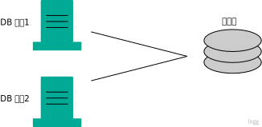
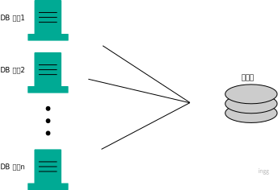
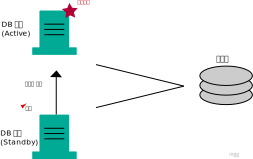
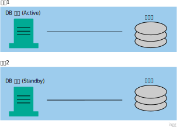
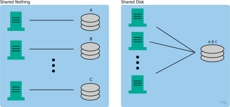

> 아키텍처란?

- 어떤 기능을 가진 서버를 준비하고 어떤 저장소나 네트워크 기기와 조합해서 시스템 전체를 만들것인가
- = 하드웨어와 미들웨어의 구성

 

## 데이터베이스의 아키텍처

### 아키텍처 역사

- Stand-alone : 데이터베이스만으로 시스템이 성립
- 클라이언트/서버 : 클라/서버로 계층을 분리해서 상호간에 네트워크로 접속
- Web 3계층 : 현재 주류. 클라이언트/서버를 더 발전시킨것

 

### Stand-alone

- 데이터베이스가 동작하는 머신(DB 서버)이 LAN이나 인터넷 등의 **네트워크에 접속하지 않고 독립되어 동작**하는 구성
- 데이터베이스의 미들웨어(DBMS)와 애플리케이션의 소프트웨어가 같은 DB서버에서 동작

#### 단점

- 물리적으로 **떨어진 장소에서 접근 불가**
  - 네트워크에 연결되어 있지 않다 = 데이터베이스 이용하려면 데이터베이스 서버 앞 까지 가야함
- **복수 사용자가 동시에 작업 불가**
- **가용성이 낮다** : 서버 1대이므로 장애 발생하면 서비스 정지
- **확장성이 부족하다** : 서버 1대 밖에 없으면 그 서버의 성능 늘리는 것 외에 방법이 없다

> 가용성 : 시스템이 서비스 제공시간에 장애없이 서비스를 지속할 수 있는 비율을 나타내는 개념

#### 장점

- 구축이 간단하여 **소규모 작업/테스트를 빠르게 가능**
- 네트워크를 매개로 침입 불가 = **보안이 매우높다**

 

### 클라이언트/서버

- **데이터베이스를 네트워크에 연결**하여 복수 사용자가 물리적으로 떨어진 장소에서 데이터베이스에 접속가능

#### 단점

- 인터넷에서 직접 데이터베이스에 접속 = **보안 위험**
- 다수 사용자가 사용하는 클라이언트에서의 애플리케이션 **관리비용**이 많이 든다
  - 각종 환경에 대응, 각각에 대한 버전 관리/버그 수정 배포 등의 비용

 

### Web 3계층

- 애플리케이션을 **서버에서 관리해 비용을 절감**
- 3가지 계층 조합 : **웹서버 계층, 애플리케이션 계층, 데이터베이스 계층**
  - 웹서버 : 클라이언트로부터 접속 요청(HTTP 요청)을 받아 뒷단의 애플리케이션 계층에 넘기고 그 결과를 클라이언트에 반환
  - 애플리케이션 계층 : 비즈니스 로직을 구현한 애플리케이션이 동작하는 층. 웹 서버로부터 연계된 요청을 처리하거나 데이터베이스 계층에 접속해서 데이터를 추출하고 가공한 결과를 웹서버로 반환

#### 단점

- 확장성 부족과 가용성이 낮다는 문제 해결이 안됨

#### 해결책

- 가용성은 아키텍처 설계에서 견고한 시스템을 만들기 위해 가장 중요
  - 가용성을 높이는 두가지 방법 : **심장전략**(고품질-소수), **신장전략**(저품질-다수)

#### 클러스터

> 사물이나 사람의 집합

- 클러스터링 : **신장전략처럼 동일기능의 컴포넌트를 병렬화** 하는것
  - 동일 기능의 컴포넌트 여러개로 한개의 기능을 실현
- **클러스터 구성으로 시스템의 가동률을 높이는것** = **여유도 확보, 다중화**
- 같은 기능을 가진 서버를 늘릴수록 장애 발생률 낮아짐
  - ex) 서버 한대일때 10%, 2대일때 0.1% ...
  - 그래도 가동률이 100% 되지는 않음
  - 서버대수가 증가할수록 가동률의 향상폭이 작아짐 : 수확체감의 법칙

> 체감 = 점차 줄어든다

#### 단일 장애점

- 다중화되어 있지않아서 시스템 전체 서비스의 계속성에 양향을 주는 컴포넌트
- 단일 장애점의 신뢰성이 시스템 전체의 가용성을 결정

 

## 다중화 - 클러스터링

- 웹서버나 애플리케이션서버는 일시적으로 데이터를 보존하기도하지만 계속 보존하지는 않음
- 데이터베이스는 영구적으로 보존해야하므로 외부 저장소 사용
  - 데이터베이스는 **서버와 저장소**로 구성됨
    - DB 서버(계산이나 업무로직 처리) + 저장소(데이터보존)

 

#### 간단한 다중화 구성

- DB 서버만을 다중화하고, 저장소는 하나

 

 

- 서버 2대가 동시에 동작하는 것을 허락할지에 따라 2가지로 나뉨
  - **Active-Active** : 클러스터 구성하는 컴포넌트를 동시에 가동
  - **Active-Standby** : 컴포넌트중 실제 가동하는것은 Active, 나머지는 대기(Standby)
    - Active Standby는 다시 두가지로 나뉨
    - _Cold-Standby_ : 평소엔 Standby DB가 작동하지 않고 Active가 다운되면 작동
    - _Hot-Standby_ : 평소에도 Standby DB가 작동

 

#### Active-Active 구성

- 장점 : 시스템 다운 시간이 짧고, DB 서버 대수가 증가하면 CPU나 메모리도 증가해서 성능도 좋아짐

 

#### Active-Standby 과정

- Standby DB 서버는 일정간격으로 Active DB에 이상없는지 조사하는 통신(Heartbeat)함

 

#### 가용성과 성능이 좋은 순서 (라이선스 가격순)

1. Active-Active
2. Active-Standby (Hot-Standby, 평소에도 작동)
3. Active-Standby (Cold-Standby, 평소엔 x)

 

## 다중화 - 리플리케이션

- 위의 클러스터 구성에서는, 저장소 부분은 다중화할수 없어서 저장소에 문제있으면 데이터 잃게됨
- 리플리케이션 : **DB 서버와 저장소 세트**를 복수로 준비하는 것
  - 따라서 매우 가용성이 높은 아키텍쳐

 

#### 주의할점

- Active 측 저장소는 사용자로부터 갱신됨
- Standby 측 데이터에도 갱신을 반영하여 최신화해야함 (점점 과거데이터가 되므로)

 

## Shared Disk, Shared Nothing

- Shared Nothing : 네트워크 이외의 자원을 모두 분리
  - 각각 DB 서버가 동일한 1개 데이터에 액세스할 수 없는 단점 -> DB 서버 하나가 다운됐을때 다른 DB 서버가 이어받을 수 있는 커버링 구성 등을 해야함
- Shared Disk : Active-Active 같은 구성. 저장소가 공유자원이라 늘리기 어렵고 DB 서버가 증가할수록 오버헤드가 큼
