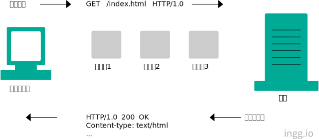

## HTTP 메세지

> HTTP가 인터넷의 배달원이면, HTTP메세지는 소포와 같음

### 📌 Contents

- [메시지 흐름](#flow)
- [메시지 구조](#structure)
  - [메시지 문법](#grammar)
  - [시작줄](#message-start)
  - [헤더](#message-header)
- [메서드](#method)
- [상태코드](#status)

<hr>

## <a name="flow"></a>메시지 흐름

- HTTP메세지는 HTTP애플리케이션 간의 주고받은 데이터 블록들
- 인바운드, 아웃바운드 : 트랜잭션 방향을 표현
  - 인바운드 이동 : 메시지가 원 서버로 향하는 것
  - 아웃바운드 이동 : 모든 처리 후에 메시지가 사용자 에이전트로 돌아오는 것



<br>

## <a name="structure"></a>메시지 구조

- 메시지는 시작줄,헤더,본문 으로 이루어짐
  - 시작줄 = 이것이 어떤 메시지인가
  - 헤더 = 속성
  - 본문 = 데이터를 담음(생략가능)


<br>

### <a name="grammar"></a>메시지 문법

- 모든 HTTP 메시지는 요청메시지 or 응답메시지로 분류됨

  - 요청메시지는 웹서버에 어떤 동작을 요구
  - 응답메시지는 요청 결과를 클라이언트에 돌려줌

#### 요청 메시지 형식

```
<메서드>  <요청 URL>  <버전>
<헤더>

<엔터티 본문>
```

#### 응답 메시지 형식

```
<버전>  <상태 코드>  <사유 구절>
<헤더>

<엔터티 본문>
```

#### 메서드

- 클라이언트 측에서 서버가 리소스에 대해 수행해주길 바라는 동작. (ex: GET, HEAD, POST)

#### 요청 URL

- 요청 대상이 되는 리소르를 지칭하는 완전한 URL or URL의 경로 구성요소

#### 버전

- 이 메세지에서 사용중인 HTTP 버전
  - 형식: _HTTP/<메이저>,<마이너>_

#### 상태코드

- 요청 중 무엇이 일어났는지 설명하는 세자리수. 첫번째 자리수는 성공,에러 등을 나타냄

#### 사유 구절

- 상태 콛의 의미를 사람이 이해할 수 있게 설명해주는 문구 (상태코드 이후부터 줄바꿈문자열까지가 사유구절)

#### 헤더들

- 이름, 콜론(`:`), 선택적 공백, 값, CRLF(줄바꿈 문자열)이 순서대로 나타나는 0개 이상 헤더들

<br>

### <a name="message-start"></a>시작줄

- 모든 HTTP 메시지는 시작줄로 시작
- 요청메시지 시작줄은 무엇을 할지, 응답메시지 시작줄은 무슨일이 일어났는지 말함

#### 요청줄

- 요청 메세지는 서버에게 리소스에 대해 무언가를 해달라고 요청함
- 요청 메시지의 시작줄(요청줄)에는 서버에서 어떤 동작이 일어나야하는지 설명하는 **메서드**, 그 동작에 대한 대상을 지칭하는 **요청 URL**, **HTTP 버전**이 있음

```
//요청메시지 예시
GET  /test/hi.txt  HTTP/1.1
```

- 요청 메서드는 GET, 요청 URL은 /text/hi.txt, 버전은 HTTP/1.1

#### 응답줄

- 응답 메세지는 수행 결과에 대한 상태정보, 결과 데이터를 클라이언트에게 돌려줌
- 응답 메시지의 시작줄(응답줄)에는 응답메세지에서 쓰인 **HTTP버전, 상태코드, 사유구절**이 있음

```
//응답메시지 예시
HTTP/1.0  200  OK
```

#### 메서드

> 요청의 시작줄은 메서드로 시작하고, 서버에 무엇을 해야하는지 말해줌

| 메서드  | 설명                                                 | 메세지본문 |
| ------- | ---------------------------------------------------- | ---------- |
| GET     | 서버에서 어떤 문서를 가져옴                          | 없음       |
| HEAD    | 서버에서 어떤 문서에 대해 헤더만 가져옴              | 없음       |
| POST    | 서버가 처리해야할 데이터를 보냄                      | 있음       |
| PUT     | 서버에 요청 메시지의 본문을 저장함                   | 있음       |
| TRACE   | 메시지가 프락시를 거쳐 서버에 도달하는 과정을 추적함 | 없음       |
| OPTIONS | 서버가 어떤 메서드를 수행할 수 있는지 확인함         | 없음       |
| DELETE  | 서버에서 문서를 제거함                               | 없음       |

#### 상태코드

> 상태코드는 클라이언트에게 무엇이 일어났는지 말해줌

| 전체범위 | 정의된 범위 | 분류                        |
| -------- | ----------- | --------------------------- |
| 100-199  | 100-101     | 정보                        |
| 200-299  | 200-206     | 성공                        |
| 300-399  | 300-305     | 리다이렉션(리소스가 옮겨짐) |
| 400-499  | 400-415     | 클라이언트 에러             |
| 500-599  | 500-505     | 서버 에러                   |

- 많이 쓰이는 상태코드

| 상태 코드 | 사유 구절    | 의미                                           |
| --------- | ------------ | ---------------------------------------------- |
| 200       | OK           | 성공, 요청한 모든 데이터가 응답 본문에 있음    |
| 401       | Unauthorized | 사용자 이름과 비밀번호를 입력해야함            |
| 404       | Not Found    | 서버는 요청한 URL에 해당하는 리소스를 찾지못함 |

<br>

### <a name="message-header"></a>헤더

- 시작줄 다음에는 HTTP 헤더가 옴
- 기본적으로 이름/값 쌍 목록
  - 예를 들어, 아래 헤더줄은 _Content-length_ 헤더필드에 19라는 값 할당

```
Content-length: 19
```

#### 헤더 분류

- 일반 헤더 : 요청, 응답 양쪽에 모두 나타날수 있음
- 요청 헤더 : 요청에 대한 부가정보 제공
- 응답 헤더 : 응답에 대한 부가정보 제공
- Entity 헤더 : 본문 크기와 콘텐츠 or 리소스 자체를 서술
- 확장 헤더 : 명세에 정의되지 않은 새로운 헤더

> 흔히 쓰이는 헤더

| 헤더 예시                                | 설명                                                    |
| ---------------------------------------- | ------------------------------------------------------- |
| Date: Wed, 29, Oct 1997 02:11:02 GMT     | 서버가 응답을 만들어 낸 시각                            |
| Content-length: 15040                    | 15,040 바이트의 데이터를 포함한 엔터티 본문             |
| Content-type: image/gif                  | 엔터티 본문은 GIF 이미지                                |
| Accept: image/gif, image/jpeg, text/html | 클라이언트는 GIF, JPEG 이미지와 HTML을 받아들일 수 있음 |

<br>

## <a name="method"></a>메서드

### 안전한 메서드

- **GET, HEAD** 메서드는 안전하다고 할 수 있음
- HTTP 요청 결과로 서버에 어떤 작용도 없기 때문

### GET

- 가장 흔히 쓰이는 메서드. 서버에게 리소스를 달라고 요청하기위해 쓰임

### HEAD

- 서버가 응답으로 헤더만 돌려주고, 엔터티본문은 반환되지않음
- 클라이언트가 리소스를 가져오지 않고도 헤더만 조사할 수 있게 해줌

### PUT

- GET 메서드는 서버로부터 문서를 읽지만 PUT 메서드는 서버에 문서를 씀
- 서버가 요청의 본문을 갖고 요청 URL 이름대로 새 문서를 만들거나, 이미 URL이 존재하면 본문을 이용해서 교체하는 것

### POST

- 서버에 입력 데이터를 전송함
  - PUT은 서버에 있는 리소스(ex 파일)에 데이터를 입력하기위해 사용, POST는 서버에 데이터를 보내기위해 사용

### TRACE

- 클라이언트에게 자신의 요청이 서버에 도달했을때 어떻게 보이는지 알려줌
- 주로 진단을 위해 사용

### OPTIONS

- 웹 서버에게 여러 종류의 지원범위를 물어봄
- 서버에게 특정 리소스에 대해 어떤 메서드가 지원되는지 물어볼 수 있음

### DELETE

- 서버에게 요청 URL로 지정한 리소스를 삭제할 것을 요청함

<br>

## <a name="status"></a>상태코드

### 100~199 : 정보성 상태코드

| 상태코드 | 사유구절            | 의미                                                                              |
| -------- | ------------------- | --------------------------------------------------------------------------------- |
| `100`    | Continue            | 요청의 시작 부분 일부가 받아들여졌고, 클라이언트는 나머지를 계속 이어서 보내야함  |
| `101`    | Switching Protocols | 클라이언트가 Upgrade 헤더에 나열한 것 중 하나로 서버가 프로토콜을 바꾸었음을 의미 |

### 200~299 : 성공 상태코드

| 상태코드 | 사유구절                      | 의미                                                                                                                                                         |
| -------- | ----------------------------- | ------------------------------------------------------------------------------------------------------------------------------------------------------------ |
| `200`    | OK                            | 요청은 정상, 엔터티 본문은 요청된 리소스를 포함하고 있음                                                                                                     |
| `201`    | Created                       | 요청이 성공적이었으며 그 결과로 새로운 리소스가 생성됨. 이 응답은 일반적으로 POST 요청 또는 일부 PUT 요청 이후에 따라옴                                      |
| 202      | Accepted                      | 요청을 수신하였지만 그에 응하여 행동할 수 없음                                                                                                               |
| 203      | Non-Authoritative Information | 엔터티 헤더에 들어있는 정보가 원래 서버가 아닌 리소스의 사본에서 왔음. 엔터티 헤더가 원래 서버에서 온 것이였으면 `200` 상태였을 애플리케이션을 위한 선택사항 |
| `204`    | No Content                    | 응답 메시지는 헤더와 상태줄을 포함하지만 엔터티 본문은 포함하지 않음                                                                                         |
| `205`    | Reset Content                 | 브라우저에게 현재 페이지에 있는 HTML 폼에 채워진 모든 값을 비우라고 말함                                                                                     |
| `206`    | Partial Content               | 범위 요청이 성공했음                                                                                                                                         |

### 300~399 : 리다이렉션 상태코드

| 상태코드 | 사유구절           | 의미                                                                                                                                                                     |
| -------- | ------------------ | ------------------------------------------------------------------------------------------------------------------------------------------------------------------------ |
| 300      | Multiple Choices   | 클라이언트가 동시에 여러 리소스를 가리키는 URL을 요청한 경우, 그 리소스의 목록과 함께 반환함                                                                             |
| `301`    | Moved Permanently  | 요청한 URL이 옮겨졌을때 사용. 응답은 Location 헤더에 현재 리소스가 존재하고 있는 URL을 포함해야함                                                                        |
| `302`    | Found              | 301상태코드와 같음. 그러나 클라이언트는 Location 헤더로 주어진 URL을 리소스를 임시로 가리키기 위해 사용해야함. 이후 요청에서는 원래 URL을 사용해야함                     |
| 303      | See Other          | 클라이언트에게 리소스를 다른 URL에서 가져와야 한다고 말해주고자 할때 쓰임                                                                                                |
| `304`    | Not Modified       | 리소스가 수정되지 않았음을 의미                                                                                                                                          |
| 305      | Use Proxy          | 리소스가 프록시를 통해 접근되어야함을 의미                                                                                                                               |
| 306      | (사용되지 않음)    | 현재는 사용되지않음                                                                                                                                                      |
| `307`    | Temporary Redirect | `302` 와 동일, 사용자 에이전트가 반드시 사용된 HTTP 메소드를 변경하지 말아야 하는 점만 다름: 만약 첫 요청에 POST가 사용되었다면, 두번째 요청도 반드시 POST를 사용해야 함 |

### 400~499 : 클라이언트 에러 상태코드

| 상태코드 | 사유구절                        | 의미                                                                                                      |
| -------- | ------------------------------- | --------------------------------------------------------------------------------------------------------- |
| `400`    | Bad Request                     | 클라이언트가 잘못된 요청을 보냄                                                                           |
| `401`    | Unauthorized                    | 리소스를 얻기전 클라이언트에게 스스로 인증하라고 요구하는 응답을 헤더와 함께 반환함                       |
| 402      | Payment Required                | 응답 코드는 나중에 사용될 것을 대비해 예약됨                                                              |
| `403`    | Forbidden                       | 요청이 서버에 의해 거부되었음                                                                             |
| `404`    | Not Found                       | 서버가 요청한 URL을 찾을 수 없음                                                                          |
| `405`    | Method Not Allowed              | 지원하지 않는 메서드로 요청받았을때 사용                                                                  |
| 406      | Not Acceptable                  | 주어진 URL에 대한 리소스 중 클라이언트가 받아들일 수 있는 것이 없을때 사용                                |
| 407      | Proxy Authentication Required   | 401과 같으나, 리소스에 대해 인증을 요구하는 프록시 서버를 위해 사용                                       |
| `408`    | Request Timeout                 | 클라이언트의 요청을 완수하기 시간이 너무 많이 걸리면, 서버가 이 상태코드로 응답하고 연결을 끊을 수 있음   |
| 409      | Conflict                        | 요청이 현재 서버의 상태와 충돌                                                                            |
| 410      | Gone                            | 404와 비슷하지만, 서버가 한때 그 리소스를 갖고있었음                                                      |
| 411      | Length Required                 | 서버에서 필요로 하는 Content-Length 헤더 필드가 정의되지 않은 요청이 들어왔기 때문에 서버가 요청을 거절함 |
| 412      | Precondition Failed             | 클라이언트가 조건부 요청을 했는데 그중 하나가 실패                                                        |
| 413      | Payload Too Large               | 서버가 처리할 한계를 넘은 크기의 요청을 클라이언트가 보냄                                                 |
| 414      | URI Too Long                    | 서버가 처리할 한계를 넘은 길이의 요청 URL이 포함된 요청을 클라이언트가 보냄                               |
| 415      | Unsupported Media Type          | 서버가 이해불가능한 엔터티를 클라이언트가 보냄                                                            |
| 416      | Requested Range Not Satisfiable | 요청메시지의 리소스 특정범위 요청에서, 범위가 잘못됨                                                      |
| 417      | Expectation Failed              | Expect 요청 헤더 필드로 요청한 예상이 서버에서는 적당하지 않음                                            |

### 500~599 : 서버 에러 상태코드

| 상태코드 | 사유구절                   | 의미                                                                                                                                                     |
| -------- | -------------------------- | -------------------------------------------------------------------------------------------------------------------------------------------------------- |
| `500`    | Internal Server Error      | 서버가 처리 방법을 모르는 상황이 발생함                                                                                                                  |
| `501`    | Not Implemented            | 요청 방법이 서버에서 지원되지 않아 처리할 수 없음 (ex 서버가 지원하지 않는 메서드 사용)                                                                  |
| `502`    | Bad Gateway                | 서버가 요청을 처리하는 데 필요한 응답을 얻기 위해 게이트웨이로 작업하는 동안 잘못된 응답을 수신했음                                                      |
| `503`    | Service Unavailable        | 현재는 서버가 요청을 처리할 수 없지만 나중에는 가능함. 서버가 언제 그 리소스를 사용할 수 있을지 알고 있으면 _Retry-After_ 헤더를 응답에 포함시킬 수 있음 |
| 504      | Gateway Timeout            | 서버가 게이트웨이 역할을 하고 있으며 적시에 응답을 받을 수 없음                                                                                          |
| 505      | HTTP Version Not Supported | 요청에 사용된 HTTP 버전은 서버에서 지원되지 않음                                                                                                         |
