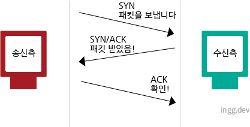

## 신뢰성을 담당하는 TCP

- TCP(Transfer Control PRotocol)는 트랜스포트 계층에 해당
- 대용량의 데이터를 보내기쉽게 분해하여 상대에게 보내고, 정확하게 도착했는지 확인하는 역할 담당

 

## 쓰리웨이 핸드셰이킹(three way handshaking)

- 상대에게 확실하게 데이터를 보내기위한 방법
- 패킷을 보내고 나서 바로 끝나는 것이 아닌, 보내졌는지 여부를 상대에게 확인함
- SYN와 ACK라는 TCP플래그를 사용

 

 

### 왜 2가지 패킷일까?

- 일단 연결을 성립하려면 서로 통신이 가능한지 먼저 파악하기 위해 패킷을 주고 받아야하는데,
  - **요청과 응답**에 대한 패킷을 주고 받아야 하므로 2가지임

### 왜 3-way일까?

- 클라이언트에서 서버에게 존재를 알리고 패킷을 보낼 수 있다는 것을 알리듯,
- 서버에서도 클라이언트에게 존재를 알리고 패킷을 보낼 수 있다는 신호를 보내야함
- 따라서, 2-way-handshake로는 부족함
