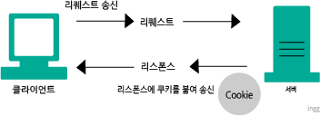
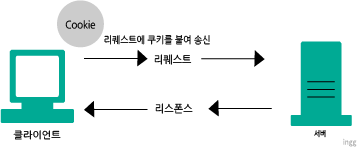

## HTTP는 클라이언트와 서버간의 통신을 한다

- 리소스를 필요하다고 **요구하는 쪽이 클라이언트**
- 리소스를 **제공하는 쪽이 서버**

> 클라이언트와 서버는 역할의 개념!

<br>

## 리퀘스트와 리스폰스를 교환하여 성립

- HTTP는 클라이언트로부터 리퀘스트(요청, Request)가 송신되고
- 그 결과가 서버로부터 리스폰스(응답, Response)로 되돌아옴
- 리퀘스트를 수신하지않으면 리스폰스가 발생하지 않음

<br>

## HTTP는 상태를 유지하지않음

- HTTP는 상태를 유지하지 않는 스테이트리스 프로토콜
- 이전에 보낸 리퀘스트나 되돌려준 리스폰스에 대해 기억하지 않음
  - 그러나 로그인 등 상태를 유지할 필요도 있음
  - 상태를 유지하기 위해 **쿠키(Cookie)** 라는 기술 사용

<br>

## 리퀘스트 URI로 리소스 식별

- HTTP는 URI를 이용하여 클라이언트가 리소스를 특정한다
- 리소스를 호출할때마다 클라이언트는 리퀘스트 안에 리퀘스트 URI라는 형식으로 URI를 포함해야함
- 리퀘스트 URI를 지정하는 방법
  - 모든 URI를 리퀘스트 URI에 포함

```
GET http://xxx.kr/index.html HTTP/1.1
```

- Host헤더 필드에 네트워크 로케이션을 포함

```
GET /index.html HTTP/1.1
Host: xxx.kr
```

<br>

## HTTP 메소드로 서버에 임무를 부여

- GET : 리퀘스트 URI로 식별된 **리소스를 가져올수 있도록 요구**
- POST : **엔티티를 전송하기 위해 사용.** GET으로도 엔티티 전송가능하지만, 일반적이지 않음
- PUT : 파일 전송을 위해 사용. 누구든 파일을 업로드 가능하다는 보안상 문제로 일반적 웹사이트에서는 사용되지않음. REST와 같이 설계 양식을 사용할때 이용
- HEAD : 메세지 헤더 취득. 메세지 바디는 돌려주지않음
- DELETE : 리퀘스트 URI로 지정된 리소스의 삭제를 요구
- OPTIONS : 제공하고 있는 메소드 문의. 서버가 제공하고있는 메소드를 되돌려줌

<br>

## 지속연결, 파이프라인화

- 지속연결 (HTTP/1.1에서 표준, 1.0에서는 정식사양x)
  - TCP 연결을 계속 유지.
- 파이프라인화
  - 지속연결은 여러 리퀘스트를 보낼수 있게함
  - 리스폰스를 기다리지 않고 바로 다음 리퀘스트 전송 가능

<br>

## 쿠키로 상태관리

- HTTP는 스테이트리스 프로토콜이라, 기존에 교환했던 상태 관리하지않음
  - (스테이트리스는, 서버의 CPU나 메모리같은 리소스 소비를 억제하는 이점은 있음)
- **쿠키**는 **리퀘스트와 리스폰스에 쿠기 정보를 추가**해서 클라이언트의 상태를 파악
  - 쿠키는 서버에서 리스폰스로 보내진 _Set-Cookie_ 라는 헤더필드에 의해 쿠키를 **클라이언트에 보존**함
  - 다음번에 클라이언트가 같은서버로 리퀘스트를 보낼때, 자동으로 **쿠키값을 넣어서 송신**
  - 서버는 쿠키를 확인해서 어느 클라이언트가 접속했는지 체크, 서버상 기록을 확인해서 이전상태를 알수 있음

<br>

#### 쿠키를 가지지 않은 상태에서 리퀘스트



```bash
# 리퀘스트 (쿠키 가지지 않은 상태)
GET /reader/ HTTP /1.1
Host: www.xxx.com
# 헤더 필드에 쿠키 없음
```

```bash
# 리스폰스 (서버가 쿠키 발행)
HTTP /1.1 200 OK
Date: Thu, 14, Jun 2011 03:11:22 GMT
Sever: Apache
<Set-Cookie: sid=123456789876543; path=/;expires=Wed, => 10-Oct-11 03:11:22 GMT>
Content-Type: text/plain: charset=UTF-8
```

<br>

#### 이후, 쿠키를 가진 상태의 리퀘스트



```bash
# 리퀘스트 (보관하던 쿠키를 자동송신)
GET /image/ HTTP /1.1
Host: www.xxx.com
Cookie: sid=123456789876543
```
