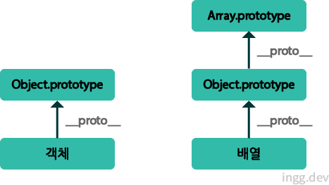
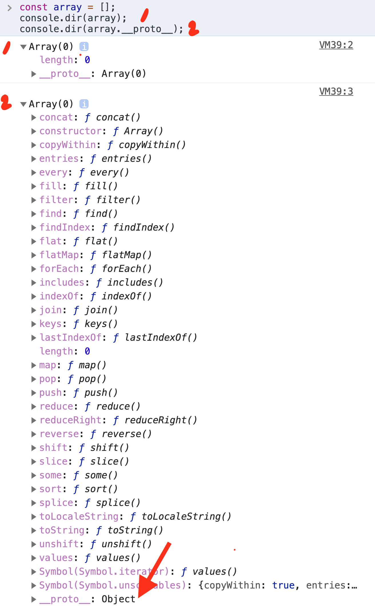

## 배열과 객체의 차이점/유사점

## 1. 생성

```js
const colorArray = ["red", "green", "blue"];
console.log(colorArray[0]); // red
console.log(colorArray[1]); // green

const colorObj = {
  0: "red",
  1: "green",
  2: "blue",
};
console.log(colorObj[0]); // red
console.log(colorObj[1]); // green
```

- 객체의 프로퍼티에 접근할때 대괄호안에 속성을 문자열로 적어야 한다.
- 즉, `colorObj['0']` 형태로 기입하는게 맞지만 자바스크립트 엔진이 `[]` 연산자 내에 숫자가 사용되면 **자동으로 문자열 형태로 바꿔준다.**

<br>

## 2. typeof 연산자

```js
console.log(typeof colorArray); // object
console.log(typeof colorObj); // object
```

- `typeof` 연산결과 : 배열과 객체모두 `object`

<br>

## 3. length 프로퍼티

```js
console.log(colorArray.length); // 3
console.log(colorObj.length); // undefined
```

객체 `colorObj`는 `length` 프로퍼티가 없다.

<br>

## 4. 배열 표준 메서드 호출 여부

- colorObj는 배열이 아니라서 `push()`같은 표준 배열 메서드가 존재하지 않는다.
- 배열과 객체가 **자신의 부모인 프로토타입 객체가 다르기 때문**



- 객체 리터럴 방식으로 생성한 객체 : `Object.prototype 객체`가 프로토타입 (객체 표준 메서드를 포함하고 있음)

* 배열 : `Array.prototype 객체`가 부모 객체인 프로토타입 (`push(), pop()같은` 표준 메서드를 포함하고 있음)
  - 그리고 `Array.prototype 객체`의 프로토타입이 `Object.prototype` 이다.

<br>


