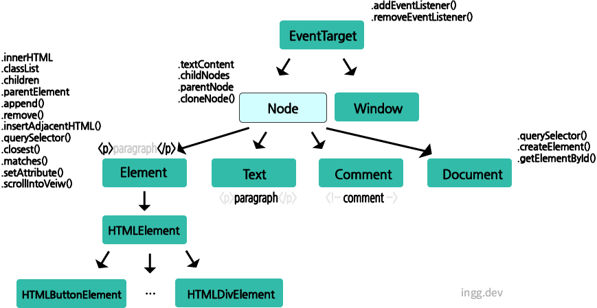

### DOM (Document Object Model) 이란?

- DOM은 브라우저와 자바스크립트가 상호작용 할수있게 한다.
- DOM은 **DOM 트리**와 상호작용 하기위한 많은 메서드와 프로퍼티를 가지는 복잡한 API이다.
  - ex) `.querySelector()`, `.addEventListener()`, `.createElement`, `.innerHTML`, ...

<br/>

## 1. DOM 트리

> 웹페이지 내용은 Document객체가 관리한다. 웹브라우저가 웹페이지를 읽으면 렌더링엔진은 웹페이지의 HTML 문서 구문을 해석하고 Document객체에서 문서내용을 관리하는 DOM 트리라는 객체의 트리 구조를 만든다.

- **DOM 트리를 구성하는 객체** 하나를 `노드(Node)`라고 한다.
- 각각의 노드는 자바스크립트 객체로 표현된다.
  - 이 객체는 특별한 노드 메서드/프로퍼티에 접근할 수 있다.
  - ex) _.textContent_, _.childNodes_, _.parentNode_, _.cloneNode()_, ...

<br>

## 노드(Node)



<br/>

#### 노드는 **Element타입, Text타입, Comment타입, Document타입**이 있다.

- `Element타입 노드`는 각 HTML 요소가 프로퍼티나 메서드에 접근할 수 있게한다.
  - ex프로퍼티) _.innerHTML_, _.classList_, _.children_, _parentElement_, ...
  - ex메서드) _.append()_, _.remove()_, _insertAdjacentHTML()_, _.querySelector()_, _.closest()_ ...
  - Element타입은 내부적으로 자식 HTMLElement를 갖는다.
- `Text타입 노드`는 텍스트를, `Comment타입 노드`는 주석을 가리킨다.
- `Document 노드`는 전체 문서를 가리키는 노드다.
  - 중요한 메서드들을 포함한다.
  - _.querySelector()_, _.createElement()_, _.getElementById()_

#### **또한 메서드와 프로퍼티는 상속되어서**, 모든 child 타입들도 접근할 수 있다.

- ex) HTMLElement도 _.addEventListener()_, _closest()_, ... 등에 접근 가능하다.

#### 중요한 점은 **EventTarget**라는 노드와 Window노드의 부모인 특별한 노드 타입이다.

- 그래서 상속덕분에 addEventListener를 모든 노드 타입마다 마치 자신의 메서드인 것처럼 사용할 수 있는것

<br>

## 2. 노드 객체 가져오기

> javascrip로 HTML요소를 제어하려면 요소 객체를 가져와야한다.

#### id 속성으로 노드 가져오기

```js
document.getElementById("id 값");
```

#### 요소 이름으로 노드 가져오기

```js
document.getElementByTagName("요소의 태그이름");
```

#### class 속성 값으로 노드 가져오기

```js
document.getElementByClassName("class의 이름");
```

#### name 속성 값으로 노드 가져오기

```js
document.getElementsByName("name 속성 값")

ex) ...
    <form>
        <input type="checkbox" name="food" value="potato" />
    </form>
    <script>
      const foods = document.getElementsByName("food");
      console.log(foods[0].value);      // potato
    </script>
    ...
```

#### CSS선택자로 노드 가져오기

- `querySelector`는 노드의 첫번째 자식을 반환한다. CSS선택자와 비슷하다

```js
class로 찾고싶으면 document.querySelector(".title")
id는 document.querySelector("#title")
```

<br>

## 3. HTML 요소의 내용 읽고 쓰기

요소안의 HTML코드는 `innerHTML` 프로퍼티로 읽고 쓸 수 있다. 요소를 웹페이지에 표시할 때의 텍스트정보는 `textContent`와 `innerText` 프로퍼티를 이용해 읽고 쓸 수 있다.

#### Element.innerHTML

> 요소안의 HTML코드를 가리킨다. 요소안의 코드를 읽거나 쓸 수 있다.

```js
// Syntax
const content = element.innerHTML;

element.innerHTML = htmlString;
```

#### Node.innerText

```js
// Syntax
// Return the text content of a node:

node.innerText;

// Set the text content of a node:

node.innerText = text;
```

#### innerHTML vs innerText

차이점을 알아보기위해 콘솔에 찍어보았다. innerHTML은 HTML 구조까지 가져오고, innerText는 텍스트만 가져온다.

```html
<h2>Hi <em>My</em> Name is</h2>
```

```js
console.log(document.querySelector("h2").innerHTML); // console 결과: Hi <em>My</em> Name is
console.log(document.querySelector("h2").innerText); // console 결과: Hi My Name is
```

innerHTML은 태그를 붙여서 사용할 수도 있다. 반면 innerText는 그대로 입력된다.

```html
<h2>example</h2>
```

```js
const test = document.querySelector("h2");
test.innerText = "<em>Hi<em>"; // h2 결과: <em>Hi<em>
test.innerHTML = "<em>Hi<em>"; // h2 결과: Hi
```

<!-- ### 4. 노드 생성/삽입/삭제하기 -->
