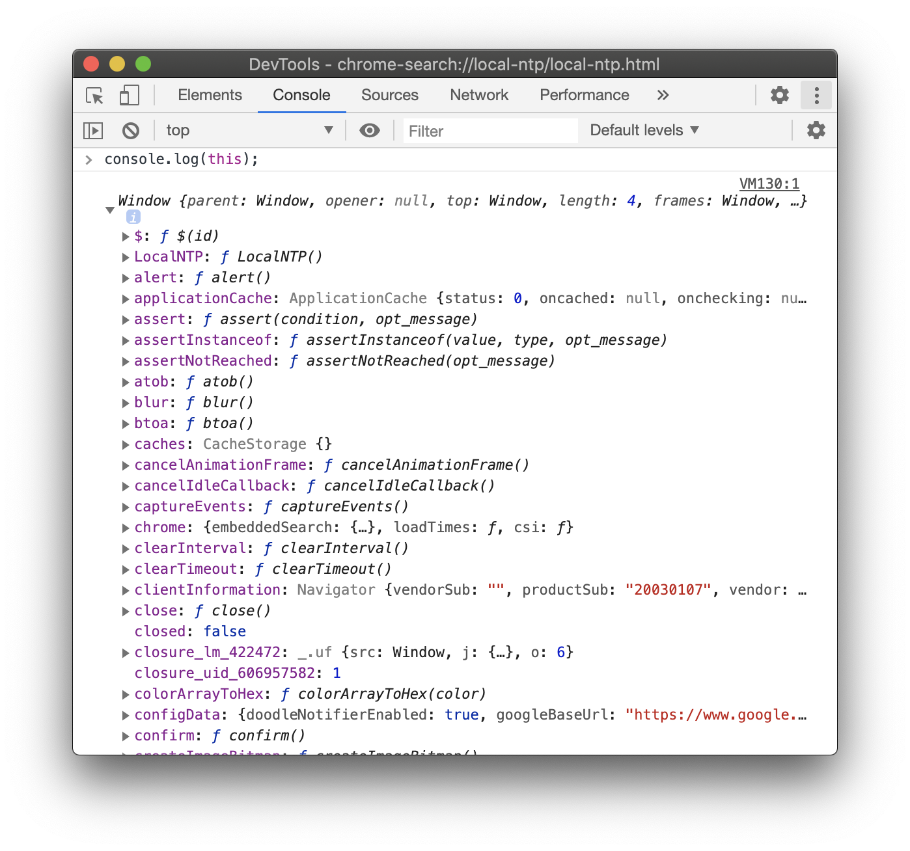
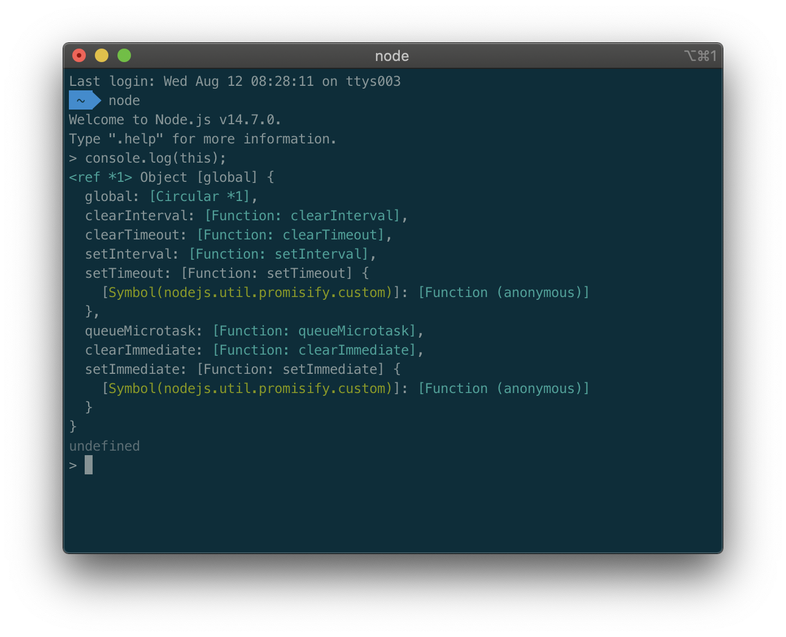

## this

> 함수가 호출되어 실행되는 시점에 this 값이 결정된다. this 값은 함수가 호출되었을때 그 함수가 속해있던 객체의 참조이고 thisBinding 컴포넌트가 참조하는 객체이다.

### 📌Contents

- [상황에 따라 달라지는 this](#situation)
  - [전역 공간에서 this](#global)
  - [메서드 내부에서의 this](#method)
  - [함수로서 호출할때 그 함수 내부에서의 this](#function)
  - [콜백 함수 호출시 그 함수 내부에서의 this](#callback)
  - [생성자 함수 내부에서 this](#new)

---

## <a name="situation"></a>상황에 따라 달라지는 this

`this`는 기본적으로 실행 컨텍스트가 생성될때 같이 결정된다. 실행 컨텍스트는 함수를 호출할 때 생성되므로, `this`는 함수를 호출할 때 결정되고 함수를 어떤 방식으로 호출하느냐에 따라 값이 달라진다.

### <a name="global"></a>전역 공간에서 this

전역 공간에서 `this`는 전역 객체를 가리킨다. 전역 컨텍스트를 생성하는 주체가 전역 객체이기 때문이다. 전역 객체는 자바스크립트 런타임 환경에 따라 다른 이름과 정보를 가지는데, 브라우저 환경에서는 `window`, Node.js에서는 `global`이다.

- 브라우저 환경 : 전역 공간에서 _this_

```js
console.log(this); //Window
console.log(window); //Window
console.log(this === window); //true
```



- _Node.js_ 환경 : 전역 공간에서 _this_

```js
console.log(this === global); //true
```



<br>

자바스크립트 엔진은, 전역변수를 선언하면 이를 전역객체의 프로퍼티로도 할당한다.

```js
const a = 1;
console.log(a); //1
console.log(window.a); //1
console.log(this.a); //1
```

자바스크립트의 모든 변수는 사실 특정 객체의 프로퍼티로 동작한다. 사용자가 `var`로 변수를 선언해도 자바스크립트 엔진은 특정 객체의 프로퍼티로 인식한다. 특정 객체는 실행 컨텍스트의 **_LexicalEnvironment_** 이다.

실행 컨텍스트는 변수를 수집해서 **_LexicalEnvironment_** 의 프로퍼티로 저장한다. 이후 어떤 변수를 호출하면 **_LexicalEnvironment_** 를 조회해서 일치하는 프로퍼티가 있으면 그 값을 반환한다. 전역 컨텍스트의 경우 **_LexicalEnvironment_** 는 전역객체를 그대로 참조한다.

전역 공간에서 `var`로 변수를 선언하는 대신 `window`의 프로퍼티에 직접 할당해도 `var`로 선언한것과 똑같이 동작한다.

```js
var a = 1;
console.log(a, window.a, this.a); //1 1 1

window.a = 2;
console.log(a, window.a, this.a); //2 2 2
```

단, `삭제` 명령에 대해서는 전역변수 선언과 전역객체의 프로퍼티 할당은 다르다.

```js
var a = 1;
delete window.a; //false
console.log(a, window.a, this.a); //1 1 1

window.b = 3;
delete window.b; //true
console.log(b, window.b, this.b); //Uncaught ReferenceError: b is not defined
```

전역변수로 선언한 경우 삭제가 되지않고, 전역객체의 프로퍼티로 할당한 경우 삭제가 된다.

<br>

### <a name="method"></a>메서드 내부에서의 this

#### 함수로 호출 vs 메서드로 호출

어떤 함수를 객체의 프로퍼티에 할당한다고 그 자체로 메서드가 아니라, 객체의 메서드로서 호출할 경우에만 메서드로 동작하고, 그게아니면 함수로 동작한다.

```js
var func = function (x) {
  console.log(this, x);
};
func(1); //Window {... } 1

var obj = {
  method: func,
};
obj.method(2); //{method: ƒ} 2
```

`func`라는 변수에 익명함수를 할당하고 `func`를 호출했더니 `this`로 전역객체 **_Window_** 가 출력된다.

`obj`라는 변수에 객체를 할당하는데, 그 객체의 `method` 프로퍼티에 위에서 만든 `func`함수를 할당했다. `obj`의 `method`를 호출했더니, 이번에는 `this`가 `obj`가 된다.

원래의 익명함수는 그대로인데 이를 변수에 담아 호출한 경우와, `obj` 객체의 프로퍼티에 할당해서 호출한 경우의 `this`가 달라진다.

어떤 함수를 호출할때 그 **함수 이름(프로퍼티명) 앞에 객체가 명시되면** **메서드로 호출**한 것이고, 그렇지않으면 **함수로 호출**한 것이다.

<br>

#### 메서드 내부에서의 this

`this`에는 호출한 주체에 대한 정보가 담긴다. 어떤 함수를 메서드로서 호출하면 호출 주체는 함수명(프로퍼티명) 앞의 객체다. 점 표기법의 경우 마지막 점(`.`)앞에 명시된 객체가 `this`가 된다.

```js
var obj = {
  methodA: function () {
    console.log(this);
  },
  inner: {
    methodB: function () {
      console.log(this);
    },
  },
};

obj.methodA(); //{inner: {…}, methodA: ƒ}
obj.inner.methodB(); //{methodB: ƒ}
```

<br>

### <a name="function"></a>함수로서 호출할때 그 함수 내부에서의 this

#### 메서드의 내부함수에서의 this

내부함수도, 함수로서 호출했는지 메서드로서 호출했는지 파악하면 `this`의 값을 알 수 있다.

```js
var obj1 = {
  outer: function () {
    console.log(this); //{outer: ƒ}
    var innerFunc = function () {
      console.log(this); //Window {...} //{innerMethod: ƒ}
    };
    innerFunc();

    var obj2 = {
      innerMethod: innerFunc,
    };
    obj2.innerMethod();
  },
};
obj1.outer();
```

위의 예제에서 _console.log_ 위치의 `this`가 가리키는 것은 **_obj1, Window, obj2_** 가 된다.

- 코드 흐름
  - 1번째줄 : 객체를 생성하는데 객체내부에 `outer`라는 프로퍼티가 있고 익명함수가 연결된다. 이 객체를 변수 `obj1`에 할당한다.
  - 마지막줄 : `obj1.outer`를 호출
  - 2번째줄 : `obj1.outer`함수의 실행 컨텍스트가 생성되면서 호이스팅하고, 스코프체인 정보를 수집하고, this를 바인딩한다. 이 함수는 호출할때 함수명 `outer` 앞에 점(`.`)이 있었으므로 메서드로서 호출한 것. 따라서 `this`에는 `obj1`이 바인딩됨
  - 3번째줄 : `obj1` 객체 정보가 출력됨
  - 4번째줄 : 호이스팅된 변수 `innerFunc`는 `outer` 스코프 내에서만 접근가능한 지역변수이다. 이 지역변수에 익명함수를 할당한다.
  - 7번째줄 : `innerFunc`를 호출한다.
  - 4번째줄 : `innerFunc`함수의 실행 컨텍스트가 생성되면서 호이스팅, 스코프체인 수집, this바인딩 등을 수행한다. 이 함수를 호출할때 함수명 앞에 점(`.`)이 없었으므로 함수로서 호출한 것이다. 따라서 전역객체(**Window**)가 바인딩된다.
  - 5번째줄 : **Window** 객체 정보가 출력됨
  - 9번째줄 : `obj2`도 `outer`스코프 내에서만 접근가능한 지역변수. 여기에 다시 객체를 할당하는데, 그 객체에는 `innerMethod`라는 프로퍼티가 있고, 앞서 정의된 변수 `innerFunc`와 연결된 익명함수가 연결된다.
  - 12번째줄 : `obj2.innerMethod`를 호출한다.
  - 9번째줄 : `obj2.innerMethod`함수의 실행 컨텍스트가 생성된다. 호출할 때 함수명 앞에 점(`.`)이 있었으므로 메서드로서 호출한 것이다. 따라서 `this`에는 마지막 점 앞의 객체인 `obj2`가 바인딩된다.
  - 10번째줄 : `obj2` 객체 정보가 출력됨

<br>

#### 메서드의 내부함수에서의 this를 우회하기

만약 호출 주체가 없을때 자동으로 전역객체를 바인딩하지 않고, 호출 당시 주변환경의 `this`를 상속받아 사용한다면 좋을 것이다. ES5까지는 자체적으로 내부함수에 `this`를 상속할 방법이 없지만, 변수를 활용해 우회하는 방법이 있다.

```js
var obj = {
  outer: function () {
    console.log(this); //{outer: ƒ}
    var innerFunc1 = function () {
      console.log(this); //Window { ... }
    };
    innerFunc1();

    var self = this;
    var innerFunc2 = function () {
      console.log(self); //{outer: ƒ}
    };
    innerFunc2();
  },
};
obj.outer();
```

`innerFunc1`내부에서 `this`는 전역객체를 가리킨다. `outer`스코프에서 `self`라는 변수에 `this`를 저장하고 호출한 `innerFunc2`의 경우 `self`에는 객체 `obj`가 출력된다.

상위 스코프의 `this`를 저장해서 내부함수에서 활용하는 수단으로 쓴 것이다.

<br>

#### this를 바인딩하지 않는 함수

ES6에서는 **화살표 함수(arrow function)** 으로 함수 내부에서 `this`가 전역객체를 바라보는 문제를 보완한다. 화살표 함수는 실행 컨텍스트를 생성할 때 this 바인딩 과정 자체가 빠져서, 상위 스코프의 `this`를 그대로 활용할 수 있다.

```js
const obj = {
  outer: function () {
    console.log(this); //{outer: ƒ}
    const innerFunc = () => {
      console.log(this); //{outer: ƒ}
    };
    innerFunc();
  },
};
obj.outer();
```

그 밖에도 `call`, `apply` 메서드를 활용해 함수를 호출할 때 명시적으로 `this`를 지정할 수 있다.

<br>

### <a name="callback"></a>콜백 함수 호출시 그 함수 내부에서의 this

함수 A의 제어권을 다른 함수(또는 메서드) B에게 넘겨주는 경우 함수 A를 **콜백 함수**라고 한다. 함수 A는 B의 내부 로직에 따라 실행되고, `this`도 함수 B내부 로직에서 정한 규칙에 따라 값이 결정된다.

콜백함수도 함수라서 `this`가 기본적으로 전역객체를 참조하지만, 제어권을 받은 함수에서 콜백함수에 별도로 `this`가 될 대상을 지정한 경우 그 대상을 참조한다.

```js
setTimeout(function () {
  console.log(this); // (1)
}, 300);

[1, 2, 3, 4, 5].forEach(function (x) {
  console.log(this, x); // (2)
});
```

- (1) : `setTimeout`함수는 300ms 뒤에 콜백 함수를 실행한다. 0.3초뒤 전역객체가 출력된다. ( _Window {...}_ )
- (2) : `forEach`메서드는 배열의 각 요소를 차례로 꺼내 콜백함수의 첫번째 인자로 삼아 함수를 실행한다. 전역객체와 배열요소가 총 5회 출력된다. ( _Window {...} 1_, _Window {...} 2_, _Window {...} 3_, _Window {...} 4_, _Window {...} 5_ )

```js
document.body.innerHTML += '<button id="a">클릭</button>';
document.body.querySelector("#a").addEventListener("click", function (e) {
  console.log(this, e); // (3)
});
```

- (3) : `addEventListener`는 지정한 HTML엘리먼트에 _click_ 이벤트가 발생할때마다 그 이벤트 정보를 콜백함수의 첫번째 인자로 삼아 함수를 실행한다. 버튼을 클릭하면 앞서 지정한 엘리먼트와 클릭이벤트 정보가 담긴 객체가 출력된다.

#### 정리

(1)의 `setTimeout`함수와 (2)의 `forEach`메서드는 그 내부에서 콜백함수를 호출할때 대상이 될 `this`를 지정하지 않는다. 따라서 콜백함수 내부에서 `this`는 전역객체를 참조한다.

반면 (3)의 `addEventListener`는 콜백함수를 호출할때 자신의 `this`를 상속한다. 즉 메서드명의 점(`.`) 앞부분이 `this`가 된다.

<br>

### <a name="new"></a>생성자 함수 내부에서 this

생성자 함수는 공통된 성질을 지니는 객체들을 생성하는데 사용하는 함수다. 객체 지향 언어에서 생성자를 **클래스(class)**, 클래스를 통해 만든 객체를 **인스턴스(instance)** 라고 한다.

예를 들어, '인간'의 공통 특성은 직립보행, 언어구사, 도구사용 등이 있다. 이런 공통 특성을 모아 인간 집합을 정의한 것이 **클래스**이고, 각 사람들은 인간 클래스에 속하는 **인스턴스**다. 생성자는 구체적인 인스턴스를 만들기 위한 일종의 틀이다.

`new`명령어와 함께 함수를 호출하면 해당 함수가 생성자로 동작한다. 어떤 함수가 생성자 함수로서 호출되면 내부에서의 `this`는 곧 새로 만들 구체적인 인스턴스 자신이 된다.

```js
var Dog = function (name, age) {
  this.bark = "멍멍";
  this.name = name;
  this.age = age;
};

var white = new Dog("흰둥", 5);
var black = new Dog("검둥", 7);
console.log(white, black);

//Dog {bark: "멍멍", name: "흰둥", age: 5}
//Dog {bark: "멍멍", name: "검둥", age: 7}
```

6번째줄에서 실행한 생성자 함수 내부에서의 `this`는 `white`인스턴스를, 7번째에서 실행한 생성자 함수 내부에서의 `this`는 `black`인스턴스를 가리킴을 알 수 있다.

<br>

## 정리

- 명시적 _this_ 바인딩이 없는 한 성립하는 규칙
  - 전역공간에서 _this_ 는 전역객체를 참조
  - 어떤 함수를 메서드로서 호출하면 _this_ 는 메서드 호출 주체(메서드명 앞의 객체)를 참조
  - 어떤 함수를 함수로서 호출하면 _this_ 는 전역객체를 참조. 메서드의 내부함수에서도 같음
  - 콜백함수 내부에서의 _this_ 는 콜백함수의 제어권을 넘겨받은 함수가 정의한 바에 따름. 정의하지 않은경우 전역객체를 참조
  - 생성자 함수에서의 _this_ 는 생성될 인스턴스를 참조

* 명시적 _this_ 바인딩
  - _call_, _apply_ 메서드는 _this_ 를 명시적으로 지정하면서 함수나 메서드를 호출함
  - _bind_ 메서드는 _this_ 및 함수에 넘길 인수를 일부 지정해서 새로운 함수를 생성

<br>

[다음글: 명시적으로 this를 바인딩하기](https://github.com/InKyoJeong/TIL/blob/master/JS/OOP/about_this2.md)
