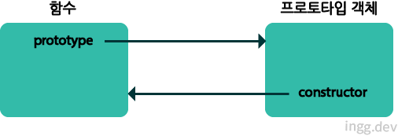

## 함수 생성 방법 3가지

1. **함수 선언문**
2. **함수 표현식**
3. **Function() 생성자 함수**

<br>

## 함수 선언문

- 함수 리터럴 형태와 같음
- 반드시 함수명이 정의되어 있어야함

```js
function add(x, y) {
  return x + y;
}
console.log(add(1, 2)); // 3
```

<br>

## 함수 표현식

- 자바스크립트에서는 함수도 하나의 값처럼 취급됨
- 함수도 숫자나 문자열처럼 변수에 할당 가능

```js
var add = function (x, y) {
  return x + y;
};

var plus = add;

// add와 plus 함수변수는 같은 함수를 참조
console.log(add(1, 2)); // 3
console.log(plus(5, 6)); // 11
```

<br>

### 기명 함수 표현식

- 함수 표현식에서 사용된 이름은 외부 코드에서 접근 불가능함

```js
var add = function sum(x, y) {
  return x + y;
};
console.log(add(1, 2)); // 3
// sum() 호출의 경우 에러발생
console.log(sum(4, 5)); // Uncaught ReferenceError: sum is not defined
```

<br>

### 왜 함수 선언문에서는 함수 이름으로 호출이 가능할까

#### 사실은 함수 선언문도 함수 표현식 형태로 변환된다.

```js
// 함수 선언문
function add(x, y) {
  return x + y;
}

// 자바스크립트 엔진에 의해 함수표현식 형태로 변경
var add = function add(x, y) {
  return x + y;
};
```

- 함수이름과 변수이름이 같으므로 함수이름으로 호출되는것처럼 보임
- 실제로는 add 함수 변수로 외부에서 호출이 가능한 것

<br>

## Function() 생성자를 통한 함수

```js
new Function(arg1, arg2, ... , functionBody)
```

```js
// 자주 사용되지 않음
var add = new Function("x", "y", "return x+y");
console.log(add(1, 2));
```

<br>

## 함수도 객체

- 자바스크립트에서는 함수도 객체
- 함수 자체가 객체처럼 프로퍼티 가질 수 있음

```js
function add(x, y) {
  return x + y;
}
add.result = add(1, 2);

console.log(add.result); //3
```

<br>

## 함수는 일급 객체

- 특징
  - 변수나 배열요소, 객체의 프로퍼티에 할당가능
  - 함수의 인자로 전달가능
  - 함수의 리턴값으로 리턴가능
  - 동적으로 프로퍼티 생성 및 할당 가능

<br>

## 함수 객체의 기본 프로퍼티

```js
function add(x, y) {
  return x + y;
}
console.dir(add);
// ƒ add(x, y)
//   arguments: null
//   caller: null
//   length: 2
//   name: "add"
//   prototype: {constructor: ƒ}
//   __proto__: ƒ ()
//   [[FunctionLocation]]: VM100:1
//   [[Scopes]]: Scopes[1]
```

- name 프로퍼티 : 함수 이름
- caller 프로퍼티 : 자신을 호출한 함수
- arguments 프로퍼티 : 함수를 호출할 때 전달된 인자값 (위에서는 add() 함수가 호출된 상태가 아니므로 null)
- length 프로퍼티 : 함수 실행될때 인자 개수

<br>

#### prototype 프로퍼티

- 모든 함수는 객체로서 `prototype 프로퍼티`를 가짐
- 모든 객체의 부모를 나타내는 내부 프로퍼티인 `[[Prototype]]`과 구별해야함
  - `prototype 프로퍼티`는 함수가 생성될때 만들어지고, `constructor` 프로퍼티 하나만 있는 객체를 가리킴
  - `constructor` 프로퍼티는 자신과 연결된 함수를 가리킴



#### 차이점

- `[[Prototype]]`와 `prototype 프로퍼티`는 둘다 프로토타입 객체를 가리키지만, 함수 객체가 가지는 `prototype 프로퍼티`는 이 함수가 생성자로 사용될때 이 함수를 통해 생성된 객체의 부모역할을 하는 프로토타입 객체를 가리킨다.

<br>

## arguments 객체

- 자바스크립트에서는 함수를 호출할 때 인수들과 함께 `arguments` 객체가 함수 내부로 전달됨

```js
function myFunc(arg1, arg2) {
  console.dir(arguments);
}
myFunc(1, 2);
// Arguments(2)
//    0: 1
//    1: 2
//    callee: ƒ myFunc(arg1, arg2)
//    length: 2
//    Symbol(Symbol.iterator): ƒ values()
//    __proto__: Object
```

- 넘겨지지 않은 인자는 `undefined` 가 할당됨

```js
function myFunc(arg1, arg2) {
  console.log(arg1, arg2);
}
myFunc(33, 44); // 33 44
myFunc(55); // 55 undefined
```
