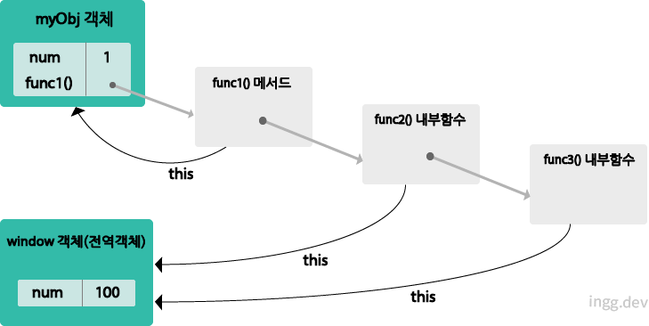
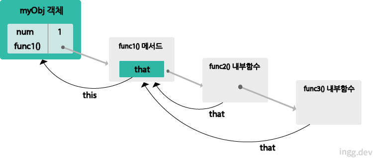

> this 바인딩 <br />
> Regular Function vs Arrow Function

## this 바인딩

- 함수가 호출되는 방식에 따라 this가 다른 객체를 참조한다.
  - 1. 객체의 메서드 호출할 때
  - 2. 함수 호출할 때
  - 3. 생성자 함수 호출할 때

<br>

## 객체의 메서드 호출

- 메서드 내부 코드에서 사용된 `this`는 **해당 메서드를 호출한 객체로 바인딩된다.**

```js
var objA = {
  name: "foo",
  hello: function () {
    console.log(this.name);
  },
};

var objB = {
  name: "boo",
};

objB.hello = objA.hello;

objA.hello(); // foo
objB.hello(); // boo
```

<br>

## 함수를 호출

- 함수를 호출하면 해당 함수 내부에서 사용된 `this`는 **전역 객체에 바인딩된다.**
- 브라우저에서는 **전역객체가 window 객체**가 된다.

```js
var foo = "FOO!";
console.log(foo); // FOO!
console.log(window.foo); // FOO!

var sayFoo = function () {
  console.log(this.foo); // FOO!
};
sayFoo();
```

- **sayFoo() 함수 호출 시 this가 전역객체에 바인딩됨**

<br>

## 내부함수

- 내부함수를 호출했을 경우에도 그대로 적용됨

```js
var num = 100;

var myObj = {
  num: 1,
  func1: function () {
    this.num += 1;
    console.log("func1 호출됨 - num: " + this.num);

    func2 = function () {
      this.num += 1;
      console.log("func2 호출됨 - num: " + this.num);

      func3 = function () {
        this.num += 1;
        console.log("func3 호출됨 - num: " + this.num);
      };
      func3(); // func2() 함수 호출
    };
    func2(); // func2() 함수 호출
  },
};

myObj.func1(); // func1() 메서드 호출
```

- 위 코드는 **2, 3, 4** 가 출력 될것 같지만 그렇지 않다.
- **내부 함수도 함수 이므로 함수 호출**로 취급된다.

<br>



```bash
# 실행 결과
func1 호출됨 - num: 2
func2 호출됨 - num: 101
func3 호출됨 - num: 102
```

<br>

### 내부함수가 this를 참조하는 한계 해결하기

- 부모함수의 this를 내부함수가 접근 가능한 다른 변수에 저장

```js
// 내부함수 this 바인딩

var num = 100;

var myObj = {
  num: 1,
  func1: function () {
    var that = this;

    this.num += 1;
    console.log("func1 호출됨 - num: " + this.num);

    func2 = function () {
      that.num += 1;
      console.log("func2 호출됨 - num: " + that.num);

      func3 = function () {
        that.num += 1;
        console.log("func3 호출됨 - num: " + that.num);
      };
      func3(); // func2() 함수 호출
    };
    func2(); // func2() 함수 호출
  },
};

myObj.func1(); // func1() 메서드 호출
```

- 이제 의도한 대로 **2, 3, 4** 가 출력됨
- 기존 부모함수의 this를 `that` 변수에 저장하고, 이후 내부 변수에서는 that으로 부모함수의 this가 가리키는 객체에 접근한다.

<br>



```bash
# 실행 결과
func1 호출됨 - num: 2
func2 호출됨 - num: 3
func3 호출됨 - num: 4
```

<br>

## 생성자 함수 호출

- 생성자 함수는 자바스크립트의 **객체를 생성하는 역할**을 한다.
- 기존 함수에 **new 연산자를 붙여 호출하면** 해당 함수는 **생성자 함수로 동작**한다.

#### 동작 방식

- 메서드와 함수 호출 방식과 다름
  - 1. 생성자 함수 코드가 실행되기전 빈 객체가 생성됨. 이후 생성자 함수 코드 내부에서 사용된 `this는 이 빈 객체를 가리킴`
  - 2. 생성자 함수가 생성한 객체는 **자신을 생성한 생성자 함수**의 **prototype 프로퍼티가 가리키는 객체**를 자신의 프로토타입 객체로 설정함
  - 3. 함수 코드 내부에서 `this를 사용해서 빈 객체에 동적으로 프로퍼티나 메서드 생성가능`
  - 4. this로 바인딩된 새로 생성된 객체 리턴

```js
var Person = function (name) {
  // 함수 코드 실행 전, 빈 객체 생성됨
  this.name = name; // this가 가르키는 빈 객체에 동적 프로퍼티 생성
  // 함수 리턴
};

var foo = new Person("FOO"); // foo 객체 생성

console.log(foo); // Person {name: "FOO"}
console.log(foo.name); // FOO
```

<br>

#### 객체(객체 리터럴 방식)랑 생성자 함수 방식 차이는 `프로토타입 객체 (__proto__ 프로퍼티)` 에 있다.

```js
// 객체 리터럴로 foo 생성
var foo = {
  name: "foo",
  age: 25,
};

console.dir(foo);
// Object
//     age: 25
//     name: "foo"
//     __proto__: Object
//         constructor: ƒ Object()
//         hasOwnProperty: ƒ hasOwnProperty()
//         isPrototypeOf: ƒ isPrototypeOf()
//         propertyIsEnumerable: ƒ propertyIsEnumerable()
//         toLocaleString: ƒ toLocaleString()
//         toString: ƒ toString()
//         valueOf: ƒ valueOf()
//         __defineGetter__: ƒ __defineGetter__()
//         __defineSetter__: ƒ __defineSetter__()
//         __lookupGetter__: ƒ __lookupGetter__()
//         __lookupSetter__: ƒ __lookupSetter__()
//         get __proto__: ƒ __proto__()
//         set __proto__: ƒ __proto__()
```

```js
// 생성자 함수로 boo 객체 생성
function Person(name, age) {
  this.name = name;
  this.age = age;
}
var boo = new Person("BOO", 30);

console.dir(boo);
// Person
//     age: 30
//     name: "BOO"
//     __proto__: Person
//         constructor: ƒ Person(name, age)
//         __proto__: Object
```

- 객체 리터럴 : 자신의 프로토타입 객체가 Object
- 생성자 함수방식 : 자신의 프로토타입 객체가 **생성자 함수 자체** Person

<br>

## Regular Function vs Arrow Function

- Function call 에서는, `this = undefined`
  - (strict mode가 아니면 global object인 window)
- Arrow function 에서는, `this = <this of surrounding function (lexical this)>`
  - (화살표함수의 바깥의 this값이 화살표함수의 this)

#### 실습 1

```js
"use strict";

const mary = {
  firstName: "Mary",
  year: 1999,
  calcAge: function () {
    console.log(this);
    console.log(2021 - this.year);
  },

  greet: () => console.log(`Hi, ${this.firstName}`), // Hi, undefined
};

mary.greet();
```

- 위에서 화살표함수는 부모 스코프의 `this` 가 **_global scope_** 이므로 `undefined`이 출력

<br>

#### 실습 2

```js
"use strict";

const mary = {
  firstName: "Mary",
  year: 1999,
  calcAge: function () {
    console.log(2021 - this.year); // 22

    const isMillenial = function () {
      console.log(this); // undefined
      console.log(this.year >= 1988); // Uncaught TypeError: Cannot read properties of undefined (reading 'year')
    };

    isMillenial();
  },

  greet: () => console.log(`Hi, ${this.firstName}`),
};

mary.calcAge();
```

- 메서드 안에서 실행됐어도, 결국 Regular Function Call 이므로 여기서도 `this`가 `undefined` 이다.

<br>

#### 실습 2 해결 (pre ES6)

- self로 this에 접근하기

```js
const mary = {
  firstName: "Mary",
  year: 1999,
  calcAge: function () {
    console.log(2021 - this.year);

    const self = this;
    const isMillenial = function () {
      console.log(self); // {firstName: 'Mary', year: 1999, calcAge: ƒ, greet: ƒ}
      console.log(self.year >= 1988); // true
    };

    isMillenial();
  },

  greet: () => console.log(`Hi, ${this.firstName}`),
};

mary.calcAge();
```

#### 실습 2 해결 (arrow function)

```js
const mary = {
  firstName: "Mary",
  year: 1999,
  calcAge: function () {
    console.log(2021 - this.year);

    const isMillenial = () => {
      console.log(this); // {firstName: 'Mary', year: 1999, calcAge: ƒ, greet: ƒ}
      console.log(this.year >= 1988); // true
    };

    isMillenial();
  },

  greet: () => console.log(`Hi, ${this.firstName}`),
};

mary.calcAge();
```

- 화살표함수는 **parent scope**인 **calcAge 메서드**에서 `this( = mary object)`를 사용하므로 위와 똑같이 작동한다.
