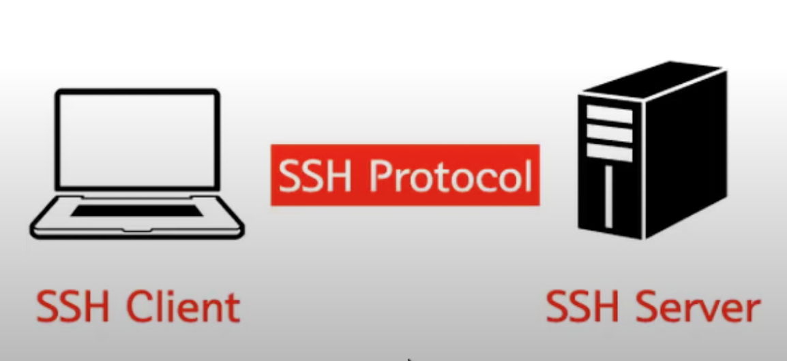
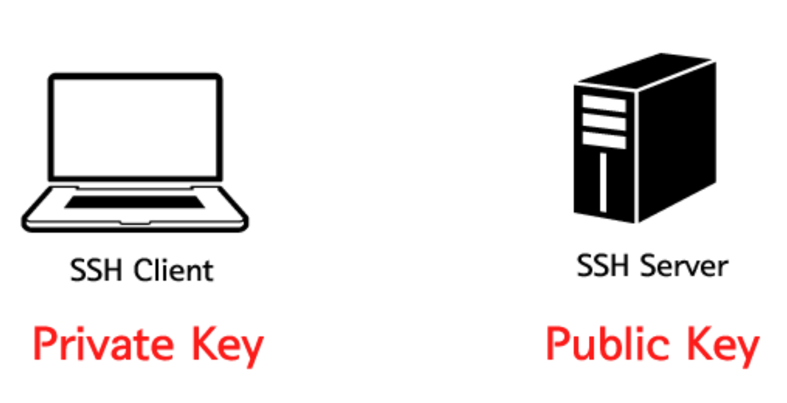

## SSH란

SSH(Secure Shell)란 명령어로 입력해서 컴퓨터를 자신의 집에서 원격지에 있는 컴퓨터를 제어할 수 있는 방식

ex) 내 노트북(SSH Client), 원격지에 있는 컴퓨터(SSH Server)

즉, 네트워크 프로토콜 중 하나로 컴퓨터와 컴퓨터가 인터넷과 같은 Public Network를 통해 서로 통신할 때 보안적으로 안전하게 통신을 하기 위해 사용하는 프로토콜

- 셸로 원격 접속을 하는 것. CLI 상에서 작업하게됨
- 기본 포트는 22번

암호화된 방식으로 데이터를 주고 받기때문에 중간에 누가 가로챈다고 해도, 암호화 되어있음

 

## SSH 클라이언트

- Mac에서는 기본적으로 SSH 클라이언트가 설치 되어 있기 때문에 SSH를 이용하기 위해서 특별한 클라이언트가 필요하지 않음
- 윈도우에서는 SSH 클라이언트가 설치되어 있지 않아서 원격지에서 원격지에 있는 컴퓨터를 SSH를 이용해서 제어할 수 있는 역할을 대신해주는 클라이언트를 설치해야함
  - ex) PuTTY, Xshell

 

## SSH 사용 예시

- 데이터 전송
  - 원격 저장소인 깃허브. 소스코드를 깃헙에 푸시할때 SSH를 활용해 파일을 전송함
- 원격제어
  - AWS의 인스턴스 서버에 접속해서 해당 머신에 명령을 내리기 위해서도 SSH를 통한 접속을 함

 

## SSH key 동작방식

- SSH Key는 공개키(public key)와 비공개 키(private key)로 이루어짐
- 비공개 키는 로컬머신(SSH Client)에 위치해야하고, 공개키는 원격 머신(SSH Server)에 위치해야함
- SSH 접속을 시도하면 SSH Client가 로컬 머신의 비공개키와 원격 머신의 비공개키를 비교해서 둘이 일치하는지를 확인함

 

#### Reference

- https://opentutorials.org/module/432/3738
- https://opentutorials.org/module/432/3742
- https://baked-corn.tistory.com/52
- https://www.youtube.com/watch?v=Bxz-1EgyA7w
