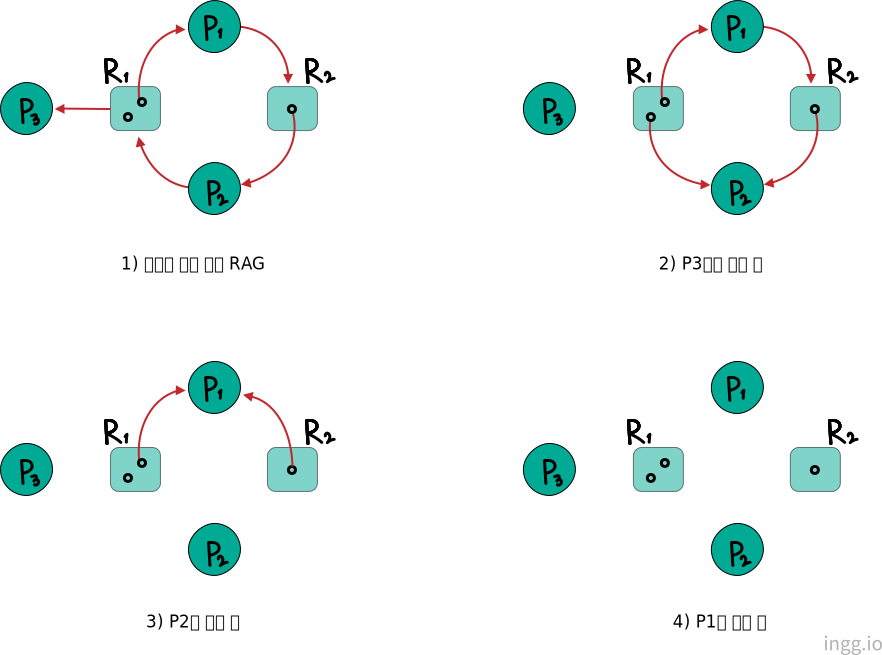
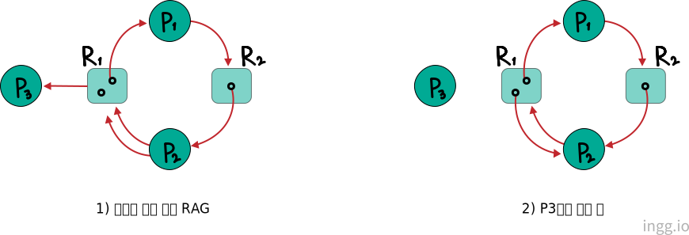

## 교착상태(Deadlock)란?

둘 이상의 프로세스가 각자 가지고 있던 자원을 보유한 채로 외부적 조치가 없는한 영원히 그 상태에서 기다리고 있는 상황

- 문제점1: 해당 프로세스들이 더 이상 실행되지 못하여 사용자들에게 응답해 주지 못함
- 문제점2: 보유된 자원들이 교착 상태에서 벗어나기 전까지 전혀 활용되지 못함

결국 시스템 성능 저하로 이어짐

 

## 자원(Resource)이란?

- 물리적인 분류
  - 하드웨어 자원: 눈으로 보고 만질 수 있는 모든 자원(하드디스크, 메모리)
  - 소프트웨어 자원: 데이터, 메시지 등
- 선점 가능성에 따라
  - 선점 가능 자원 : (CPU, 메모리처럼) 한 프로세스에 의해 사용 도중 선점되어 다른 프로세스에게 할당해 주었다가 이 후 다시 원래 프로세스에게 돌려주어도 되는 자원들
  - 선점 불가능 자원 : 선점 될 경우 자원을 뺏긴 프로세스는 불이익을 받는 경우의 자원
- 사용되는 방식에 따라
  - 공유 가능 자원 : 한 프로세스에게 할당된 자원을 동시에 다른 프로세스가 할당받아 같이 사용할수 있는 자원
    - ex) 공유가능한 프로그램(시스템 프로그램 or 유틸리티 프로그램), 공유 데이터 등
  - 배타적 사용 자원 : 공유가능하지 않은 자원
    - ex) CPU, 메모리, 테이프, 버퍼(Buffer), 키보드, 모니터 등
- 속성에 따라
  - 순차적 재사용 가능 자원 : 먼저 할당된 자원이 사용후 반납되었을때 자원 자체는 계속 존재하여 다른 프로세스에게 할당 가능한 자원
    - ex) CPU, 메모리, 테이프, 하드디스크, 버퍼, 프로그램
  - 소모성 자원 : 사용 후 사라지는 자원
    - ex) 시그널(Signal), 메시지

 

### 실행중인 프로세스가 자원에 대해 취할 수 있는 행동

1. 필요한 자원에 대한 요청 : 요청된 자원이 사용가능하면 이 자원을 할당받아 사용하고, 다른 프로세스에 의해 사용중이라면 반납될때까지 대기상태로 기다린다.
2. 사용이 끝난 자원의 반납 : 실행 중인 프로세스가 시스템 서비스를 호출(System Call)하여 운영체제에 의해 이루어짐

 

## 교착 상태 원인

다음 4가지 조건이 모두 갖춰질때 교착상태가 발생한다.

1. **자원의 배타적인 사용** : 시스템이 보유한 자원 중 배타적 사용이 요구되는 자원 때문

2. **자원의 부분 할당 (점유대기, Hold & Wait)** : 프로세스가 할당된 자원을 가진 상태에서 다른 자원을 기다리는 경우

3. **자원의 선점 불가능성** : 자원의 선점 불가능성을 고수할 경우

4. **자원에 대한 환형 대기** : 각 프로세스가 자신의 자원은 보유한채로, 상대방의 자원을 상호 요청하는 경우

 

## 교착 상태 해결

교착 상태 해결을 위한 기법은 **예방, 회피, 탐지, 복구** 기법이 있다.

 

### 예방 기법

교착 상태가 발생되는 4가지 원인 중에 하나를 없애서 발생을 막는 방법

- 자원의 배타적 사용 조건을 배제 : 모든 자원을 공유 자원으로 함
  - 문제점 : 자원 중에는 배타적으로 사용할 수 밖에 없는 자원들도 있음 (ex 프린터, 테이프 장치..)
- 자원의 부분할당을 배제 : 모두 할당
  - 문제점 : 자원의 낭비, 프로세스의 무한대기 가능성
- 자원의 선점 불가능을 배제 : 모든 자원이 선점가능 하게 함
  - 문제점 : 자원의 낭비, 비정상적인 종료로 프로세스가 무한 대기 가능성
- 자원의 환형 대기 상황을 배제
  - 문제점 : 자원의 낭비, 프로세스의 무한대기 가능성

 

### 회피 기법

예방 기법과 교착 상태를 막는 것은 비슷하지만 다른 알고리즘

- 대표적으로 은행가 알고리즘 : 시스템의 상태를 **안전 상태**로 계속 유지

> 안전 상태(Safe State) : 시스템에 있는 모든 프로세스가 유한 시간내에 정상적으로 종료될 수 있는 상태

 

### 탐지 기법

자원 할당 그래프(Resource Allocation Graph, RAG)를 통해 교착 상태를 탐지한다.

- 화살표(에지) : 프로세스와 자원들간의 할당과 대기 상황
- 프로세스 노드 = 동그라미
- 자원 노드 = 네모
- 싱크(Sink) : RAG에서 자원으로 향하는 에지가 없는 프로세스

#### RAG 그래프 제거 과정

- 교착 상태가 없는 예

**R1**과 **R2**가 각각 2개, 1개 자원을 가질때 싱크는 **P3**밖에없으므로 **P3**으로 향하는 에지 제거를 제거한다. 그결과 반납되는 자원을 **P2**에 할당하면 **P2**가 다시 싱크가 되고 에지들이 제거된다. 모든 에지가 제거되므로 제거 전의 **원래 RAG에 교착상태는 없다.**

 

- 교착 상태가 있는 예

**P2->R1** 에지는 2개인데 **R1**형 자원2개가 필요하다는 요청이다. **P3**으로 제거를 한 후 반납된 자원이 **P2**를 싱크로 만들어주지 못한다. 아직 한개가 더필요하고 **P1**이 가지고 있다. 따라서 더이상 에지를 제거할 싱크가 없고 제거 전의 **원래 RAG에 교착상태가 있다**는 것이 탐지된다.

 

### 복구 기법

- 프로세스의 종료 방식 : 교착 상태로부터 복구될때까지 종료 비용이 최소인 프로세스부터 종료시킨다.

- 자원의 선점에 의한 방식 : 필요한 자원을 가지고 있는 프로세스부터 강제로 뺏어(선점하여) 교착상태의 프로세스들에게 준다.

프로세스 종료 방식과 차이는, 자원을 선점 당하는 프로세스는 교착 상태와 상관이 없어도 해당 자원을 가지고 있으면 선택될 수 있다.
