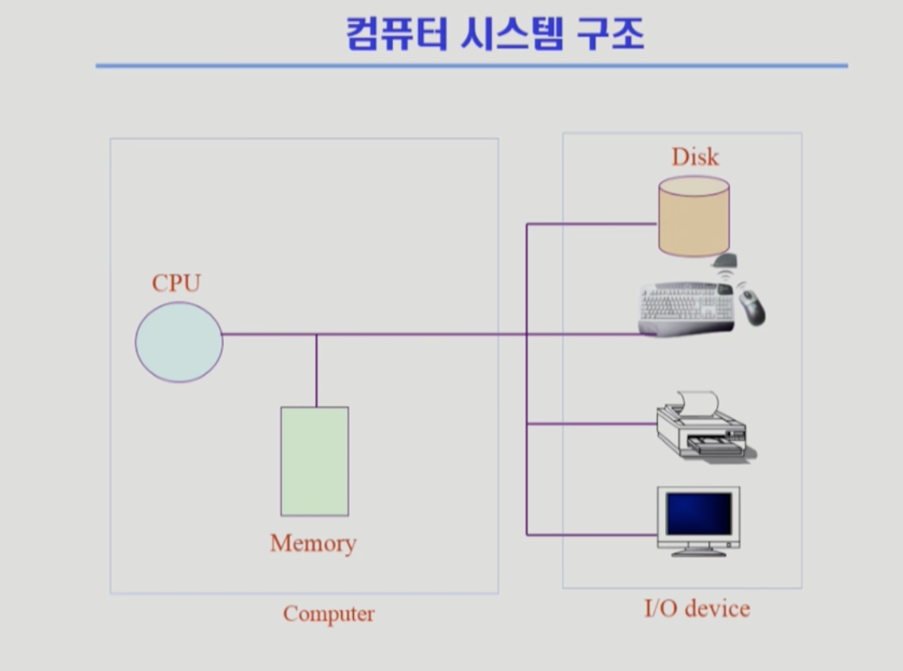

## 운영체제

> 이화여대 반효경 교수님 [kocw 공개강의](http://www.kocw.net/home/search/kemView.do?kemId=1046323)를 듣고 정리한 레포지토리 
> 운영체제는 컴퓨터 하드웨어 바로 위에 설치되는 소프트웨어 계층으로서 모든 컴퓨터 시스템의 필수적인 부분이다. 본 강좌에서는 이와 같은 운영체제의 개념과 역할, 운영체제를 구성하는 각 요소 및 그 알고리즘의 핵심적인 부분에 대해 기초부터 학습한다.

## 운영체제란 무엇인가?

> 컴퓨터 하드웨어 바로 위에 설치되어 사용자 및 다른 모든 소프트웨어와 하드웨어를 연결하는 소프트웨어 계층

- 협의의 운영체제(커널) : 운영체제의 핵심 부분으로 메모리에 상주하는 부분 (좁은 의미)
- 광의의 운영체제 : 커널 뿐 아니라 각종 주변 시스템 유틸리티를 포함한 개념 (넓은 의미)

 

## 운영체제의 목적

- 컴퓨터 시스템을 편리하게 사용할 수 있는 환경을 제공
- 컴퓨터 시스템의 **자원을 효율적으로 관리** (프로세서, 기억장치, 입출력 장치 등의 효율적 관리)

 

## 운영 체제의 분류

### 동시 작업 가능 여부

- 단일 작업(Single tasking) : 한번에 하나의 작업만 처리 (ex: MS-DOS 프롬프트 상에서는 동시에 한 명령만 가능)
- 다중 작업(Multi tasking) : 동시에 두개 이상의 작업 처리. 현대의 운영체제. (ex: UNIX, MS Window등에서는 한 명령의 수행이 끝나기 전에 다른 명령이나 프로그램을 수행 할 수 있음)a

### 사용자의 수

- 단일 사용자 (single user)
- 다중 사용자 (multi user)

### 처리 방식

- 일괄처리 (batch processing)
  - 작업 요청의 일정량을 모아 한꺼번에 처리
  - 작업이 완전 종료될 때까지 기다려함
- 시분할 (time sharing)
  - 여러 작업을 수행할 때 컴퓨터 처리 능력을 일정한 시간 단위로 분할하여 사용
  - 일괄 처리 시스템에 비해 짧은 응답시간
  - interactive한 방식(바로 결과가 화면에 나오는)
- 실시간 (Realtime OS)
  - 정해진 시간 안에 어떠한 일이 반드시 종료됨이 보장되어야 하는 실시간시스템을 위한 OS

## 몇가지 용어

- Multitasking
- Multiprogramming : 여러 프로그램이 메모리에 올라가 있음을 강조
- Time sharing : CPU의 시간을 분할하여 나누어쓴다는 의미를 강조
- Multiprocess

위의 용어들은 컴퓨터에서 여러 작업을 동시에 수행하는 것을 뜻함

- Multiprocessor : 하나의 컴퓨터에 CPU (processor)가 여러개 붙어 있음을 의미

## 운영체제의 예

- 유닉스(UNIX)
  - 코드의 대부분을 C언어로 작성
  - 높은 이식성
  - 최소한의 커널 구조
  - 복잡한 시스템에 맞게 확장 용이
  - 소스 코드 공개, 프로그램개발에 용이
  - 다양한 버전(System V, FreeBSD, SunOS, Solaris, Linux)
- DOS(Disk Operating System)
  - MS사에서 1981년 IBM-PC를 위해 개발
  - 단일 사용자용 운영체제, 메모리 관리 능력의 한계
- MS Windows
  - MS사의 다중 작업용 GUI기반 운영체제
  - Plug and Play, 네트워크 환경 강화
  - DOS용 응용프로그램과 호환성 제공
  - 풍부한 지원 소프트웨어

## 운영체제의 구조

`CPU <-> Memory <-> Disk, I/O device`

CPU 스케줄링 : 누구한테 CPU를 줄 것인가
메모리 관리 : 한정된 메모리를 어떻게 쪼개 쓸것인가
Disk - 파일관리 : 디스크에 파일을 어떻게 보관할 것인가
I/O device - 입출력 관리 : 각기다른 입출력장치와 컴퓨터 간에 어떻게 정보를 주고받게 할 것인가

 

## System Structure & Program Execution

컴퓨터 시스템은 크게 CPU와 메모리로 구성된 컴퓨터와 IO device로 구성되어있음
