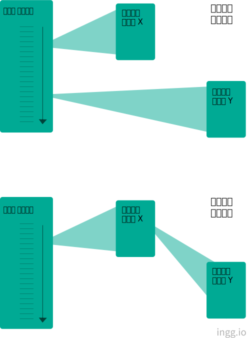

## 운영체제란?

> 사용자 인터페이스(User Interface)와 자원관리(Resource Management)를 위한 프로그램의 집합

운영체제는 시스템의 자원과 동작을 관리하는 소프트웨어다.
 

### 운영체제의 목적

1. 컴퓨터 시스템을 편리하게 사용할 수 있는 환경을 제공
2. 컴퓨터 시스템의 자원을 효율적으로 관리

쉘(Shell)이라고도 불리는 사용자 인터페이스는 사용자나 응용프로그램이 운영체제와의 의사소통에 필요한 요소이다.

- 사용자 인터페이스(쉘)

  - 장치관리 (시스템 주변 장치 : 키보드/모니터/하드디스크 등을 제어)
  - 파일관리 (사용자가 파일을 만들고 지우고 수정, 디렉토리 관리)
  - 메모리관리 (주기억 장치의 관리 담당)
  - 처리기관리 (CPU의 처리능력을 각 작업에 효과적으로 배분하도록 함)

#### 크게 커널과 유틸리티 프로그램으로 나뉨

- 커널(Kernel) : 운영체제의 각 기능들 중 사용자와 실행프로그램을 위해 자주 사용되는 부분
  - 컴퓨터가 처음 부팅될때 주기억 장치에 적재
  - 시스템의 운영이 종료될때까지 계속해서 주기억장치에 남음
- 유틸리티 : 사용자 인터페이스의 대부분이 속함

 

## 부팅

- 과정
  - 전원 버튼이 눌러져 커널이 메모리에 올라와 실행됨 -> 장치들을 준비시키고 각종 레지스터값을 초기화 -> 사용자의 입력을 받을 준비를 마침 (=부팅 되었다)
- 부트 프로그램은 커널을 찾아 메모리에 올린 후 실행시켜줌

 

## 레지스터(Register)

> CPU에 위치한 고속메모리

- 사용 목적에 따라 8/16/32비트 등의 크기
- 프로그램에서 이용 가능한 것들 : 데이터, 주소, 조건 코드 레지스터
- CPU의 연산을 제어하기 위한 것들 : MBR, MAR, IR, PC

 

## 명령어 처리

- 명령어를 처리하는 절차 :
  메모리에 있는 명령어를 읽어 처리기에 있는 레지스터로 가져옴 (연산을 제어하는 레지스터들이 동원됨) -> 연산의 종류를 파악하여 실제로 실행 -> 하나의 명령어가 처리됨

 

## 인터럽트(Interrupt)

각 자원(장치or주변장치)들이 능동적으로 자신의 상태변화를 CPU에게 알리는 방식

- 하드웨어 인터럽트 : 자원들로부터의 인터럽트
  - 현재 진행중인 명령어 실행을 마치고 처리됨
- 소프트웨어 인터럽트 : CPU의 내부적인 연산이나 명령에 의해 발생되는 인터럽트

#### 인터럽트 처리 절차

- 장치가 인터럽트 신호를 CPU에게 보냄
- CPU는 명령어를 실행중이었으면 먼저 이 명령어의 실행을 완료시키고 인터럽트 신호 확인
- 실행 중이던 프로그램이 인터럽트 처리후 다시 실행되기 위해 현 상태의 정보를 시스템 스택에 저장
- 인터럽트 처리 루틴의 시작 주소를 PC에 넣어 실행
- CPU에 있는 레지스터들의 값을 저장하고, 필요한 인터럽트 처리를 시작

#### 중첩된 인터럽트 처리

- 순차적 처리 : 인터럽트를 처리하는 동안 발생한 인터럽트는 현재 처리가 끝난 뒤에 처리
- 중첩 처리 : 현재 처리중인 인터럽트를 잠시 접어두고 다른 인터럽트로 실행을 옮길 수 있게 함

 

## I/O 방식

> 입출력 장치에는 컨트롤러가 있고 여기에는 CPU와 입출력할 데이터를 저장하는 버퍼가 있음

1. CPU 개입 정도에 따라

- 프로그램에 의한 입출력 (Programmed I/O)
  - CPU가 지속적으로 완료 여부를 확인
- 인터럽트에 의한 입출력 (Interrupt-driven I/O)
  - 입력이 이루어지는 사이 CPU는 다른 작업에 활용
  - 완료 시 인터럽트를 통해 CPU에 알려짐
- 메모리에 직접 접근하는 입출력 (Direct Memory Access, DMA)
  - 입출력 작업을 CPU대신 채널이 해줌
  - 인터럽트의 횟수가 줄어듬

2. 하드웨어 구성에 따라

- 독립적인 입출력 (Isolated I/O)
  - 입출력 장치들이 입출력버스(I/O Bus)를 통해 CPU와 연결됨
- 메모리 주소지정 입출력(Memory-mapped I/O)
  - 입출력 장치들이 메모리와 함께 메모리 버스에 연결됨
