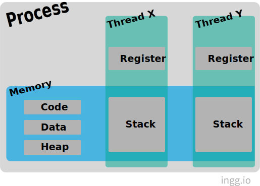

# 프로세스와 스레드

## 프로세스(Process)

프로세스는 **실행 중인 프로그램**이다. 프로그램과 프로세스의 차이는 **생명력**에 있다. `프로그램`은 단순히 보조 기억장치(하드디스크, SSD)에 저장되어 있고, 실행되기를 기다리는 명령어와 정적인 데이터의 묶음인데 이 프로그램의 명령어와 정적 데이터가 메모리에 적재되면 생명력이 있는 `프로세스`가 된다.

### 프로세스 제어 블록 (Process Control Block, PCB)

PCB는 특정 프로세스에 대한 중요한 정보를 저장 하고 있는 운영체제의 자료구조이다. 프로세스 하나가 만들어진다는 것은 프로세스에 대한 모든것을 표현하는 PCB하나가 만들어진다는 것과 같다.

#### PCB에 저장되는 정보들

- 프로세스 번호(Process ID, PID) : 프로세스 식별 번호
- 프로세스 상태 : 준비, 실행, 대기, 보류 등의 상태를 나타냄
- 프로세스 우선순위 : 스케줄링을 할때 사용되는 우선순위
- 프로그램 카운터 값 : 프로세스가 다음에 실행할 명령어의 주소
- 메모리 포인터 : 프로그램과 데이터가 저장된 메모리 블록 위치, 공유되는 메모리 블록들의 포인터 등
- 문맥 데이터 : 문맥교환 시 CPU 레지스터 값들을 저장
- 할당받은 자원들에 대한 목록
- 계정 정보 : CPU 사용시간 등의 정보
- 입출력 정보 : 진행중인 입출력 요구 등의 정보

 

## 스레드(Thread)

스레드는 **프로세스의 실행 단위**이다. 한 프로세스 내의 스레드들은 프로세스가 가지는 주소 공간이나 자원을 공유할 수 있다. 스레드는 스레드 ID, 프로그램 카운터, 레지스터 집합, 그리고 스택으로 구성된다.

하나의 프로세스를 다수의 스레드로 만들어 실행하는 것을 **다중 스레딩(Multi-threading)** 이라고 한다. 자원의 생성과 관리가 중복되는 것을 줄일 수 있다. 이 경우 각각의 스레드는 독립적인 작업을 수행을 위해 각각의 스택과 PC 레지스터 값을 갖고 있다.

<!--  -->

#### 스택을 스레드마다 독립적으로 할당하는 이유

스택은 함수 호출 시 전달되는 인자, 되돌아갈 주소값 및 함수 내에서 선언하는 변수 등을 저장하기 위해 사용되는 메모리 공간이므로 스택 메모리 공간이 독립적이라는 것은 독립적인 함수 호출이 가능하다는 것이고 이는 독립적인 실행 흐름이 추가되는 것이다. 따라서 스레드의 정의에 따라 독립적인 실행 흐름을 추가하기 위한 최소 조건으로 독립된 스택을 할당한다.

#### PC Register를 스레드마다 독립적으로 할당하는 이유

PC 값은 스레드가 명령어의 어디까지 수행하였는지를 나타나게 된다. 스레드는 CPU 를 할당받았다가 스케줄러에 의해 다시 선점당한다. 그렇기 때문에 명령어가 연속적으로 수행되지 못하고 어느 부분까지 수행했는지 기억할 필요가 있다. 따라서 PC 레지스터를 독립적으로 할당한다.

 

## 프로세스와 스레드의 차이점

**프로세스**는 완벽히 독립적이기 때문에 메모리 영역(Code, Data, Heap, Stack)을 다른 프로세스와 공유하지 않는다. **스레드**는 스택 공간을 제외한 나머지 공간과 시스템 자원을 공유한다. 그러므로 프로세스를 이용하여 동시에 처리하던 일을 스레드로 구현할 경우 메모리 공간은 물론 시스템 자원 소모도 현격히 줄어든다.
