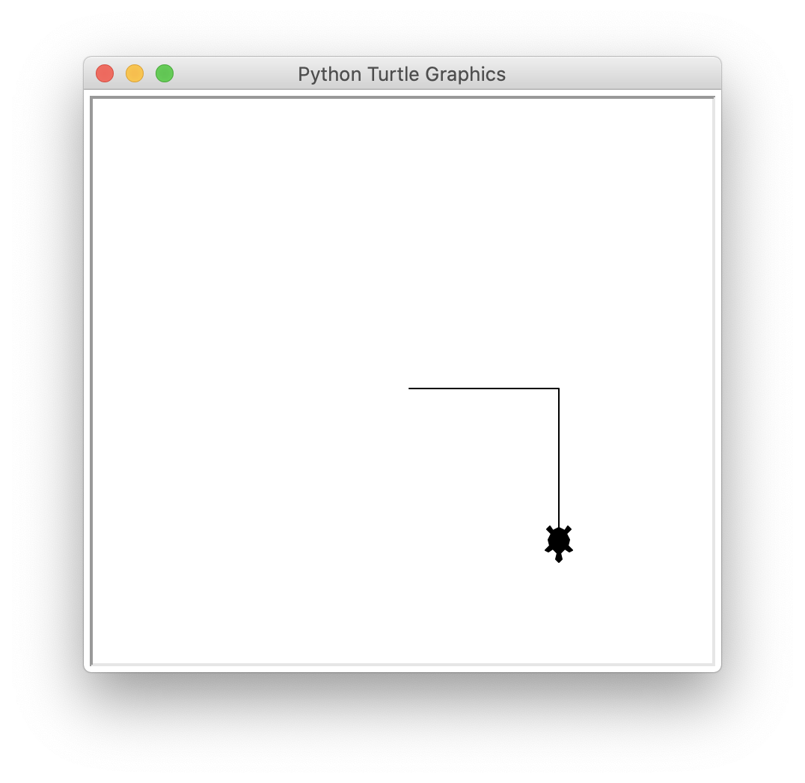
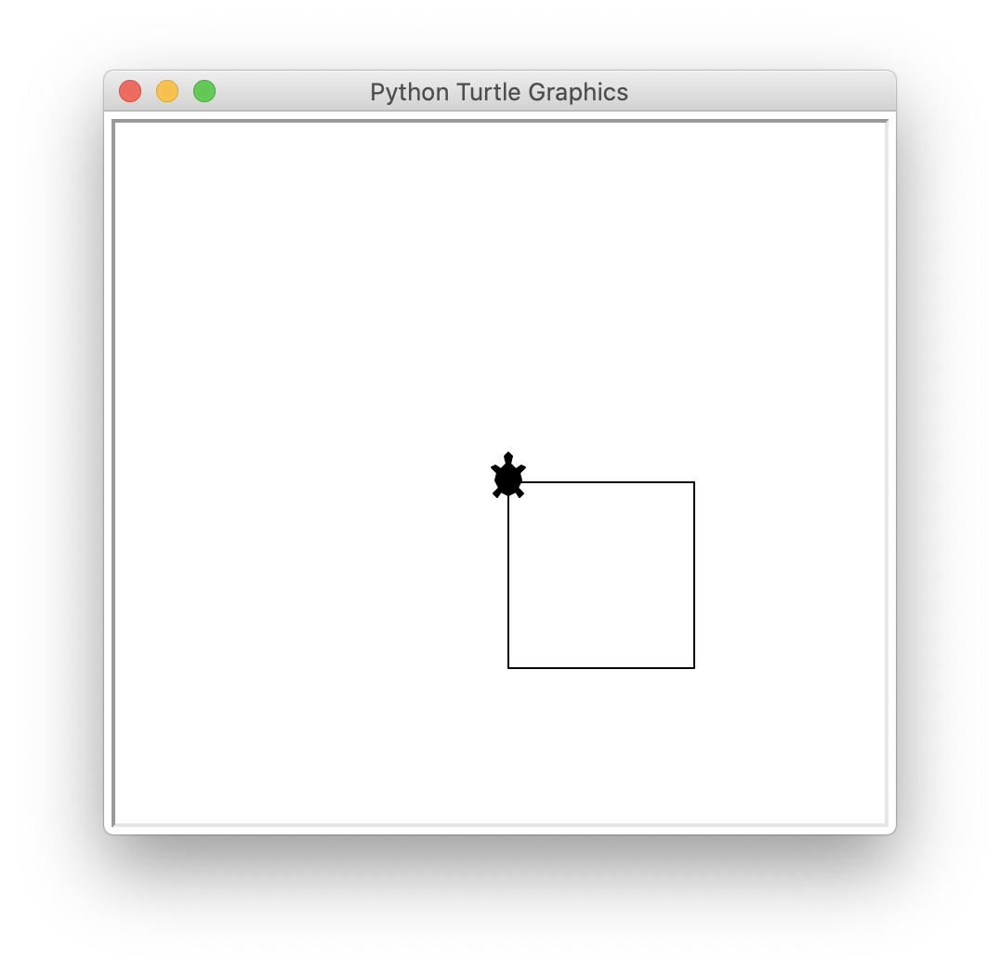
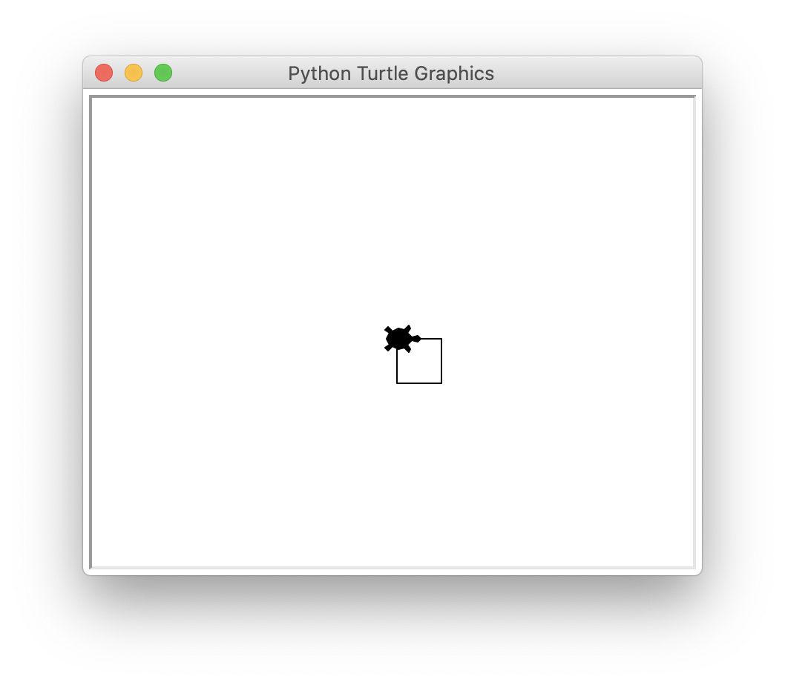
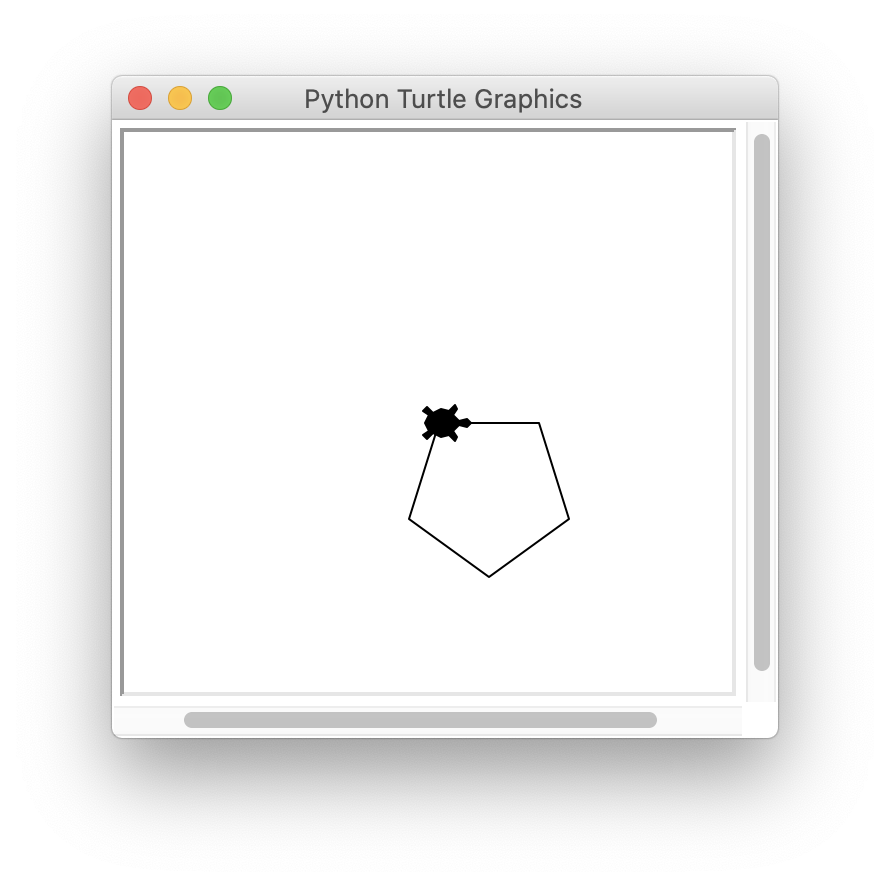

# 터틀 그래픽스로 그림 그리기

> 터틀은 초보자가 파이썬을 쉽게 배울 수 있도록 만든 모듈이다.

## 사각형 그리기

이렇게 작성하면 그림을 그릴수 있다.

```py
>>> import turtle as t
>>> t.shape('turtle')
```

- 앞으로 이동시키기

```py
>>> t.forward(100)
```


- 방향을 바꾸기

```py
>>> t.right(90)
>>> t.forward(100)
```



- 같은 방법으로 사각형 이어 그리기

```py
>>> t.right(90)
>>> t.forward(100)
>>> t.right(90)
>>> t.forward(100)
>>> t.right(90)
>>> t.forward(100)
```



```
앞으로 이동 : forward, fd
뒤로 이동 : backward, bk, back
왼쪽으로 회전 : left, lt
오른쪽으로 회전 : right, rt
```

### 반복문으로 사각형 그리기

```py
>>> import turtle as t

>>> t.shape('turtle')
>>> for i in range(4):
	    t.forward(30)
	    t.right(90)
```



## 오각형 그리기

```py
>>> import turtle as t

>>> t.shape('turtle')
>>> for i in range(5):
	t.forward(50)
	t.right(360 / 5)
```



## 원 그리기

```py
>>> import turtle as t
>>> t.shape('turtle')
>>> t.circle(60)
```
