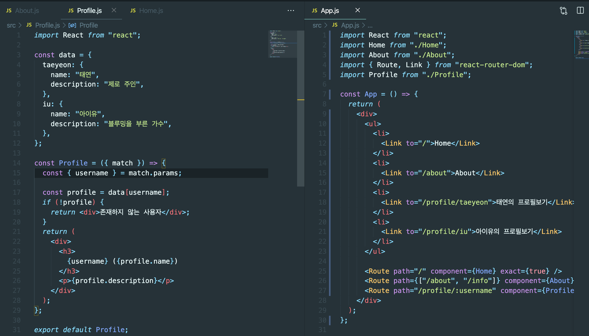
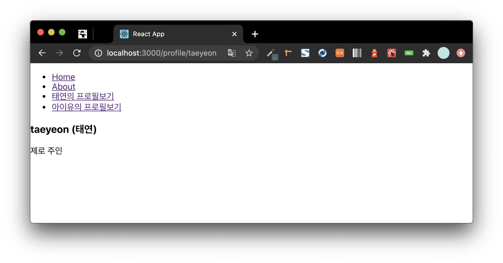
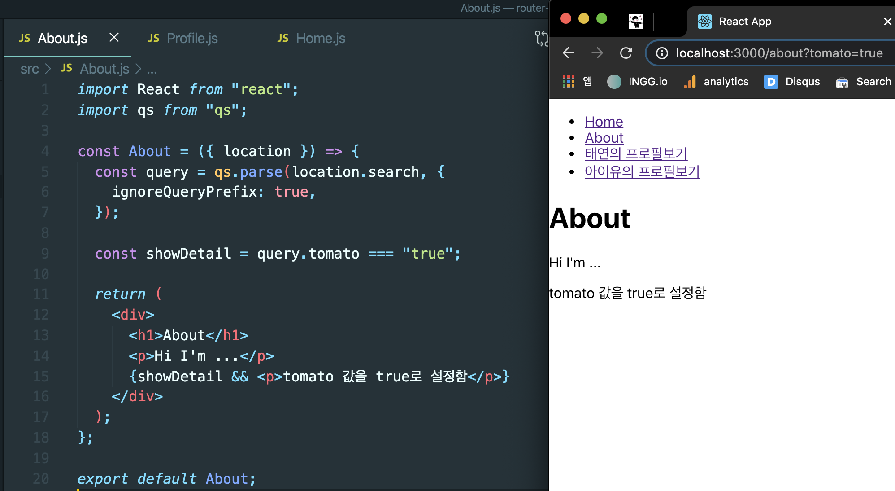

## SPA란?

- SPA(Single Page Application)은 한 개의 페이지로 이뤄진 애플리케이션
- 새로 화면을 보여줄때마다 서버측에서 모든 뷰를 준비하면 성능상 문제가 발생할 수 있음
- 리액트를 사용하여 뷰 렌더링을 사용자의 브라우저가 담당하게하고 인터렉션이 발생하면 필요한 부분만 js로 업데이트함
- 다른 주소에 다른 화면을 보여주는 것을 라우팅이라고 함
- 라우팅 라이브러리로는 리액트 라우터(react-router), 리치 라우터(reach-router), Next.js 등이 있음

#### SPA 단점

- 로딩시 방문하지 않을 페이지의 스크립트도 불러움 = 앱의 규모가 커지만 js파일이 무거워짐
  - 코드 스플리팅으로 개선할 수 있음

### 설치

```js
$ yarn add react-router-dom
```

### 라우터 적용

- **_src/index.js_**

```js
//...
import { BrowserRouter } from "react-router-dom";

ReactDOM.render(
  <BrowserRouter>
    <App />
  </BrowserRouter>,
  document.getElementById("root")
);
```

### 컴포넌트 연결

```js
import { Route } from "react-router-dom";

<Route path="주소" component={보여줄 컴포넌트} />
```

- 경로 규칙이 일치하면 `exact={true}` 를 추가

```js
<Route path="/" component={Home} exact={true} />
```

- Route 하나에 여러 경로를 설정하기

```js
<Route path="/about" component={About} />
<Route path="/info" component={About} />
// 는 아래와 같음

<Route path={["/about", "/info"]} component={About} />
```

### Link 컴포넌트

- 리액트 라우터를 사용할때는 `a`태그 대신 `Link`컴포넌트를 이용
  - `a`태그는 페이지를 새로 불러와서 애플리케이션의 상태들을 모두 날리기때문
  - Link컴포넌트는 페이지 전환을 방지함

```js
<Link to="주소">내용</Link>
```

<br>

## URL 파라미터, 쿼리

- 파라미터 : 일반적으로 특정 아이디나 이름을 사용하여 조회할때 사용
  - 파라미터 예 : **_/profile/ingg_**
- 쿼리 : 어떤 키워드를 검색하거나 페이지에 옵션을 전달할때 사용
  - 쿼리 예 : **_/about?details=true_**

### URL 파라미터

- `match`라는 객체안의 `params` 값을 참조
  - `match`객체 안에는 현재 컴포넌트가 어떤 경로 규칙에 의해 보이는지 정보가 들어있음




### URL 쿼리

- 쿼리는 `location` 객체에 들어있는 `search`값에서 조회가능
  - `location`객체는 라우트로 사용된 컴포넌트에게 `props`로 전달되고, 웹 애플리케이션의 현재 주소에 대한 정보를 가지고 있음

```
// location 형태 ex) http://localhost:3000/about?detail=true
{
    "pathname": "/about",
    "search": "?detail=true",
    "hash": ""
}
```

- URL 쿼리를 읽을때는 `search`값을 확인해야함
  - 문자열 형태로 되어있어서 객체 형태로 변환해야함
- 쿼리 문자열을 객체로 변환할때는 `qs`라이브러리 사용

```
$ yarn add qs
```


