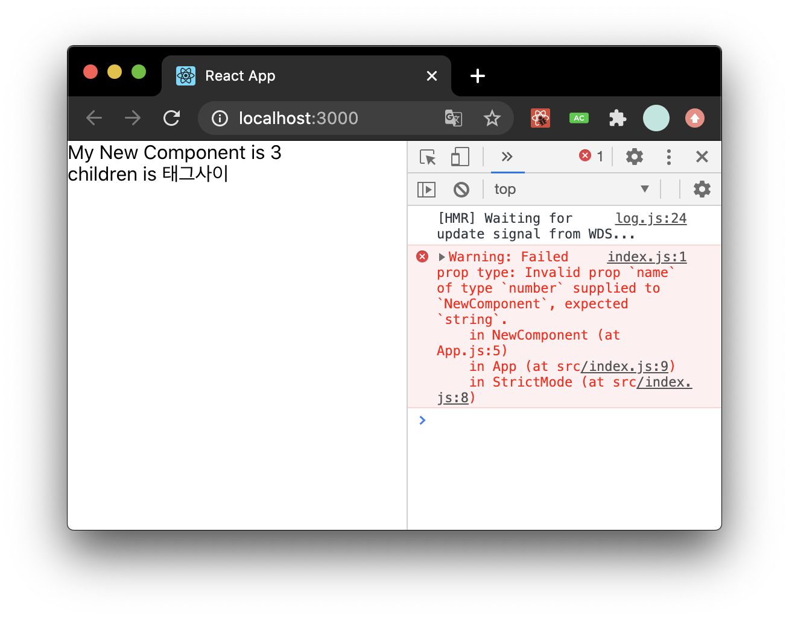
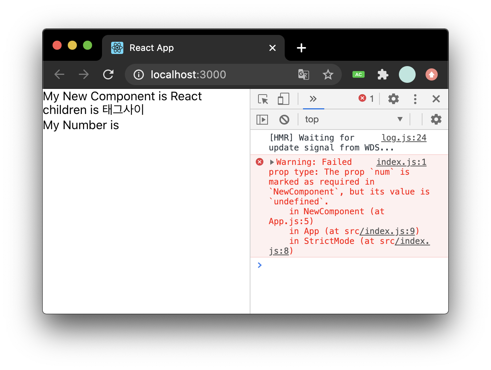
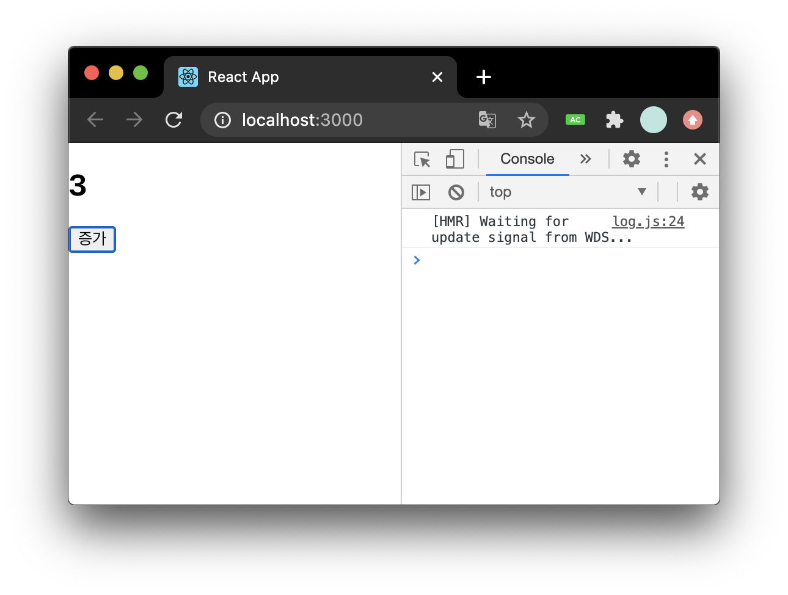
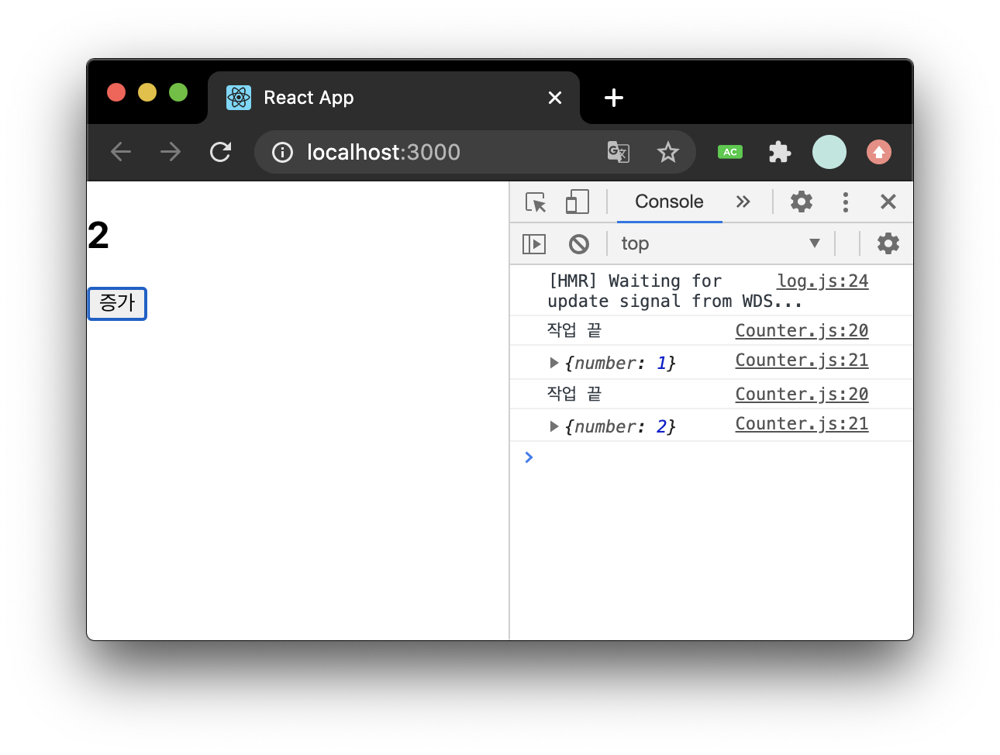
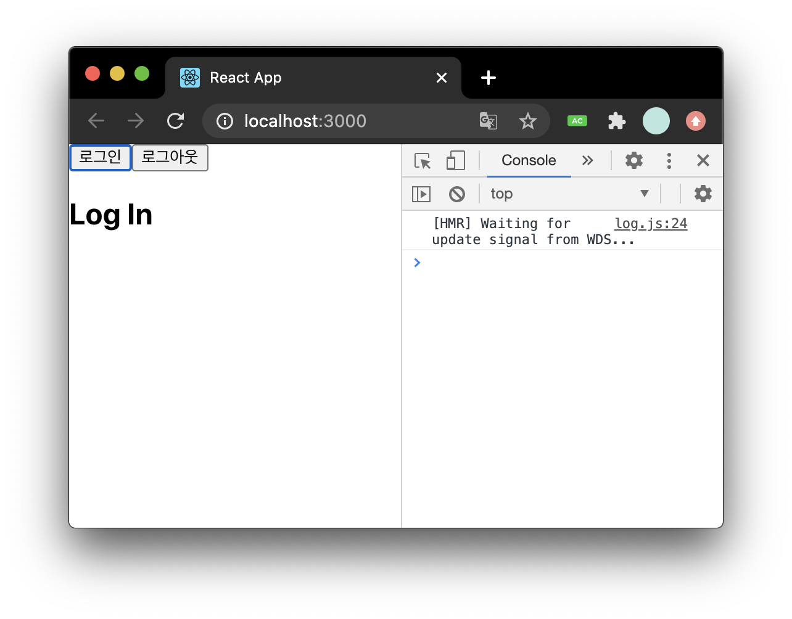
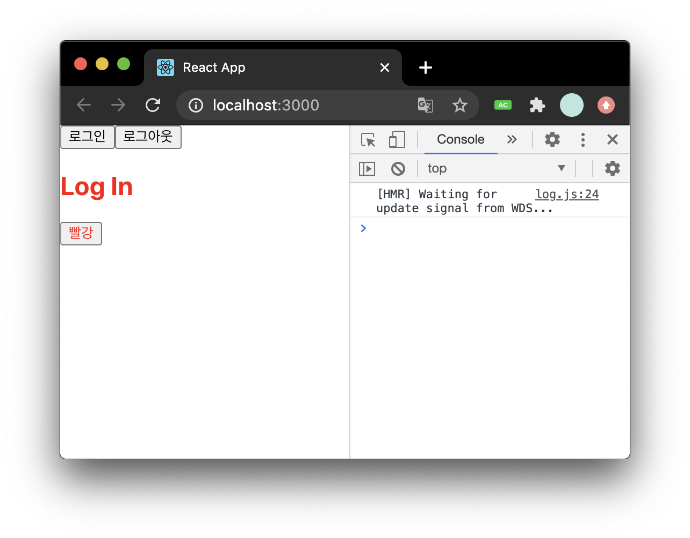

### 📌Contents

- [Component](#component)
- [props](#props)
  - defaultProps
  - children
  - propTypes, isRequired
- [state](#state)
  - 클래스형 컴포넌트의 state
  - 함수형 컴포넌트의 state
    - [useState](#useState)

---

## <a name="component"></a>함수형 컴포넌트

- 공식 문서에서는 **함수형 컴포넌트와 Hooks**를 사용권장

```jsx
import React from "react";
import "./App.css";

function App() {
  const greet = "world";
  return (
    <>
      <h2 className="react">hello {greet}</h2>
    </>
  );
}
export default App;
```

- 장점: 클래스형 컴포넌트보다 선언이 편하며 메모리자원도 덜 사용한다.
- 단점: `state`와 라이프사이클 API 사용이 불가능 하다 => v16.8 이후 **Hooks** 도입으로 해결됨

<br>

## 클래스형 컴포넌트

```jsx
import React, { Component } from "react";

class App extends Component {
  render() {
    const greet = "world";
    return <div className="react">{greet}</div>;
  }
}

export default App;
```

- 클래스형 컴포넌트에는 `render`함수가 꼭 있어야 한다.

<br>

## 모듈 export/import

- **_export_**

```js
// NewComponent.js
export default NewComponent;
```

- **_import_**

```js
// App.js
import React from "react";
import NewComponent from "./NewComponent";

const App = () => {
  return <NewComponent />;
};

export default App;
```

<br>

## <a name="props"></a>props

- `props`는 컴포넌트 속성을 설정할때 사용하는 요소
- 해당 컴포넌트를 불러와서 사용하는 부모 컴포넌트에서 설정함

```js
// NewComponent.js
import React from "react";

const NewComponent = (props) => {
  return <div>My New Component is {props.name}</div>;
};

export default NewComponent;
```

```js
// App.js (부모 컴포넌트)
import React from "react";
import NewComponent from "./NewComponent";

const App = () => {
  return <NewComponent name="React!!" />;
};

export default App;
//실행결과 : My New Component is React!!
```

<br>

### defaultProps

- `props`의 **기본값**을 설정할 수 있음

```js
// NewComponent.js
import React from "react";

const NewComponent = (props) => {
  return <div>My New Component is {props.name}</div>;
};

NewComponent.defaultProps = {
  name: "디폴트",
};
export default NewComponent;
```

```js
// App.js
//...
const App = () => {
  return <NewComponent />;
};
//실행결과 : My New Component is 디폴트
```

<br>

### children

- `props.children`은 컴포넌트 태그 사이의 내용을 보여줌

```js
// NewComponent.js
const NewComponent = (props) => {
  return (
    <div>
      My New Component is {props.name} <br />
      children is {props.children}
    </div>
  );
};

NewComponent.defaultProps = {
  name: "디폴트",
};
export default NewComponent;
```

```js
//App.js
//...
const App = () => {
  return <NewComponent>태그사이</NewComponent>;
};
//실행결과
//My New Component is 디폴트
//children is 태그사이
```

<br>

### 비구조화 할당

- ES6 비구조화 할당

```js
import React from "react";

const NewComponent = (props) => {
  const { name, children } = props;
  return (
    <div>
      My New Component is {name} <br />
      children is {children}
    </div>
  );
};
```

- 함수의 매개변수로도 사용가능

```js
const NewComponent = ({ name, children }) => {
  return (
    <div>
      My New Component is {name} <br />
      children is {children}
    </div>
  );
};
```

<br>

### propTypes

- `props`의 타입 지정
- 꼭 사용할필요는 없으나 큰 프로젝트 진행시 해당 컴포넌트에 어떤 `props`가 필요한지 쉽게 알 수 있음

```js
// NewComponent.js
import React from "react";
import PropTypes from "prop-types";

const NewComponent = ({ name, children }) => {
  return (
    <div>
      My New Component is {name} <br />
      children is {children}
    </div>
  );
};

NewComponent.defaultProps = {
  name: "디폴트",
};

NewComponent.propTypes = {
  name: PropTypes.string,
};
export default NewComponent;
```

위처럼 `propTypes`를 `string`으로 지정하면 `name`을 문자열(string) 으로 전달해야함

```js
//App.js
import React from "react";
import NewComponent from "./NewComponent";

const App = () => {
  return <NewComponent name={3}>태그사이</NewComponent>;
};

export default App;
```



- 수정

```js
const App = () => {
  return <NewComponent name="React">태그사이</NewComponent>;
```

<br>

### isRequired

- `propTypes`를 지정할때 필수 `props`로 지정함

```js
import React from "react";
import PropTypes from "prop-types";

const NewComponent = ({ name, children, num }) => {
  return (
    <div>
      My New Component is {name} <br />
      children is {children} <br />
      My Number is {num}
    </div>
  );
};

NewComponent.defaultProps = {
  name: "디폴트",
};

NewComponent.propTypes = {
  name: PropTypes.string,
  num: PropTypes.number.isRequired,
};
export default NewComponent;
```

```js
// App.js
const App = () => {
  return <NewComponent name="React">태그사이</NewComponent>;
};
```

`num`을 설정하지 않아 경고가 뜸



- 수정

```js
// App.js
const App = () => {
  return (
    <NewComponent name="React" num={11}>
      태그사이
    </NewComponent>
  );
};
```

<br>

#### PropTypes 종류

- `array` : 배열
- `arrayOf` : 특정 PropTypes로 이뤄진 배열. ex) `arrayOf(PropTypes.number)`
- `bool` : true/false
- `func` : 함수
- `number` : 숫자
- `object` : 객체
- `string` : 문자열
- `symbol`
- `oneOf(['A', 'B'])` : 주어진 배열 요소 중 하나
- `oneOfType([React.PropTypes.string, PropTypes.number])` : 주어진 배열 안의 종류 중 하나
- `instanceOf(클래스)` : 특정 클래스의 인스턴스

<br>

### 클래스형 컴포넌트에서 props 사용

- 클래스형 컴포넌트에서는 `render`함수에서 `this.props`를 조회

```js
// NewComponent.js
import React, { Component } from "react";
import PropTypes from "prop-types";

class NewComponent extends Component {
  render() {
    const { name, children, num } = this.props;
    return (
      <div>
        My New Component is {name} <br />
        children is {children} <br />
        My Number is {num}
      </div>
    );
  }
}

NewComponent.defaultProps = {
  name: "디폴트",
};

NewComponent.propTypes = {
  name: PropTypes.string,
  num: PropTypes.number.isRequired,
};

export default NewComponent;
```

<br>

- class 내부에서 지정
  - `defaultProps`와 `propTypes`를 **_class_** 내부에서 지정할 수도 있음

```js
import React, { Component } from "react";
import PropTypes from "prop-types";

class NewComponent extends Component {
  static defaultProps = {
    name: "디폴트",
  };
  static propTypes = {
    name: PropTypes.string,
    num: PropTypes.number.isRequired,
  };
  render() {
    const { name, children, num } = this.props;
    return (
      <div>
        My New Component is {name} <br />
        children is {children} <br />
        My Number is {num}
      </div>
    );
  }
}

export default NewComponent;
```

<br>

## <a name="state"></a>state

- `state`는 컴포넌트 내부에서 바뀔 수 있는 값
- 두가지 종류
  - 클래스형 컴포넌트의 `state`
  - 함수형 컴포넌트의 `useState` 함수를 통해 사용하는 `state`

### 클래스형 컴포넌트의 state

- 컴포넌트에서 `state`를 설정할때 `constructor`메서드를 사용하여 설정
- `constructor`를 사용할때는 `super(props)`를 사용해야함
- `render`함수에서 현재 `state`를 조회할때는 `this.state`를 조회하면 됨

```js
// Counter.js
import React, { Component } from "react";

class Counter extends Component {
  constructor(props) {
    super(props);
    this.state = {
      number: 0,
    };
  }
  render() {
    const { number } = this.state;
    return (
      <div>
        <h2>{number}</h2>
        <button
          onClick={() => {
            this.setState({ number: number + 1 });
          }}
        >
          증가
        </button>
      </div>
    );
  }
}
export default Counter;
```

- `onClick`이라는 **_props_** 는 버튼이 클릭될때 호출할 함수 설정함 (이벤트설정)
- 이벤트로 설정할 함수를 넣을때는 화살표함수 사용
- `this.setState`는 **_state_** 값을 바꿀 수 있게함

```js
// App.js
import React from "react";
import Counter from "./Counter";

const App = () => {
  return <Counter />;
};

export default App;
```



<br>

- 다른 방식으로 `state`의 초기값을 지정할 수 있음
- 이렇게하면 `constructor` 메서드를 선언하지 않아도 `state` 초기값을 설정가능

```js
// Counter.js
import React, { Component } from "react";

class Counter extends Component {
  state = {
    number: 0,
  };

  render() {
    const { number } = this.state;
    return ( ...
```

<br>

#### this.setState에 함수인자 전달

- 이렇게 객체를 넣으면 두번써도 클릭했을때 **+2** 되지않음

```js
// Counter.js
<button
  onClick={() => {
    this.setState({ number: number + 1 });
    this.setState({ number: this.state.number + 1 });
  }}
>
  증가
</button>
```

- 객체 대신 함수를 넣으면 클릭했을때 **+2** 가 됨

```js
<button
  onClick={() => {
    this.setState((prevState) => {
      return {
        number: prevState.number + 1,
      };
    });

    this.setState((prevState) => ({
      number: prevState.number + 1,
    }));
  }}
>
  증가
</button>
```

<br>

#### this.setState 끝난후 특정작업

- `setState`로 값을 업데이트 하고나서 특정 작업을 하려면 **두번째 인자**로 **콜백함수**를 등록

```js
<button
  onClick={() => {
    this.setState(
      {
        number: number + 1,
      },
      () => {
        console.log("작업 끝");
        console.log(this.state);
      }
    );
  }}
>
  증가
</button>
```



<br>

### 함수형 컴포넌트의 state

- 16.8v 부터 `useState` 함수를 사용하여 함수형 컴포넌트에서도 `state` 사용가능
  - **Hooks**를 사용

#### 비구조화 할당

```js
const array = [77, 88];
const first = array[0];
const two = array[1];
```

위 코드를 비구조화 할당을 이용해 변경

```js
const array = [77, 88];
const [first, two] = array;
```

<br>

#### <a name="useState"></a>useState

- 함수를 호출하면 배열이 반환되는데, 배열의 **첫번째 원소**는 **현재 상태**, **두번째 원소**는 **상태를 바꿔**주는 함수임

```js
// Login.js
import React, { useState } from "react";

const Login = () => {
  const [message, setFoo] = useState("");
  const onClickLogin = () => setFoo("Log In");
  const onClickLogout = () => setFoo("Log Out");

  return (
    <div>
      <button onClick={onClickLogin}>로그인</button>
      <button onClick={onClickLogout}>로그아웃</button>
      <h2>{message}</h2>
    </div>
  );
};

export default Login;
```

```js
// App.js
import React from "react";
import Login from "./Login";

const App = () => {
  return <Login />;
};

export default App;
```



<br>

#### useState 여러번 사용

- `useState`는 한 컴포넌트에서 여러번 사용 가능

```js
// Login.js
import React, { useState } from "react";

const Login = () => {
  const [message, setFoo] = useState("");
  const onClickLogin = () => setFoo("Log In");
  const onClickLogout = () => setFoo("Log Out");

  const [test, setBoo] = useState("black");

  return (
    <div>
      <button onClick={onClickLogin}>로그인</button>
      <button onClick={onClickLogout}>로그아웃</button>
      <h2 style={{ color: test }}>{message}</h2>

      <button style={{ color: "red" }} onClick={() => setBoo("red")}>
        빨강
      </button>
    </div>
  );
};
```

위와 같음

```js
//...
const [color, setColor] = useState("black");

return (
  <div>
    <button onClick={onClickLogin}>로그인</button>
    <button onClick={onClickLogout}>로그아웃</button>
    <h2 style={{ color }}>{message}</h2>

    <button style={{ color: "red" }} onClick={() => setColor("red")}>
      빨강
    </button>
  </div>
);
```



<br>

## 정리

- `props`는 부모 컴퍼넌트가 설정, `state`는 컴포넌트 자체적으로 지닌 값이고 컴포넌트 내부에서 값을 업데이트 가능
