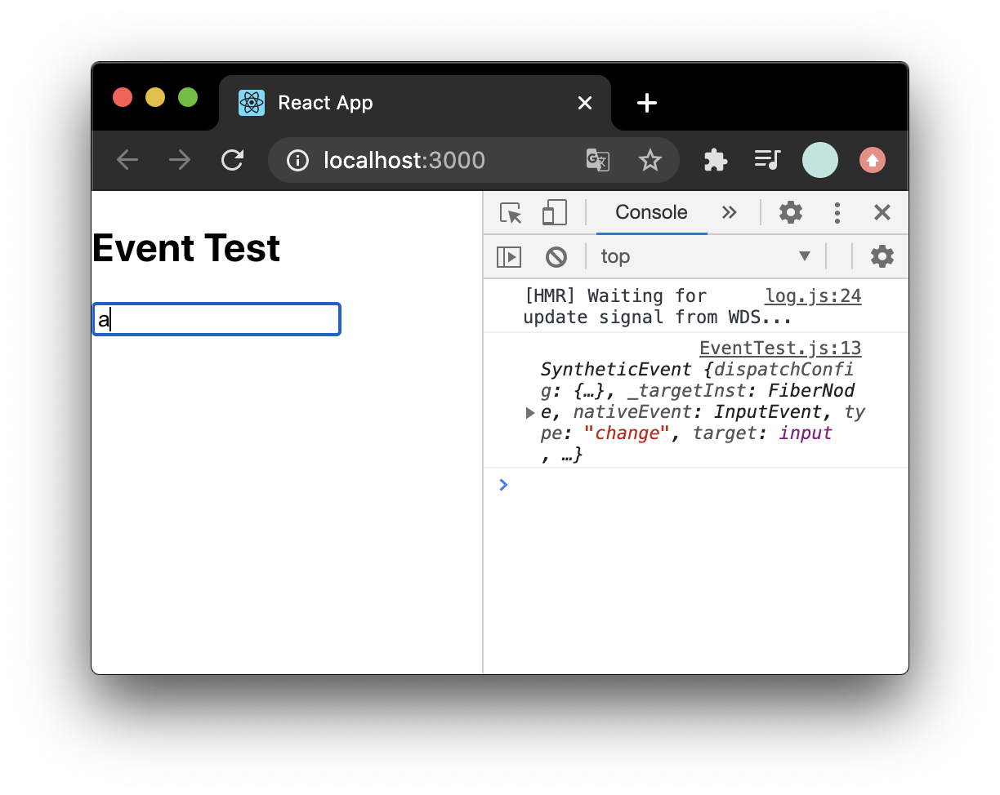
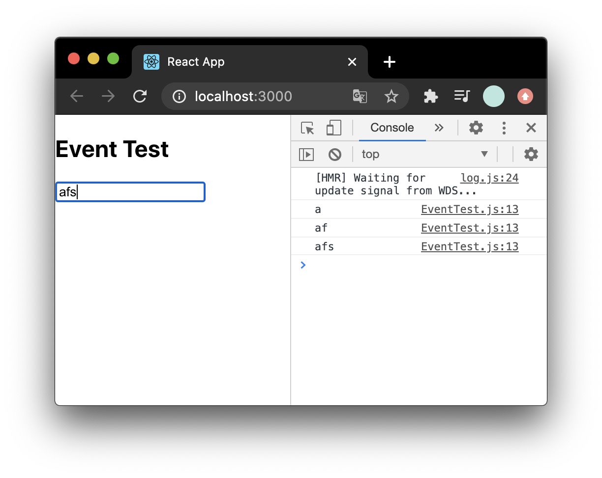
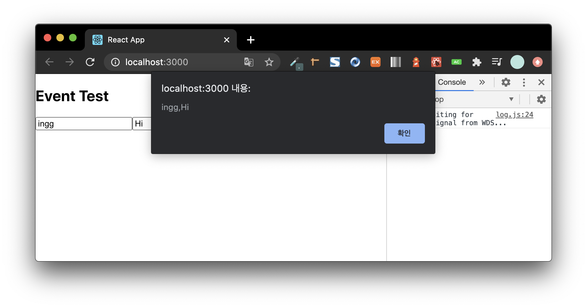

## 이벤트 핸들링

### 규칙

#### 이벤트 이름은 _camelCase_ 를 사용

- HTML의 `onclick`은 리액트에서 `onClick`이고, `onkeyup`은 `onKeyUp`이다.

#### JSX를 사용하여 문자열이 아닌 함수로 이벤트 핸들러를 전달

- HTML

```html
<button onclick="activateLasers()">
  Activate Lasers
</button>
```

- React 에서는

```html
<button onClick="{activateLasers}">Activate Lasers</button>
```

#### DOM 요소에만 이벤트 설정 가능

- `div`, `button`, `input`, `form`, `span`등 DOM 요소에는 이벤트 설정 가능하지만 컴포넌트에는 자체적으로 설정 불가

#### [이벤트 종류](https://ko.reactjs.org/docs/events.html)

- **Clipboard** 이벤트
- **Composition** 이벤트
- **Keyboard** 이벤트
- **Focus** 이벤트
- **Form** 이벤트
- **Generic** 이벤트
- **Mouse** 이벤트
- **Pointer** 이벤트
- **Selection** 이벤트
- **Touch** 이벤트
- **UI** 이벤트
- **Wheel** 이벤트
- **Media** 이벤트
- **Image** 이벤트
- **Animation** 이벤트
- **Transition** 이벤트
- **기타** 이벤트

<br>

### onChange

```js
// EventTest.js
import React, { Component } from "react";

class EventTest extends Component {
  render() {
    return (
      <div>
        <h2>Event Test</h2>
        <input
          type="text"
          name="message"
          placeholder="입력하세요"
          onChange={(e) => {
            console.log(e);
          }}
        />
      </div>
    );
  }
}

export default EventTest;
```



```js
//...
onChange={(e) => {
    console.log(e.target.value);
//...
```



<br>

#### state에 input값 담기

```js
import React, { Component } from "react";

class EventTest extends Component {
  state = {
    message: "",
  };

  render() {
    return (
      <div>
        <h2>Event Test</h2>
        <input
          type="text"
          name="message"
          placeholder="입력하세요"
          value={this.state.message}
          onChange={(e) => {
            this.setState({
              message: e.target.value,
            });
          }}
        />
        <button
          onClick={() => {
            alert(this.state.message);
            this.setState({
              message: "",
            });
          }}
        >
          Send
        </button>
      </div>
    );
  }
}

export default EventTest;
```

<br>

### 임의 메서드 생성

- 함수를 미리 준비하여 전달할 수도 있음
- JSX 콜백 안에서 this의 의미에 대해 주의해야 함. JavaScript에서 클래스 메서드는 기본적으로 바인딩되어 있지 않다. `this.handleClick`을 바인딩하지 않고 `onClick`에 전달하였다면, 함수가 실제 호출될 때 `this`는 `undefined`가 된다.

```js
import React, { Component } from "react";

class EventTest extends Component {
  state = {
    message: "",
  };

  constructor(props) {
    super(props);
    this.handleChange = this.handleChange.bind(this);
    this.handleClick = this.handleClick.bind(this);
  }

  handleChange(e) {
    this.setState({
      message: e.target.value,
    });
  }

  handleClick() {
    alert(this.state.message);
    this.setState({
      message: "",
    });
  }

  render() {
    return (
      <div>
        <h2>Event Test</h2>
        <input
          type="text"
          name="message"
          placeholder="입력하세요"
          value={this.state.message}
          onChange={this.handleChange}
        />
        <button onClick={this.handleClick}>Send</button>
      </div>
    );
  }
}

export default EventTest;
```

<br>

- 메서드 바인딩은 생성자 메서드에서 해야하지만, 불편할 수 있음
- 새 메서드를 만들때마다 `constructor`도 수정해야하므로, 화살표함수 형태로 메서드를 정의할 수도 있음

```js
class EventTest extends Component {
  state = {
    message: "",
  };

  // constructor(props) {
  //   super(props);
  //   this.handleChange = this.handleChange.bind(this);
  //   this.handleClick = this.handleClick.bind(this);
  // }

  handleChange = (e) => {
    this.setState({
      message: e.target.value,
    });
  };

  handleClick = () => {
    alert(this.state.message);
    this.setState({
      message: "",
    });
  };

  render() {
      //...
```

<br>

### 여러개 input

- input값이 여러개일때 event 객체를 활용
- `e.target.name` 은 해당 input의 **_name_** 을 가리킴

```js
import React, { Component } from "react";

class EventTest extends Component {
  state = {
    yourname: "",
    message: "",
  };

  handleChange = (e) => {
    this.setState({
      [e.target.name]: e.target.value,
    });
  };

  handleClick = () => {
    alert(this.state.yourname + "," + this.state.message);
    this.setState({
      yourname: "",
      message: "",
    });
  };

  render() {
    return (
      <div>
        <h2>Event Test</h2>
        <input
          type="text"
          name="yourname"
          placeholder="이름"
          value={this.state.yourname}
          onChange={this.handleChange}
        />
        <input
          type="text"
          name="message"
          placeholder="입력하세요"
          value={this.state.message}
          onChange={this.handleChange}
        />
        <button onClick={this.handleClick}>Send</button>
      </div>
    );
  }
}

export default EventTest;
```



<br>

#### [key]

객체 안에서 `key`를 `[]`로 감싸면 그 안에 넣은 레퍼런스가 가리키는 실제 값이 `key`로 됨

```js
const name = "test";
const obj = {
  [name]: "value",
};
```

위의 결과는 아래와 같음

```js
{
    'test' : 'value'
}
```

<br>

### onKeyPress

```js
//...

handleKeyPress = (e) => {
  if (e.key === "Enter") {
    this.handleClick();
  }
};

//...
<input
  type="text"
  name="message"
  placeholder="입력하세요"
  value={this.state.message}
  onChange={this.handleChange}
  onKeyPress={thihandleKeyPress}
/>
<button onClick={thihandleClick}>Send</button>

```

<br>

### 함수형 컴포넌트

```js
//EventTest2
import React, { useState } from "react";

const EventTest2 = () => {
  const [yourname, setYourName] = useState("");
  const [message, setMessage] = useState("");
  const onChangeYourname = (e) => setYourName(e.target.value);
  const onChangeMessage = (e) => setMessage(e.target.value);
  const onClick = () => {
    alert(yourname + "," + message);
    setYourName("");
    setMessage("");
  };
  const onKeyPress = (e) => {
    if (e.key === "Enter") {
      onClick();
    }
  };

  return (
    <div>
      <h2>Event Test</h2>
      <input
        type="text"
        name="yourname"
        placeholder="이름"
        value={yourname}
        onChange={onChangeYourname}
      />
      <input
        type="text"
        name="message"
        placeholder="입력하세요"
        value={message}
        onChange={onChangeMessage}
        onKeyPress={onKeyPress}
      />
      <button onClick={onClick}>Send</button>
    </div>
  );
};

export default EventTest2;
```
