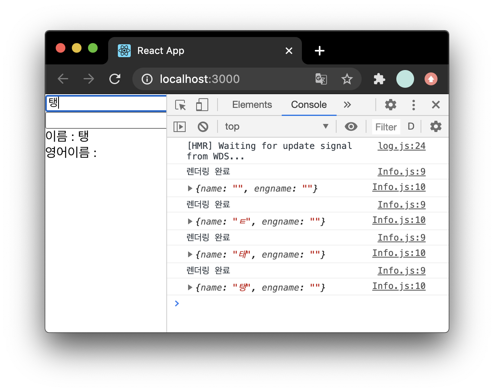
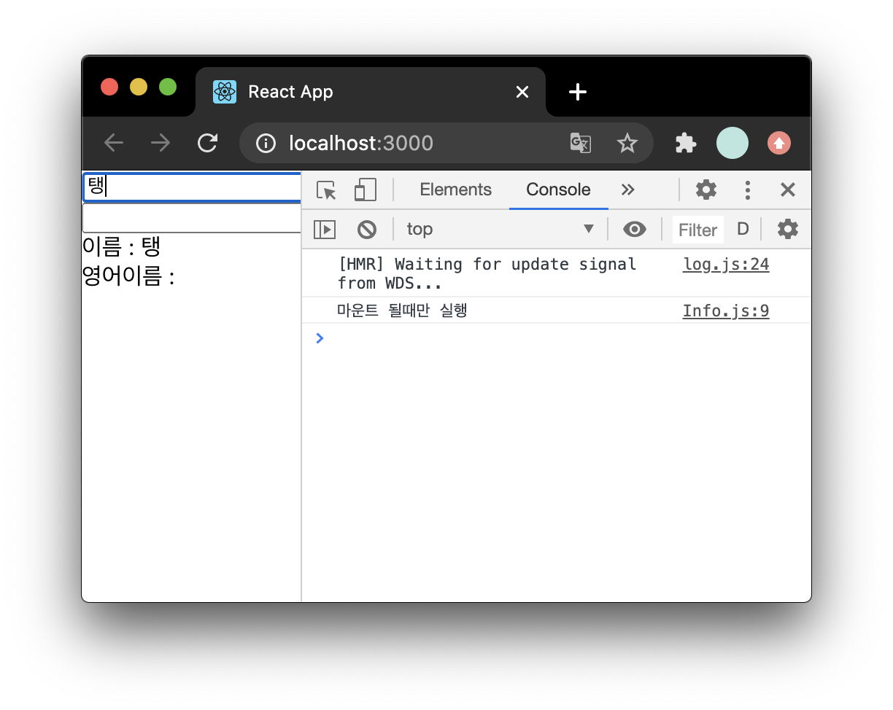
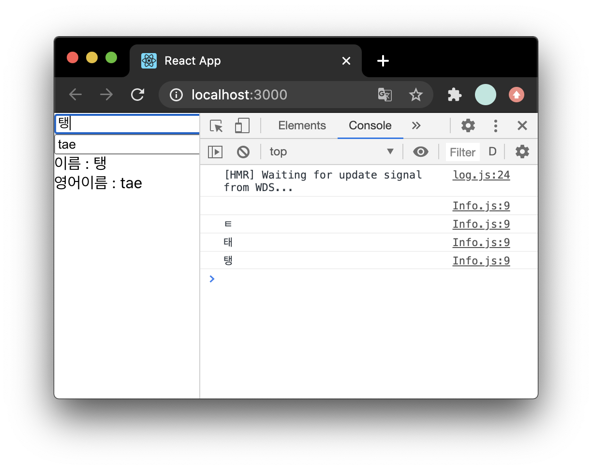

## useState

- 가장 기본적인 Hook
- 함수형 컴포넌트에서도 가변적 상태를 지닐수 있게함
- `useState` 피라미터에는 상태의 **기본값**을 넣음
- 함수가 호출되면 반환하는 배열의 **첫번째 원소는 상태값**, **두번째 원소는 상태를 설정하는 함수**

```js
//useState 한개사용
import React, { useState } from "react";

const Counter = () => {
  const [value, setValue] = useState(0);

  return (
    <div>
      <p>현재 카운터 값: {value}</p>
      <button onClick={() => setValue(value + 1)}>+1</button>
      <button onClick={() => setValue(value - 1)}>-1</button>
    </div>
  );
};

export default Counter;
```

<br>

### useState 여러번 사용

- 관리할 상태가 여러개라면 `useState`를 여러번 사용하면 됨

```js
//useState 여러개사용
import React, { useState } from "react";

const Info = () => {
  const [name, setName] = useState("");
  const [engname, setEngname] = useState("");

  const onChangeName = (e) => {
    setName(e.target.value);
  };

  const onChangeEngname = (e) => {
    setEngname(e.target.value);
  };

  return (
    <div>
      <div>
        <input value={name} onChange={onChangeName} />
        <input value={engname} onChange={onChangeEngname} />
      </div>
      <div>
        <div>이름 : {name}</div>
        <div>영어이름 : {engname}</div>
      </div>
    </div>
  );
};

export default Info;
```

<br>

## useEffect

- `useEffect`는 리액트 컴포넌트가 렌더링될 때마다 특정 작업을 수행하도록 설정할 수 있는 Hook
- 클래스형 컴포넌트의 `componentDidMount`와 `componentDidUpdate`를 합친형태

```js
import React, { useState, useEffect } from "react";

const Info = () => {
  const [name, setName] = useState("");
  const [engname, setEngname] = useState("");

  useEffect(() => {
    console.log("렌더링 완료");
    console.log({
      name,
      engname,
    });
  });
//...
```



<br>

### 마운트 될때만 실행하기

`useEffect`에서 설정한 함수를 컴포넌트를 첫 렌더링될때만 실행하고 업데이트할땐 실행하지 않으려면 두번째인자로 `[]`를 넣음

```js
//...

useEffect(() => {
  console.log("마운트 될때만 실행");
}, []);
//...
```



<br>

### 업데이트 될때만 실행하기

- 특정 값이 변경될때만 호출하려면, 클래스형 컴포넌트에서는

```js
componenetDidUpdate(prevProps, nextState){
    if(prevProps.value !== this.props.value){
        doSomething();
    }
}
// props안에 있는 value가 바뀔때만 특정작업 수행
```

- `useEffect`에서는
  - 두번째 피라미터의 배열안에 검사할 값을 넣음

```js
//...

useEffect(() => {
  console.log(name);
}, [name]);
//...
```



<br>

### 뒷정리

- 컴포넌트가 언마운트되기 전이나 업데이트 직전 어떤작업을 수행하려면 뒷정리(cleanup) 함수를 반환해야함

```js
//Info.js
//...
useEffect(() => {
  console.log("effect");
  console.log(name);
  return () => {
    console.log("cleanup");
    console.log(name);
  };
});
//...
```

```js
//App.js
import React, { useState } from "react";
import Info from "./Info";

const App = () => {
  const [visible, setVisible] = useState(false);
  return (
    <div>
      <button
        onClick={() => {
          setVisible(!visible);
        }}
      >
        {visible ? "숨기기" : "보이기"}
      </button>
      <hr />
      {visible && <Info />}
    </div>
  );
};

export default App;
//렌더링될때마다 뒷정리함수가 나타남
```

- 언마운트될때만 뒷정리함수를 호출하려면 `useEffect`함수 두번째 피라미터에 빈배열을 넣는다.

<br>

## useReducer

- 현재상태, 업데이트를 위한 정보를 담은 액션값을 전달받아 새로운 상태를 반환하는 함수
- `useState`보다 다양한 상태를 다른 값으로 업데이트 할때 사용
- 첫번째 피라미터에 **리듀서 함수**, 두번째 피라미터에 **해당 리듀서의 기본값**을 넣음
- 이 Hook은 `state`값과 `dispatch`함수를 받아옴
  - `state`는 현재 가리키고있는 상태, `dispatch`는 액션을 발생시키는 함수

```js
//useReducer
import React, { useReducer } from "react";

function reducer(state, action) {
  switch (action.type) {
    case "INCREMENT":
      return { value: state.value + 1 };
    case "DECREMENT":
      return { value: state.value - 1 };
    default:
      return state;
  }
}

const Counter = () => {
  const [state, dispatch] = useReducer(reducer, { value: 0 });

  return (
    <div>
      <p>
        현재 카운터 값은 <b>{state.value}</b>
      </p>
      <button onClick={() => dispatch({ type: "INCREMENT" })}>+1</button>
      <button onClick={() => dispatch({ type: "DECREMENT" })}>-1</button>
    </div>
  );
};

export default Counter;
```

<br>

### 인풋 상태관리

```js
import React, { useReducer } from "react";

function reducer(state, action) {
  return {
    ...state,
    [action.name]: action.value,
  };
}

const Info2 = () => {
  const [state, dispatch] = useReducer(reducer, {
    name: "",
    engname: "",
  });
  const { name, engname } = state;
  const onChange = (e) => {
    dispatch(e.target);
  };

  return (
    <div>
      <div>
        <input name="name" value={name} onChange={onChange} />
        <input name="engname" value={engname} onChange={onChange} />
      </div>
      <div>
        <div>이름 : {name}</div>
        <div>영어이름 : {engname}</div>
      </div>
    </div>
  );
};

export default Info2;
```

<br>

## useMemo

- `useMemo`는 함수형 컴포넌트 내부에서 발생하는 연산을 최적화할 수 있음
- 렌더링하는 과정에서 특정 값이 바뀌었을때만 연산을 실행, 원하는 값이 안바뀌었으면 이전에 연산한 결과를 다시 사용

```js
import React, { useState } from "react";

const getAverage = (numbers) => {
  console.log("평균 계산중");
  if (numbers.length === 0) return 0;
  const sum = numbers.reduce((a, b) => a + b);
  return sum / numbers.length;
};

const Average = () => {
  const [list, setList] = useState([]);
  const [number, setNumber] = useState("");

  const onChange = (e) => {
    setNumber(e.target.value);
  };

  const onInsert = (e) => {
    const nextList = list.concat(parseInt(number));
    setList(nextList);
    setNumber("");
  };

  return (
    <div>
      <input value={number} onChange={onChange} />
      <button onClick={onInsert}>등록</button>
      <ul>
        {list.map((value, index) => (
          <li key={index}>{value}</li>
        ))}
      </ul>
      <div>평균 : {getAverage(list)}</div>
    </div>
  );
};

export default Average;
```

```js
// useMemo 사용 - 인풋내용이 바뀔때는 평균값을 다시계산하지않음
//...

  const avg = useMemo(() => getAverage(list), [list]);

  return (
    <div>
      <input value={number} onChange={onChange} />
      <button onClick={onInsert}>등록</button>
      <ul>
        {list.map((value, index) => (
          <li key={index}>{value}</li>
        ))}
      </ul>
      <div>평균 : {avg}</div>
    </div>
  );
};

export default Average;
```

<br>

## useCallback

- `useMemo`와 비슷함. 렌더링성능 최적화에 쓰임
- 첫번째 피라미터에 **생성하고 싶은함수**를, 두번째 피라미터에 어떤 값이 바뀔때 함수를 새로 생성해야하는지 알려주는 **배열**을 넣음

```js
//...
const onChange = useCallback((e) => {
  setNumber(e.target.value);
}, []); //컴포넌트가 처음 렌더링될때만 함수생성

const onInsert = useCallback(
  (e) => {
    const nextList = list.concat(parseInt(number));
    setList(nextList);
    setNumber("");
  },
  [number, list] //number나 list가 바뀌었을때만 함수생성
);
//...
```

<br>

## useRef

- 함수형 컴포넌트에서 `ref`를 쉽게 사용하게 해줌
